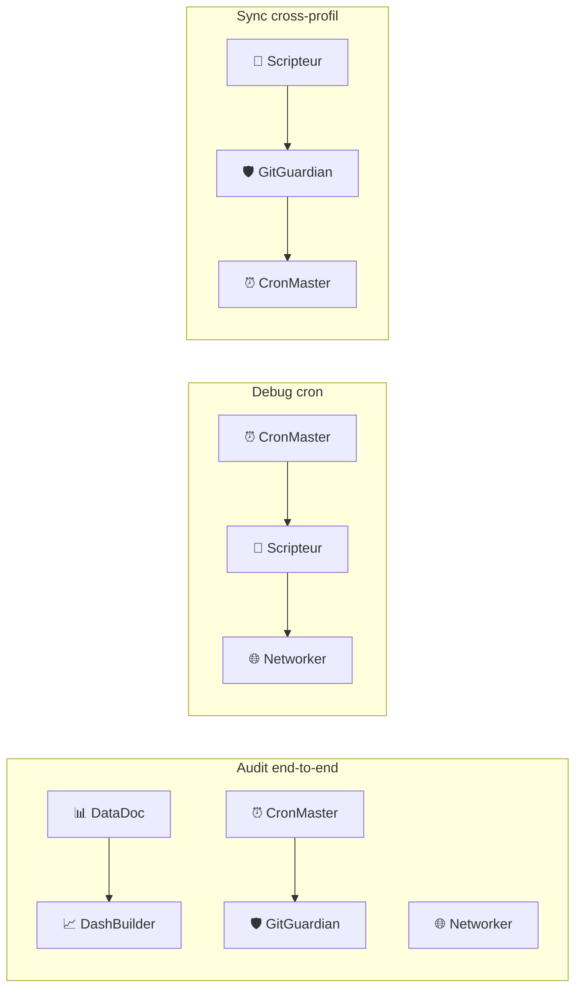

# Architecture bureaux : le système de dossiers intelligents

Au cœur de LEO se trouve un concept unique : **les bureaux BAVI** (Bureaux Agentiques Virtuels). Chaque bureau est un dossier intelligent spécialisé dans un domaine, avec ses propres règles, ses experts et ses modèles.

## Le constat de départ

Un assistant IA généraliste sait tout faire, mais il ne sait rien faire parfaitement. Quand vous lui demandez à la fois un calcul de budget et un roadbook camping-car, le résultat est moyen sur les deux.

La solution de LEO : **découper l'intelligence en bureaux spécialisés**.

```
Assistant généraliste
├── Parle un peu de tout
├── Mélange les contextes
└── Résultat = moyen partout

vs

10 bureaux spécialisés
├── Chacun son métier
├── Chacun ses modèles
├── Chacun ses règles
└── Résultat = excellent partout
```

## Les 10 bureaux LEO

| Bureau | Rôle | Statut |
|:-------|:-----|:------:|
| 🔧 **Michel** | Infrastructure — crons, dashboards, n8n, budget | ✅ Actif |
| 🤖 **LEO** | Hub central — analyses, dossiers personnels | ✅ Actif |
| 🧭 **Sylvia** | Voyages — roadbooks camping-car, itinéraires | ✅ Actif |
| 🎓 **Émile** | Pédagogie — assistant mémoire universitaire | ✅ Actif |
| 🏛️ **Robert** | Conseil stratégique IT — architectures, recommandations | ✅ Actif |
| 💰 **Sophie** | Pilotage financier — TCO, ROI, business cases | 📝 En reconstruction |
| 🏗️ **Gérard** | Documentation T600 — télescope automatisé | ✅ Actif |
| 🩺 **Virginie** | Médical — consultations pluridisciplinaires | ✅ Actif |
| 🛡️ **AO** | Assurance obligatoire — INAMI, eHealth | 📝 Structure prête |
| 📋 **Versioning** | Gestion des versions et des releases | 📝 Structure prête |

## Comment fonctionne un bureau

### 1. Un dossier dédié

Chaque bureau a son propre dossier dans `AGENT-PRO` :

```bash
BAVI/AGENT-PRO/
├── bureau-michel/        ← 🔧 Infrastructure
│   ├── index.md          ← Tableau de bord généré automatiquement
│   ├── analyse-*.md      ← Analyses produites
│   └── archive/          ← Anciennes analyses
├── bureau-leo/           ← 🤖 Hub central
├── bureau-sylvia/        ← 🧭 Voyages
└── ...
```

### 2. Des experts spécialisés

Chaque bureau peut faire appel à des sous-experts (agents CrewAI). Par exemple, le Bureau Michel a 8 experts :

```
Bureau Michel
├── 🔧 SysAdmin      — Administration du serveur
├── 🐳 DevOps        — Déploiement Docker
├── 📜 Scripteur     — Scripts Python/Bash
├── 📊 DataDoc       — Documentation et archives
├── 🌐 Networker     — Nginx, Cloudflare, DNS
├── 📈 DashBuilder   — Dashboards Chart.js
├── ⏰ CronMaster    — Crons Hermes (staggering)
└── 🛡️ GitGuardian   — Git, sync, clean trees
```

### 3. Des dispatch patterns

Les experts ne travaillent pas toujours seuls. Selon la tâche, le bureau active plusieurs experts en parallèle ou en séquence :



### 4. Des modèles adaptés

Chaque bureau utilise le modèle le plus adapté à son travail :

| Bureau | Modèle principal | Pourquoi |
|:-------|:-----------------|:---------|
| Michel | DeepSeek V4 Pro | Analyses complexes, décisions techniques |
| Sylvia | DeepSeek V4 Flash | Création de contenu, roadbooks |
| Robert | DeepSeek V4 Pro | Conseil stratégique, recommandations |
| Gérard | DeepSeek V4 Pro | Documentation technique, schémas |
| Émile | DeepSeek V4 Flash + Gemini (fallback) | Longs contextes, pédagogie |
| LEO | DeepSeek V4 Flash | Usage quotidien, polyvalent |

## Le cycle de production

Chaque analyse suit un workflow standardisé en **7 étapes** :

```
① Cadrage
   │  Comprendre la demande, définir le périmètre
   ▼
② Dispatch
   │  Quel bureau ? Quels experts ?
   ▼
③ Production
   │  Rédaction de l'analyse
   ▼
④ Croisement (si multi-experts)
   │  Confronter les analyses de plusieurs experts
   ▼
⑤ Synthèse
   │  Résumé, conclusions, recommandations
   ▼
⑥ Livrable
   │  Format final : analyse, rapport, note
   ▼
⑦ Archivage
   │  Sauvegarde dans AGENT-PRO + commit Git + publication wiki
```

### Variantes selon le type de livrable

| Type | Étapes | Description |
|:-----|:-------|:------------|
| **Analyse** | ①→③→⑤→⑥→⑦ | Analyse directe, pas de dispatch |
| **Rapport** | ①→②→③→④→⑤→⑥→⑦ | Cycle complet avec croisement |
| **Note** | ①→③→⑥ | Rapide, pas de dispatch ni synthèse |
| **Dossier** | ①→②→③→④→⑤→⑥→⑦ + archivage renforcé | Document complet |
| **Mémoire** | ①→②→③→④↔④↔④→⑤→⑥→⑦ | Croisement itératif (allers-retours) |

## Frontmatter standard

Chaque analyse a un en-tête YAML qui permet son indexation automatique :

```yaml
---
date: 2026-06-28
bureau: bureau-michel
version: v2
modele: deepseek-v4-pro
tags: [analyse, infrastructure, crons]
statut: finalise
type: analyse
---
```

Ces métadonnées permettent au script `agent-pro-index.py` de générer automatiquement des tableaux de bord consolidés.

## Pourquoi ça marche

1. **Spécialisation** — chaque bureau ne fait qu'un métier, il le fait mieux
2. **Réutilisabilité** — une analyse peut être reprise par un autre bureau
3. **Traçabilité** — chaque document a une date, une version, un auteur
4. **Évolutivité** — on peut ajouter un bureau sans casser les autres
5. **Automatisation** — l'index des analyses est généré, pas écrit à la main

## Voir aussi

- **Ch.11** : Bureau Michel — l'infrastructure en détail
- **Ch.12** : Bureau Sylvia — les voyages
- **Ch.13** : Bureau Émile — la pédagogie
- **Ch.14** : Bureau Robert — le conseil stratégique
- **Ch.15** : Bureau LEO et les autres bureaux
