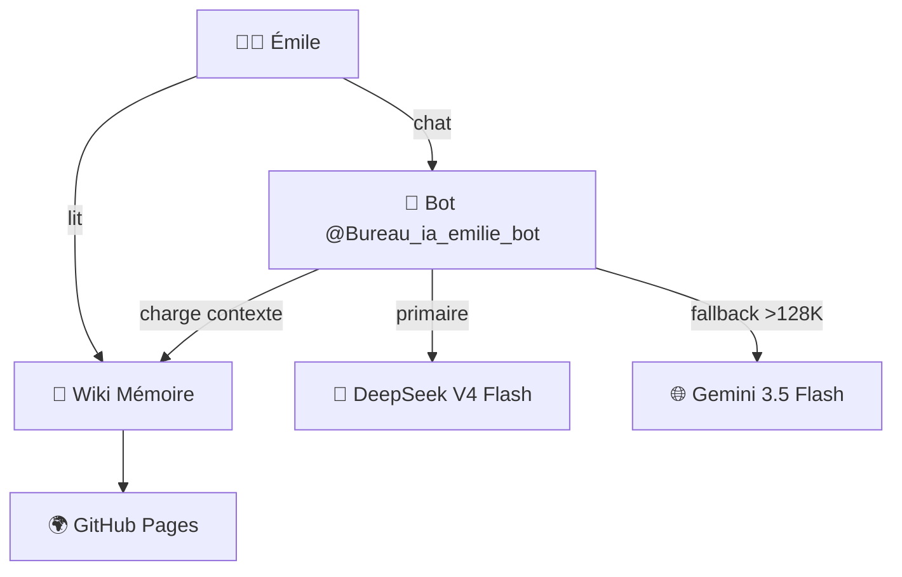

# Bureau Émile : la pédagogie

Le Bureau Émile est un assistant pédagogique dédié à l'accompagnement d'Émilie pour son **mémoire de fin d'études en sciences de l'éducation**. C'est le plus jeune bureau de LEO, créé le 25 juin 2026.

## Son rôle

Émile n'est pas un correcteur automatique — c'est un **partenaire de rédaction** qui suit l'étudiante tout au long de son travail.

```
Bureau Émile = votre directeur de mémoire IA
├── 📖 Relecture et amélioration des chapitres
├── 📚 Bibliographie et références
├── 📝 Structure et plan du mémoire
├── 🔄 Versionning (brouillons → versions finales)
├── 💡 Suggestions d'amélioration
└── ✅ Vérification orthographe et style académique
```

## Architecture



- **Modèle principal** : DeepSeek V4 Flash (contexte 128K tokens)
- **Fallback** : Gemini 3.5 Flash (contexte 1M tokens — gratuit)
- **Bot Telegram** : [@Bureau_ia_emilie_bot](https://t.me/Bureau_ia_emilie_bot)
- **Wiki** : [emile-wiki](https://christophedanhier-hash.github.io/emile-wiki/)

### Pourquoi deux modèles ?

Le mémoire d'Émilie peut faire 50 à 150 pages. Si le contexte dépasse 128K tokens (la limite de DeepSeek), le bot bascule automatiquement sur Gemini qui accepte jusqu'à 1 million de tokens — gratuitement.

```python
if contexte_tokens < 128_000:
    utiliser("deepseek-v4-flash")   # Payant mais meilleur
else:
    utiliser("gemini-3.5-flash")   # Gratuit, contexte géant
```

## Sources de connaissance

Le bot s'alimente à plusieurs sources :

| Source | Description | Comment |
|:-------|:------------|:--------|
| **Wiki** | Documentation structurée | Lecture automatique |
| **Drive** | Brouillons, notes, documents | Sync horaire → Wiki |
| **Conversation** | Historique Telegram | Mémoire de session |

### Contenu du wiki

Le wiki Émile contient déjà :

- **Plan du mémoire** — structure validée par le directeur
- **Chapitres** — brouillons en cours d'écriture
- **Bibliographie** — sources et références
- **Notes de recherche** — réflexions personnelles
- **Retours du directeur** — annotations et corrections

## Workflow typique

```
1. Émile écrit un brouillon dans Google Docs
2. Sauvegarde dans le dossier Drive partagé "bureau-emile"
3. La sync horaire convertit le .docx en .md → Wiki
4. Émile demande : "Peux-tu relire mon chapitre 2 ?"
5. Le bot charge le chapitre depuis le Wiki
6. Analyse : structure, style, orthographe, références
7. Retour avec suggestions d'amélioration
```

## Règles pédagogiques

1. **Bienveillance** — toujours encourageant et constructif
2. **Structure** — chaque retour a : points forts, suggestions, questions
3. **Exemples** — illustrer les corrections avec des exemples concrets
4. **Progression** — célébrer les améliorations d'une version à l'autre
5. **Autonomie** — ne jamais réécrire à la place d'Émilie, guider

## Intégration avec les autres bureaux

| Bureau | Interaction |
|:-------|:------------|
| 🔧 **Michel** | Héberge le bot, gère le cron de sync Drive→Wiki |
| 🤖 **LEO** | Point d'entrée : redirige les demandes pédagogiques |
| 🏛️ **Robert** | Pourrait faire une analyse qualité du mémoire |

## Comparaison avec Sylvia

Le Bureau Émile est inspiré du Bureau Sylvia (voyages) — même pattern, adapté à l'académique :

| Aspect | Sylvia (voyages) | Émile (mémoire) |
|:-------|:----------------:|:----------------:|
| **Utilisateur** | Christophe + amis | Émilie |
| **Livrable** | Roadbook | Mémoire |
| **Wiki** | `voyages-wiki` | `emile-wiki` |
| **Sync** | Drive → GitHub (docs voyages) | Drive → GitHub (brouillons) |
| **Modèle** | DeepSeek V4 Flash | DeepSeek Flash + Gemini fallback |
| **Création** | 03/06/2026 | 25/06/2026 |

## Voir aussi

- **Ch.7** : Multi-bots — comment créer un profil dédié
- **Ch.8** : Skills — les compétences pédagogiques
- **Ch.9** : Mémoire persistante
