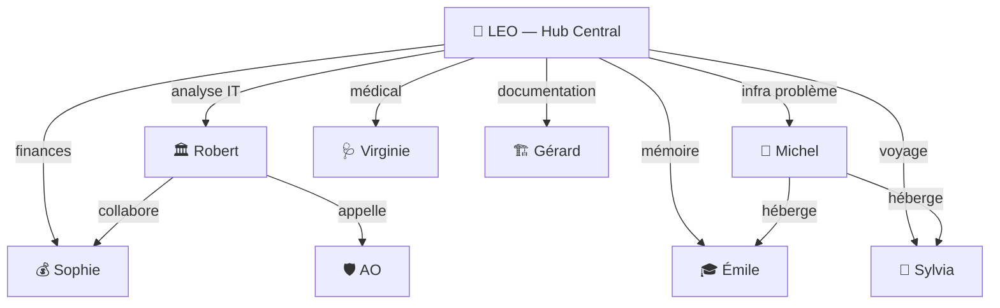

# Bureau LEO et les autres bureaux

Le Bureau LEO est le **hub central** de l'écosystème — votre point d'entrée unique pour tout ce qui ne rentre pas dans les bureaux spécialisés. Et il y a quelques autres bureaux plus discrets mais tout aussi utiles.

## Bureau LEO : le fourre-tout personnel

LEO (le bureau, pas le bot) gère tout ce qui est **personnel, transversal ou ponctuel** : analyses générales, dossiers, études de marché, documentation.

```
Bureau LEO = votre assistant personnel
├── 📝 Analyses et dossiers
├── 📧 Emails (envoi + lecture + classification)
├── 📚 Documentation wikis
├── 🏷️ Classification Gmail (9 catégories)
└── 🗂️ Archives et notes
```

### Chiffres clés

| Métrique | Valeur |
|:---------|:------:|
| Sessions totales | 431 |
| Messages échangés | 13 089 |
| Emails classifiés | 3 240 |
| Skills installés | 112 |
| Wikis gérés | 5 |

### La classification Gmail

LEO classifie automatiquement les emails entrants en 9 catégories via Ollama (modèle local, gratuit) :

| Catégorie | Type |
|:----------|:-----|
| 👑 **VIP** | Christophe, famille, chefs |
| ⚙️ **Admin** | Factures, administrations |
| 💰 **Finances** | Banques, assurances, impôts |
| 🤖 **IA & Tech** | Infos techniques, newsletters |
| 🧭 **Voyages** | Réservations, billets |
| 🛒 **Achats** | Commandes, livraisons |
| 🏠 **Maison** | Énergie, travaux, voisinage |
| 👨‍👩‍👧‍👦 **Famille** | Émilie, Camille, amis |
| 🔭 **Astro** | Observatoire, astronomie |

Règle d'or : **les labels ne sont appliqués qu'une fois**. Pas de re-classification en masse.

## Bureau Sophie : le pilotage financier

Sophie est l'**analyste financière** de l'équipe. Elle calcule des TCO, des ROI, des business cases.

```
Bureau Sophie
├── 💰 TCO/ROI des projets IT
├── 📊 Analyse de rentabilité
├── 📈 3 scenarii (pessimiste/réaliste/optimiste)
└── 📋 Business cases

Experts : Analyste Marché, Modélisateur Financier, Risques & Conformité
```

Actuellement en reconstruction — Sophie reprendra du service quand un nouveau projet financier arrivera.

## Bureau Gérard : la documentation T600

Gérard documente le **télescope T600** (600mm d'ouverture) de l'Observatoire Centre Ardennes. Il a 6 sous-experts :

```
Bureau Gérard
├── 🔭 Spécialiste Astro-optique
├── 🔧 Expert Hardware (IPX800, Pléiades, Arduino)
├── 💾 Expert Firmware (steppers, drivers TB67H303HC)
├── 📝 Rédacteur Technique
├── 👨‍🏫 Formateur
└── 🌍 Ethnographe
```

Documents produits :
- **Document de Référence T600** — architecture complète du télescope
- **Formation Opérateur T600** — guide utilisateur
- **Analyse des Risques T600** — sécurité et maintenance

## Bureau Virginie : le médical

Virginie est une **orchestratrice de consultations médicales**. Elle réunit des spécialistes pour un diagnostic pluridisciplinaire.

Une consultation produite à ce jour : **Sylvie Michaux** (v2, finalisée).

Son workflow : dispatch des spécialistes → croisement des diagnostics → synthèse.

## Bureau AO : l'assurance obligatoire

Bureau spécialisé dans le domaine de l'**Assurance Obligatoire** (INAMI, BCSS, eHealth, MyCareNet). Peut fonctionner comme sous-agent de Robert ou en skill autonome.

En attente de missions.

## Bureau Versioning

Gère les **versions et releases** des documents et analyses. Structure prête, pas encore de contenu.

## La gouvernance des bureaux



## En résumé

| Bureau | Rôle | Priorité |
|:-------|:-----|:--------:|
| **LEO** | Hub central, analyses, emails | 🔴 Quotidien |
| **Michel** | Infrastructure technique | 🔴 Quotidien |
| **Sylvia** | Voyages camping-car | 🟡 Hebdomadaire |
| **Robert** | Conseil stratégique IT | 🟡 Hebdomadaire |
| **Gérard** | Documentation T600 | 🟢 Mensuel |
| **Émile** | Assistant pédagogique | 🟢 Mensuel |
| **Virginie** | Consultations médicales | 🟢 Ponctuel |
| **Sophie** | Pilotage financier | 📝 En attente |
| **AO** | Assurance obligatoire | 📝 En attente |

## Voir aussi

- **Ch.10** : Architecture des bureaux (concept et workflow 7 étapes)
- **Ch.11** : Bureau Michel (infrastructure)
- **Ch.12** : Bureau Sylvia (voyages)
- **Ch.13** : Bureau Émile (pédagogie)
- **Ch.14** : Bureau Robert (conseil stratégique)
