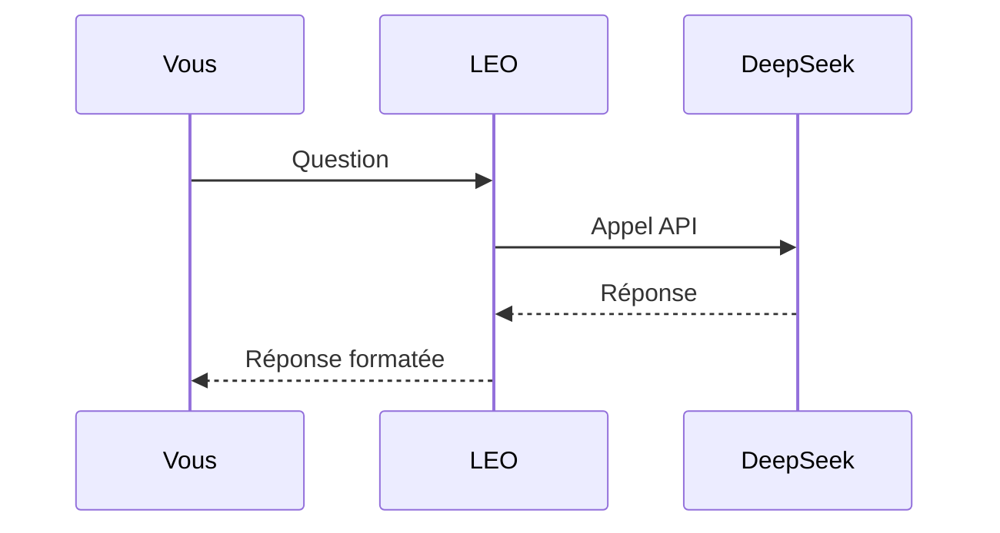
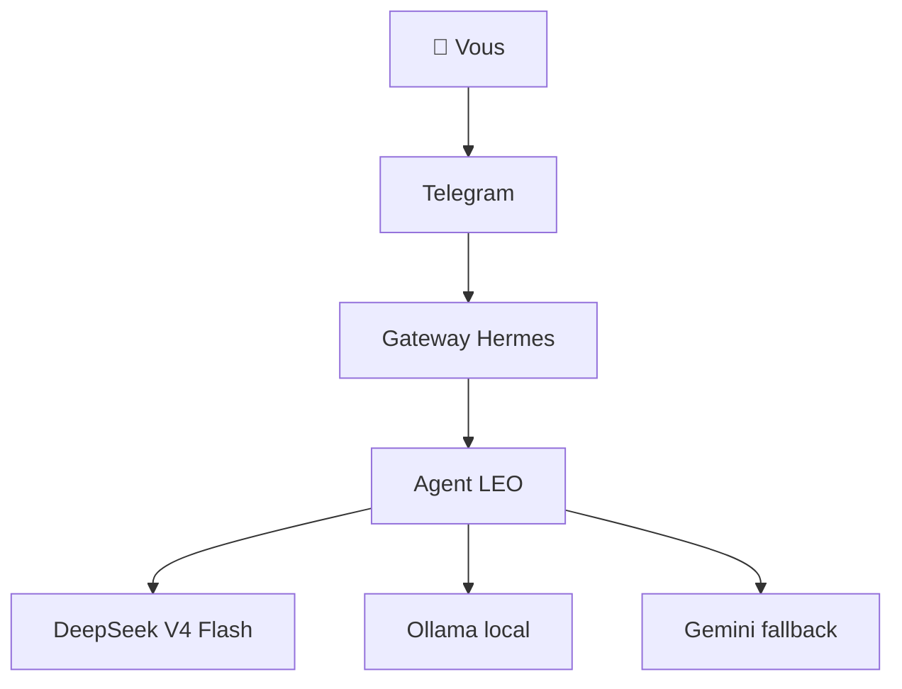

# Skills créatifs : ASCII art, designs, schémas

Hermes peut aussi faire preuve de créativité. Plusieurs skills transforment votre assistant en artiste numérique, designer ou illustrateur technique.

## ASCII Art : du texte qui dessine

Le skill `ascii-art` génère des œuvres d'art à partir de caractères texte.

```bash
# Bannière avec pyfiglet
python3 -c "import pyfiglet; print(pyfiglet.figlet_format('LEO', font='slant'))"
```

```text
   __     __   ____  
  / /    / /  / __ \ 
 / /    / /  / / / / 
/ /___ / /_ / /_/ /  
\____/ \__/ \____/   
```

### Cas d'usage

- Bannières pour les dashboards
- Logos pour les wikis
- Illustrations techniques dans la documentation
- Invitations de commande personnalisées

```bash
# Avec boxes (encadré)
python3 -c "import pyfiglet; print(pyfiglet.figlet_format('SYSTEM OK', font='bubble'))"
```

## Excalidraw : des schémas main-levée

Le skill `excalidraw` permet de créer des diagrammes et schémas au style "tableau blanc".

### Utilisation

```bash
# Générer un schéma Excalidraw
python3 /opt/data/scripts/upload.py mon-schema.excalidraw
```

### Exemple : architecture simple

```text
┌─────────────┐     ┌─────────────┐     ┌─────────────┐
│  Telegram   │────▶│  Hermes     │────▶│  DeepSeek   │
│  (vous)     │     │  Gateway    │     │  API        │
└─────────────┘     └─────────────┘     └─────────────┘
       │                                           │
       │                                           ▼
       │                                    ┌─────────────┐
       └────────────────────────────────────│  Réponse    │
                                            └─────────────┘
```

Les schémas Excalidraw sont au format JSON et peuvent être intégrés dans les wikis MkDocs.

## Diagrammes Mermaid

Mermaid est un langage de diagrammes textuels. Hermes peut générer des diagrammes Mermaid dynamiquement.

### Exemple : diagramme de séquence



### Exemple : diagramme d'architecture



Les diagrammes Mermaid sont supportés nativement par GitHub et MkDocs.

## p5.js : des animations interactives

Le skill `p5js` génère des sketches p5.js pour créer des visualisations interactives, des générateurs d'art, ou des simulations.

```javascript
function setup() {
  createCanvas(400, 400);
  background(220);
}

function draw() {
  fill(random(255), random(255), random(255));
  circle(random(width), random(height), 20);
}
```

### Cas d'usage
- Génération d'art procédural
- Visualisations interactives
- Démonstrations techniques
- Fond d'écran de dashboard

## Manim : des vidéos d'explication

Le skill `manim-video` utilise Manim (le moteur d'animation de 3Blue1Brown) pour créer des vidéos explicatives.

```python
from manim import *

class Introduction(Scene):
    def construct(self):
        title = Text("Comment fonctionne Hermes ?")
        self.play(Write(title))
        self.wait(2)
```

### Formats supportés
- Vidéos MP4
- GIFs animés
- Tutoriels pas à pas

## Design de pages web

Le skill `sketch` crée des maquettes HTML/COS rapidement pour visualiser une interface avant de la coder.

```html
<!DOCTYPE html>
<html>
<head>
<style>
body { font-family: sans-serif; max-width: 800px; margin: auto; }
.header { background: #2c3e50; color: white; padding: 2rem; }
.card { border: 1px solid #ddd; padding: 1rem; margin: 1rem 0; }
</style>
</head>
<body>
<div class="header"><h1>Dashboard LEO</h1></div>
<div class="card">Sessions: 431</div>
<div class="card">Budget: $60.31</div>
</body>
</html>
```

## Quand utiliser quel skill créatif

| Besoin | Skill | Format |
|:-------|:------|:-------|
| Bannière / logo | `ascii-art` | Texte |
| Schéma rapide | `excalidraw` | JSON SVG |
| Diagramme technique | Mermaid | Markdown |
| Animation / vidéo | `manim-video` | MP4 / GIF |
| Maquette web | `sketch` | HTML |
| Art génératif | `p5js` | JavaScript |

## Voir aussi

- **Ch.10** : Architecture des bureaux (schémas Mermaid)
- **Ch.22** : Dashboards (intégration de graphiques)
- **Annexe A** : Glossaire
