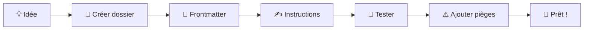

# Écrire ses propres skills

Le vrai pouvoir d'Hermes, c'est que vous pouvez **créer vos propres skills**. Pas besoin d'être développeur — un skill est juste un fichier Markdown bien structuré.

## Anatomie d'un skill

### Structure minimale

```markdown
---
name: mon-skill
description: Ce que fait mon skill
---

# Mon Skill

Instructions pas à pas pour accomplir la tâche.
```

### Structure complète

```bash
mon-skill/
├── SKILL.md         ← Instructions principales
├── references/      ← Documentation complémentaire
│   └── api.md
├── templates/       ← Modèles de sortie
│   └── rapport.md
└── scripts/         ← Scripts exécutables
    └── collect.py
```

### Frontmatter (en-tête YAML)

Le frontmatter est obligatoire. Il décrit le skill pour Hermes :

```yaml
---
name: backup-gdrive
description: Backup des profils Hermes vers Google Drive
category: infrastructure
metadata:
  hermes:
    tags: [backup, gdrive, hermes]
    workflows: [deploiement-n8n]
---
```

| Champ | Obligatoire | Description |
|:------|:-----------:|:------------|
| `name` | ✅ | Identifiant unique du skill |
| `description` | ✅ | Résumé en une phrase |
| `category` | ✅ | Groupe de skills |
| `metadata.hermes.tags` | ❌ | Mots-clés pour la recherche |
| `metadata.hermes.workflows` | ❌ | Workflows associés |

## Exemple pas à pas

Créons un skill "Vérification disque" pour LEO.

### 1. Créer le dossier

```bash
mkdir -p ~/.hermes/skills/infrastructure/check-disk
cd ~/.hermes/skills/infrastructure/check-disk
```

### 2. Écrire SKILL.md

```markdown
---
name: check-disk
description: Vérifier l'espace disque et alerter si < 20%
category: infrastructure
---

# Vérification disque

## Contexte
Vérifie l'espace disque du serveur LEO et alerte si l'utilisation
dépasse 80%.

## Étapes
1. Exécuter : `df -h / | tail -1`
2. Extraire le pourcentage d'utilisation (colonne 5)
3. Si > 80% → alerte Telegram + issue GitHub
4. Si < 80% → OK, rien à faire

## Vérification
- `df -h /opt/data` : confirmer l'espace libre
- Le cron tourne-t-il bien ? `hermes cron list`

## Pièges
- Le disque `/dev/sda2` est le SSD système
- Le disque `/dev/sdb2` est le HDD data (monté sur /mnt/data)
- Les alertes sont envoyées via le skill `notify`
```

### 3. Ajouter un script (optionnel)

```python
# scripts/check-disk.py
import subprocess, json

result = subprocess.run(
    ["df", "-h", "/"], capture_output=True, text=True
)
usage = result.stdout.strip().split("\n")[-1].split()[4].replace("%", "")

status = "OK" if int(usage) < 80 else "ALERTE"
print(json.dumps({"usage": f"{usage}%", "status": status}))
```

### 4. Tester le skill

```bash
# Demander à Hermes
"Vérifie l'espace disque"

# Ou utiliser le mode skill directement
hermes skill run check-disk
```

## Les 21 pièges à éviter

Basés sur l'expérience réelle de LEO :

| # | Piège | Solution |
|:-:|:------|:---------|
| 1 | `hermes` pas dans PATH | Utiliser `/opt/hermes/.venv/bin/hermes` |
| 2 | Symlinks dans `scripts/` refusés | Copier les fichiers, pas de liens |
| 3 | Contexte DeepSeek limité à 128K | Fallback Gemini (1M tokens) |
| 4 | `s6-svstat DOWN` = faux négatif | Vérifier les processus, pas le flag |
| 5 | Budget DeepSeek à mesurer en delta | Triple ventilation : IN/OUT/cache |
| 6 | Labels Gmail : ne pas réappliquer | Une seule classification par email |
| 7 | Migration Hermes → rebuild Docker | Script `rebuild.sh` dans recovery-kit |
| 8 | Tokens .env corrompus par le redact | Écrire via base64 |
| 9 | sshpass → `/opt/data/bin/` pas `/tmp/` | Binaire dédié |
| 10 | Config v30 → migration nécessaire | `hermes config migrate` |

## Où stocker ses skills

### Skills locaux (profil courant)

```bash
~/.hermes/skills/<categorie>/<nom>/SKILL.md
```

### Skills partagés entre profils

```bash
/opt/data/skills/<categorie>/<nom>/SKILL.md
```

### Skills synchronisés

Le profil `default` (source de vérité) synchronise ses skills vers les autres profils toutes les 30 minutes :

```yaml
# config.yaml du profil source
curator:
  enabled: true
  sync_to:
    - leo-copilot
    - bavi-leo
    - emile
```

## Bonnes pratiques

```yaml
Règles d'or:
  - ✅ Un skill = une tâche
  - ✅ Frontmatter complet et précis
  - ✅ Pitfalls documentés (au moins 3)
  - ✅ Étape de vérification incluse
  - ✅ Testé avant publication
  - ❌ Pas de fourre-tout
  - ❌ Pas de chemins en dur (utiliser des variables)
  - ❌ Pas de secrets dans le skill (utiliser .env)
```

## Exemples de skills LEO

| Skill | Fichier | Lignes |
|:------|:--------|:------:|
| `bureau-michel` | `SKILL.md` | 106 |
| `gmail-inbox-zero` | `references/classifier-script.md` | ~200 |
| `voyages-wiki` | `SKILL.md` | ~150 |
| `deployment` | Procédures Nginx, Docker | ~80 |

## En résumé



## Voir aussi

- **Ch.8** : Skills — concepts généraux
- **Ch.10** : Architecture des bureaux
- **Annexe A** : Glossaire
- **Annexe B** : Guide démarrage rapide
