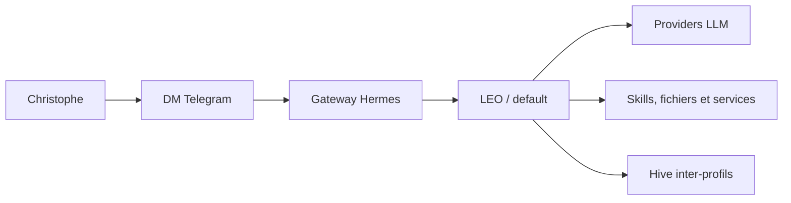
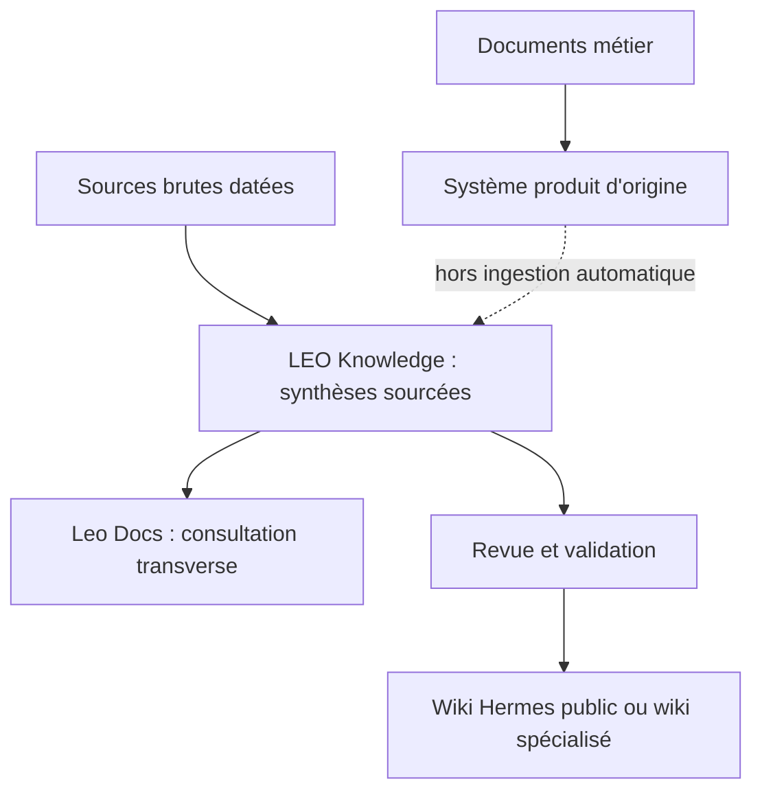

# Hermes LEO — Carte de la plateforme et parcours documentaire

> **Référence de navigation interne.** Cette page présente l’architecture actuelle de la plateforme Hermes/LEO, ses profils, ses services, sa gouvernance documentaire et les pages canoniques associées.
>
> **Dernière vérification terrain :** 21/09/2026 — Hermes `v0.19.0`, Python `3.14.4`, 6 profils, 72 jobs Michel, services `8765`, `8766`, `9119` et `8793`.
>
> Les chiffres dynamiques sont datés et doivent être revérifiés dans les sources indiquées. Les archives historiques ne décrivent pas l’état courant.

---

## 1. Comprendre Hermes et LEO

Hermes Agent est le socle d’exécution d’agents IA. LEO est l’agent principal exécuté sur le profil `default`.



### Pages de référence

- [Présentation Hermes](index.md)
- [Architecture Hermes LEO](architecture.md)
- [Architecture de la connaissance LLM Wiki et Leo Docs](https://tofdan.be/docs/?page=leo-knowledge%2Fknowledge%2Farchitecture-llm-wiki-leo-docs) — couche interne protégée
- [Sécurité](utilisation/securite.md)
- [Changelog vérifié](changelog.md)

### À retenir

- LEO est un agent Hermes, pas un bot Telegram public.
- `leo` est l’alias Hive du profil `default`, pas un septième profil.
- Les profils Hermes sont isolés : configuration, sessions, skills et mémoire sont propres à chaque profil.
- Leo Docs est l’explorateur documentaire interne ; il ne déclare pas automatiquement qu’un document est actuel.

---

## 2. Architecture actuelle de la plateforme

### Profils opérationnels

| Profil | Rôle courant | Provider principal | Modèle configuré |
|---|---|---|---|
| `default` | LEO : dialogue, pilotage général et coordination | Azure Foundry | `gpt-5.6-luna` |
| `michel` | Infrastructure, jobs, sauvegardes, métriques et déploiements | Azure Foundry | `gpt-5.6-luna` |
| `robert` | Conseil stratégique, gouvernance et architecture | Azure Foundry | `gpt-5.6-luna` |
| `sylvia` | Voyages, logistique camping-car et roadbooks | OpenRouter | `meta/muse-spark-1.3-contributor` |
| `emile` | Assistant professionnel d’Émilie dans My Émile IA Workbench | Azure Foundry | `gpt-5.6-luna` |
| `gerard` | Astronomie, astrophotographie, site tofdan, documentation et étude | Azure Foundry | `gpt-5.6-luna` |

### Fallbacks et routage

Les fallbacks déclarés sont vérifiables dans les configurations de profils. Le fallback Google Gemini ne doit pas être présenté comme le provider principal d’un profil lorsqu’il est configuré comme secours.

- [Profils, mémoires et skills](configuration/profiles.md)
- [Providers et routage LLM](configuration/providers.md)
- [Gateways et interfaces Telegram](utilisation/bots-telegram.md)
- [Architecture détaillée](architecture.md)

### Coordination

Hive assure les échanges asynchrones inter-profils et le suivi des obligations. Il ne remplace pas le chemin conversationnel direct des workbenches métier.

---

## 3. Services et interfaces

| Service | Port | Rôle | Page associée |
|---|---:|---|---|
| Panel LEO | `8765` | Métriques, jobs et supervision opérationnelle | [Dashboards](utilisation/dashboards.md) |
| Leo Docs | `8766` | Explorateur documentaire et recherche interne | [Carte documentaire](utilisation/documentation-map.md) |
| Hermes Dashboard | `9119` | Interface native et supervision Hermes | [Interface Web](interface-web.md) |
| My Émile IA | `8793` local | Workbench professionnel d’Émilie | Documentation métier My Émile IA |

### Navigation utile

- [Dashboards et monitoring](utilisation/dashboards.md)
- [Interface Web Hermes](interface-web.md)
- [Carte documentaire](utilisation/documentation-map.md)
- [Backup & Recovery](utilisation/backup-recovery.md)

Les ports et l’accessibilité doivent être vérifiés sur le système réel. Un service local ou privé ne doit pas être présenté comme une URL publique.

---

## 4. Documentation et base de connaissance

La documentation Hermes utilise plusieurs couches complémentaires.



### Leo Docs

Leo Docs répond à la question :

```text
Quels documents existent et où puis-je les consulter ?
```

Il indexe des wikis, vaults, audits, documents produits et LEO Knowledge. Son inventaire peut contenir des archives, des documents de travail et des historiques.

### LEO Knowledge / LLM Wiki

LEO Knowledge répond à la question :

```text
Quelles connaissances fiables retenons-nous de ces documents ?
```

- `raw/` : sources immuables avec SHA-256 ;
- `knowledge/` : synthèses avec provenance et confiance ;
- `reports/` : lint, contradictions et manifestes ;
- `pipeline/` : contrat commun aux six profils ;
- `scripts/` : classification, ingestion contrôlée, recherche et lint.

- [Architecture LLM Wiki et Leo Docs](https://tofdan.be/docs/?page=leo-knowledge%2Fknowledge%2Farchitecture-llm-wiki-leo-docs)
- [Gouvernance documentaire](https://tofdan.be/docs/?page=leo-knowledge%2Fknowledge%2Fgouvernance-documentaire)
- [Opérations documentaires](https://tofdan.be/docs/?page=leo-knowledge%2Fknowledge%2Foperations-documentaires)
- [Contrat documentaire multi-profils](https://tofdan.be/docs/?page=leo-knowledge%2Fpipeline%2Fdocument-contract)

### Règle de qualification

```text
classifier → dry-run → revue → ingestion raw → lint → synthèse knowledge → publication sélective
```

Les tests, secrets, credentials, briefs temporaires et documents professionnels sensibles ne sont pas ingérés automatiquement.

---

## 5. Périmètres métier

### Émile

Émile est l’assistant professionnel d’Émilie dans My Émile IA Workbench. Il accompagne la rédaction, la structuration et la gestion de notes, rapports, activités et documents professionnels, avec validation humaine.

Les documents professionnels d’Émilie restent dans leur système métier. Ils ne sont pas aspirés automatiquement dans LEO Knowledge.

- [Bureau Émile](bureaux/ch13-bureau-emile.md)
- [My Émile IA](https://tofdan.be/docs/?page=leo-knowledge%2Fknowledge%2Fmy-emile-ia)

### Gérard

Gérard accompagne Christophe pour l’astronomie, l’astrophotographie, le site et le wiki tofdan, la documentation générale et l’étude comme guide astronomie. Le T600/OCA est un projet parmi d’autres.

- [Bureau Gérard et architecture des bureaux](bureaux/ch10-architecture-bureaux.md)
- [Wiki OCA](https://christophedanhier-hash.github.io/wiki-oca/)

### Michel

Michel pilote l’infrastructure, les jobs, les sauvegardes, les métriques et les contrôles opérationnels. Les chiffres de jobs et les états de services sont dynamiques et doivent être datés.

- [Bureau Michel](bureaux/ch11-bureau-michel.md)
- [Backup & Recovery](utilisation/backup-recovery.md)

### Robert et Sylvia

- [Bureau Robert](bureaux/ch14-bureau-robert.md)
- [Bureau Sylvia](bureaux/ch12-bureau-sylvia.md)

Les descriptions historiques des anciens bureaux sont conservées dans les archives, pas dans cette table active.

---

## 6. Automatisation et jobs

Au 21/09/2026, le profil Michel contient :

```text
72 jobs planifiés
71 jobs activés
70 jobs no_agent
```

Ces valeurs décrivent le registre Michel observé à cette date ; elles ne constituent pas une valeur permanente.

### Familles opérationnelles

- maintenance quotidienne à `03:00` ;
- backup quotidien à `06:00` ;
- mise à jour et observation documentaire ;
- métriques et dashboards ;
- synchronisations et contrôles ;
- audits de qualité ciblés.

La règle de choix est simple : un traitement déterministe doit rester un script `no_agent`; une tâche nécessitant une analyse peut utiliser un agent selon son contrat et son profil.

- [Architecture Hermes LEO](architecture.md)
- [Dashboards](utilisation/dashboards.md)
- [Automatisation](automatisation/ch26-crons-intro.md)
- [Crons quotidiens](automatisation/ch28-crons-quotidiens.md)
- [Watchdogs](automatisation/ch29-watchdogs.md)
- [Drive ↔ GitHub](automatisation/ch30-drive-github-sync.md)

---

## 7. Sauvegarde, sécurité et reprise

La documentation de référence doit être lue avec les scripts réels :

- [Backup & Recovery](utilisation/backup-recovery.md)
- [Sécurité](utilisation/securite.md)
- [Architecture](architecture.md)

Principes :

- local, miroir HDD et Google Drive sont des destinations distinctes ;
- la rétention et le périmètre sont ceux du script réellement exécuté ;
- le RTO n’est pas une garantie tant qu’un exercice n’a pas été mesuré ;
- les secrets et identifiants ne sont jamais publiés ;
- les volumes métier et documents professionnels ont leurs propres procédures.

---

## 8. Parcours recommandés

### Pour comprendre la plateforme

```text
Présentation → Architecture → Profils → Providers → Dashboards
```

1. [Présentation Hermes](index.md)
2. [Architecture LEO](architecture.md)
3. [Profils](configuration/profiles.md)
4. [Providers](configuration/providers.md)
5. [Dashboards](utilisation/dashboards.md)

### Pour comprendre la documentation

```text
Carte documentaire → Leo Docs → LEO Knowledge → publication sélective
```

1. [Carte documentaire](utilisation/documentation-map.md)
- [Architecture LLM Wiki et Leo Docs](https://tofdan.be/docs/?page=leo-knowledge%2Fknowledge%2Farchitecture-llm-wiki-leo-docs)
- [Gouvernance documentaire LEO](https://tofdan.be/docs/?page=leo-knowledge%2Fknowledge%2Fgouvernance-documentaire)
- [Opérations documentaires](https://tofdan.be/docs/?page=leo-knowledge%2Fknowledge%2Foperations-documentaires)
- [Contrat documentaire multi-profils](https://tofdan.be/docs/?page=leo-knowledge%2Fpipeline%2Fdocument-contract)

### Pour exploiter Hermes au quotidien

1. [Interface Web](interface-web.md)
2. [Gateways et bots](utilisation/bots-telegram.md)
3. [Dashboards](utilisation/dashboards.md)
4. [Backup & Recovery](utilisation/backup-recovery.md)
5. [Sécurité](utilisation/securite.md)

### Pour diagnostiquer

1. [Troubleshooting](annexes/troubleshooting.md)
2. [Architecture](architecture.md)
3. [Dashboards](utilisation/dashboards.md)
4. [Carte documentaire](utilisation/documentation-map.md)

---

## 9. Archives et historique

L’ancienne table des matières du 04/07/2026 est conservée ici :

- [Table legacy 2026](archives/retirees-2026/table-legacy-2026-09-21.md)

Elle est historique et ne doit pas être utilisée pour décrire l’état courant.

Les archives d’architecture, de providers et de pages retirées sont référencées dans la [Carte documentaire](utilisation/documentation-map.md).

---

## 10. Règles de maintenance de cette table

Toute modification structurante de Hermes doit vérifier :

1. la page canonique [Architecture](architecture.md) ;
2. les pages [Profils](configuration/profiles.md) et [Providers](configuration/providers.md) ;
3. les services et ports réels ;
4. le registre des jobs Michel ;
5. la [Carte documentaire](utilisation/documentation-map.md) ;
6. Leo Docs ;
7. le build MkDocs strict ;
8. le site effectivement servi après publication.

Les chiffres dynamiques doivent porter une date et une source. Les journaux historiques ne sont pas réécrits pour refléter l’état présent.

---

> Cette refonte remplace la table historique devenue obsolète. Elle ne supprime pas l’historique : elle sépare l’état courant de l’archive.
