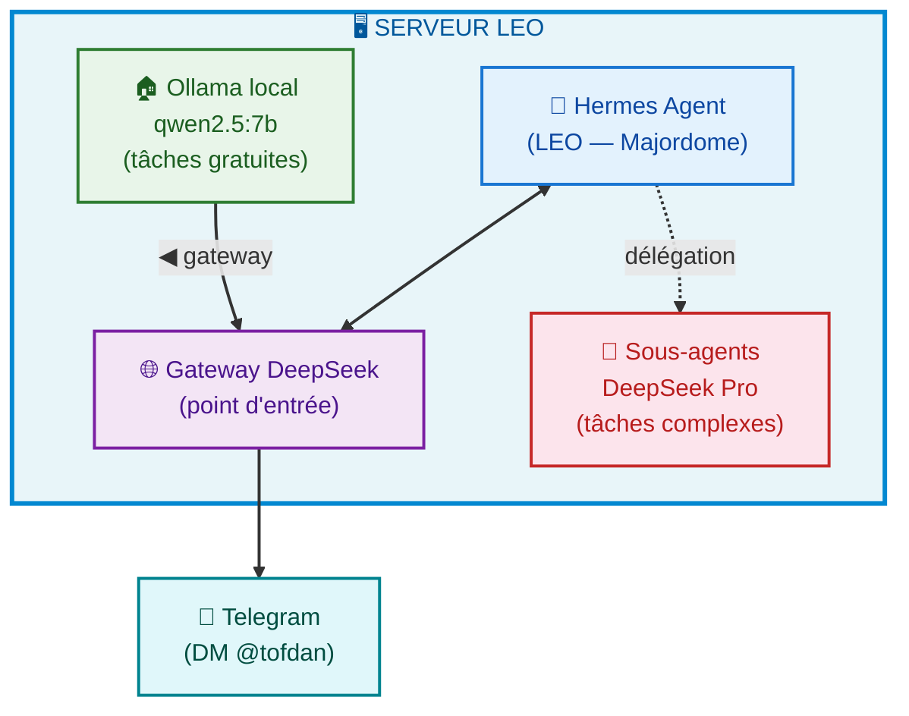
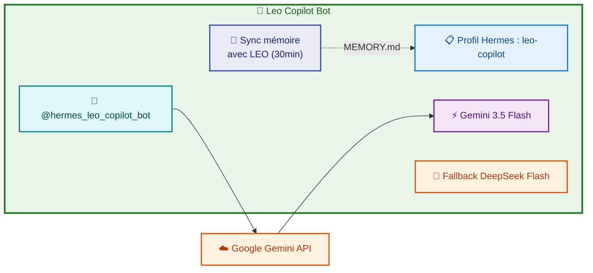
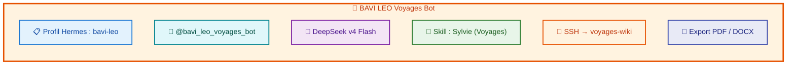
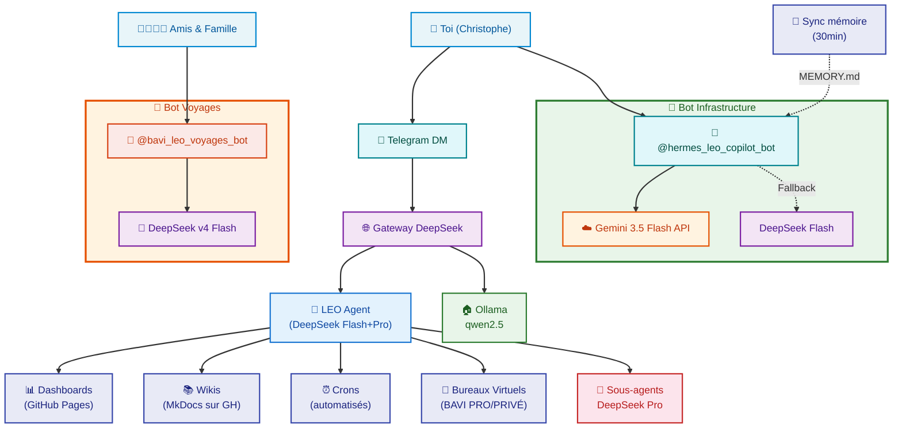

# 🏗️ Architecture de Communication

## Les 3 entités

```
👤 Toi (Christophe)
   │
   ├── 🤖 LEO (moi, Hermes Agent)
   │     DeepSeek Flash + Pro ← toi via DM Telegram
   │     └── Délègue les sous-tâches → DeepSeek Pro
   │
   ├── 🤖 @hermes_leo_copilot_bot
   │     Gemini 3.5 Flash ← focus infrastructure
   │     Mémoire synchronisée avec LEO (30min)
   │
   └── 🤖 @bavi_leo_voyages_bot
         DeepSeek v4 Flash ← voyages camping-car
         Profil Hermes isolé (bavi-leo)
```

---

## 1. LEO — L'Agent Hermes principal

**LEO** est l'agent **Hermes Agent** lui-même — ton majordome IA. Pas de handle Telegram : tu me parles en DM, le gateway fait le pont.



### Comment ça marche

1. **Tu parles à LEO via Telegram** — le Gateway DeepSeek fait le pont
2. **LEO n'a pas de handle** — réponse en DM
3. **Tâches complexes** → sous-agents DeepSeek Pro automatiquement
4. **Tâches trop lourdes** → proposition de déléguer à `@hermes_leo_copilot_bot`

---

## 2. @hermes_leo_copilot_bot — Infrastructure

Bot spécialisé **infrastructure** (n8n, serveurs, déploiements, watchdogs, dashboards). Propulsé par **Gemini 3.5 Flash** (API Google directe).



**Particularités :**
- **Mémoire partagée** : sync `default → leo-copilot` toutes les 30min via `sync-memory.py`
- **Pas de Copilot** : ancien proxy `copilot-proxy.py` supprimé, remplacé par API Gemini directe
- **Focus** : infrastructure uniquement, sauf demande explicite de ta part

---

## 3. @bavi_leo_voyages_bot — Voyages

Bot isolé pour les roadbooks camping-car. Les amis et la famille l'utilisent.



---

## 4. Schéma complet



---

## 5. Routage

| Tâche | Vers qui | Modèle |
|:------|:---------|:-------|
| Dialogue général, config, veille | **LEO** (moi) | DeepSeek Flash |
| Code, API, debug, analyses complexes | Sous-agent automatique | DeepSeek Pro |
| Infrastructure (n8n, serveurs, déploiements) | → `@hermes_leo_copilot_bot` | Gemini 3.5 Flash |
| Roadbooks, voyages camping-car | → `@bavi_leo_voyages_bot` | DeepSeek v4 Flash |
| Tâches lourdes hors-scope DeepSeek | Proposition → `@hermes_leo_copilot_bot` | Gemini 3.5 Flash |

---

## Résumé

| Concept | C'est quoi ? | Handle Telegram ? | Moteur |
|:--------|:-------------|:------------------|:-------|
| **LEO** | Agent Hermes principal | Non — DM direct | DeepSeek Flash + Pro |
| **@hermes_leo_copilot_bot** | Bot infrastructure isolé | Oui | Gemini 3.5 Flash |
| **@bavi_leo_voyages_bot** | Bot voyages isolé | Oui | DeepSeek v4 Flash |

**LEO n'est pas un bot Telegram. LEO est ton majordome IA.** Les bots sont des extensions spécialisées avec leurs propres profils, mémoires et accès.
