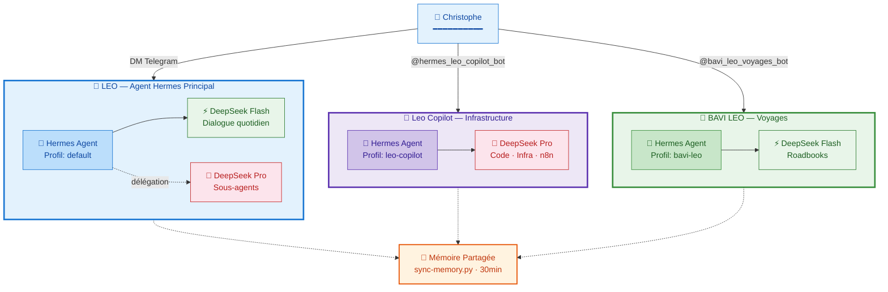
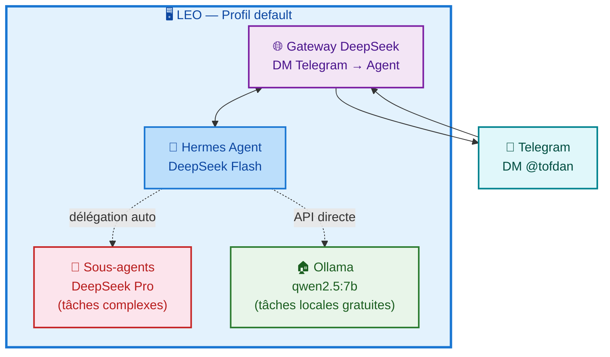
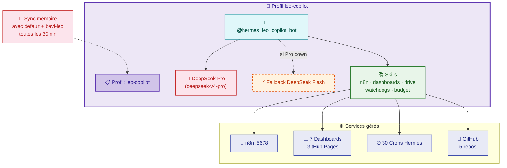
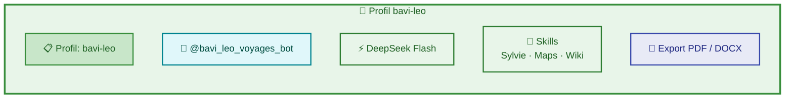
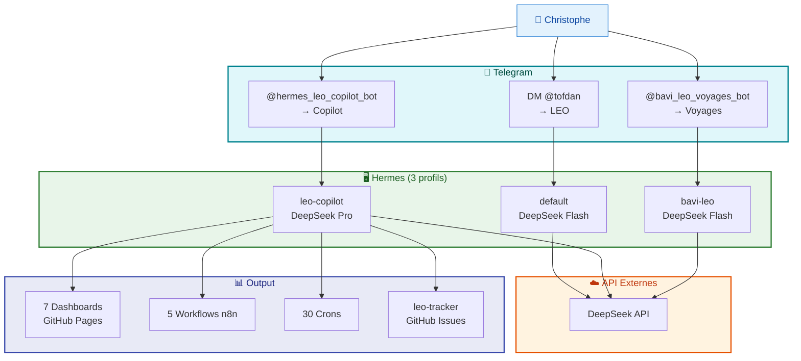

# 🏗️ Architecture de Communication — Écosystème LEO

> **3 profils Hermes, 3 gateways Telegram, 1 mémoire unifiée. 100% DeepSeek.**

---

## Les 3 entités

---

## 1. 🦁 LEO — L'Agent Hermes Principal

**LEO** est l'agent **Hermes Agent** — ton majordome IA. Pas de handle Telegram : tu lui parles en DM, le gateway fait le pont.

### Comment ça marche

1. **Tu parles à LEO via Telegram** — le Gateway DeepSeek fait le pont
2. **LEO n'a pas de handle** — réponse en DM direct
3. **Tâches complexes** → sous-agents DeepSeek Pro automatiquement
4. **Tâches locales** → Ollama (gratuit, classification, parsing)

---

## 2. 🔧 @hermes_leo_copilot_bot — Infrastructure

Bot spécialisé **infrastructure** (n8n, serveurs, déploiements, watchdogs, dashboards). Propulsé par **DeepSeek Pro**.

**Particularités :**
- **Mémoire partagée** : sync `default ↔ leo-copilot ↔ bavi-leo` toutes les 30min via `sync-memory.py`
- **100% DeepSeek** : plus de dépendance Gemini — réflexion supérieure, pas de quota
- **Focus** : infrastructure uniquement, sauf demande explicite de Christophe

---

## 3. 🧭 @bavi_leo_voyages_bot — Voyages

Bot isolé pour les roadbooks camping-car. Les amis et la famille l'utilisent.

---

## 4. Schéma complet — Flux de données

---

## 5. Routage

| Tâche | Vers qui | Modèle | Profil |
|:------|:---------|:-------|:-------|
| Dialogue général, config, veille | **LEO** (DM) | DeepSeek Flash | `default` |
| Code, API, debug, analyses complexes | Sous-agent auto | DeepSeek Pro | `default` |
| Infrastructure (n8n, dashboards, déploiements) | → `@hermes_leo_copilot_bot` | **DeepSeek Pro** | `leo-copilot` |
| Roadbooks, voyages camping-car | → `@bavi_leo_voyages_bot` | DeepSeek Flash | `bavi-leo` |
| Classification emails, parsing local | Ollama (LEO) | qwen2.5:7b | API directe |

---

## Résumé

| Concept | C'est quoi ? | Handle Telegram ? | Moteur | Profil |
|:--------|:-------------|:------------------|:-------|:-------|
| **LEO** | Agent Hermes principal | Non — DM direct | DeepSeek Flash + Pro | `default` |
| **@hermes_leo_copilot_bot** | Bot infrastructure | Oui | **DeepSeek Pro** | `leo-copilot` |
| **@bavi_leo_voyages_bot** | Bot voyages | Oui | DeepSeek Flash | `bavi-leo` |

**LEO n'est pas un bot Telegram. LEO est ton majordome IA.** Les bots sont des extensions spécialisées avec leurs propres profils, mémoires et accès.

---

*Document mis à jour le 04/07/2026 — 00:00:00 — Modèles DeepSeek unifiés 🦁*
