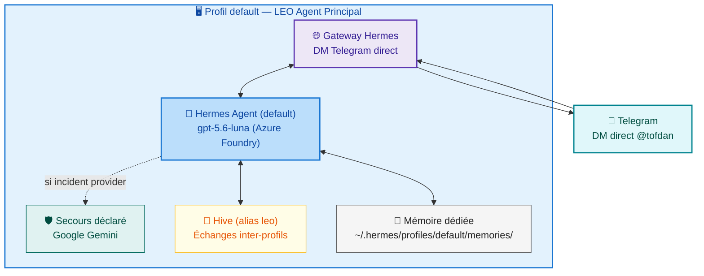
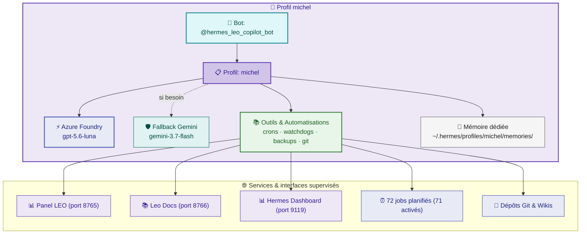
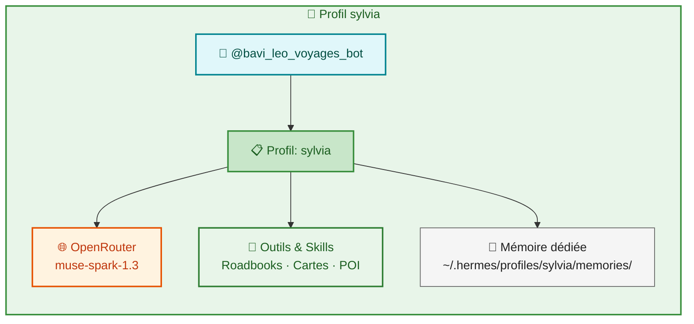
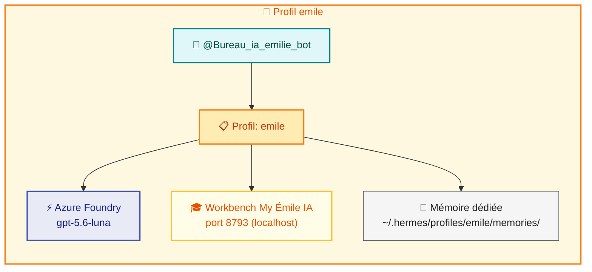
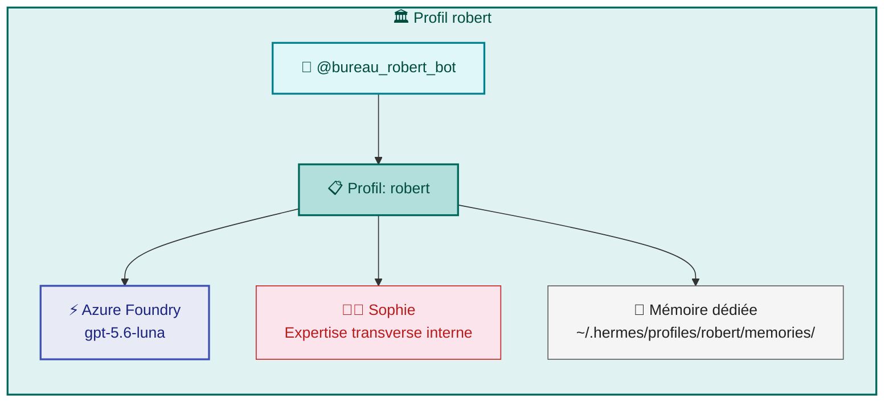
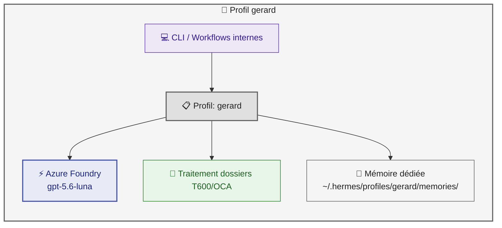
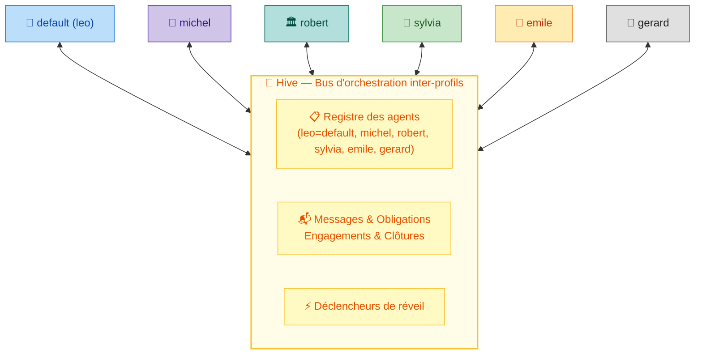

# 🔗 Architecture & Communication — Écosystème Hermes LEO

> **Page canonique de référence :** [`hermes/architecture.md`](architecture.md). Mesures vérifiées le **20/09/2026**.

Ce document détaille l'organisation des profils opérationnels Hermes, leurs passerelles de communication (gateways, DM et bots Telegram), le protocole d'échange inter-profils Hive, ainsi que les interfaces et services locaux actifs.

> [!IMPORTANT]
> **Principes d'architecture canonique :**
> - **LEO est un agent Hermes** (profil `default`) et non un bot Telegram autonome. Son accès s'effectue via le gateway Hermes en DM Telegram direct avec Christophe, sans handle public inventé.
> - **`leo`** est l'alias Hive du profil `default`, et non un septième profil d'exécution distinct.
> - **Gérard** est un profil opérationnel dédié aux dossiers T600/OCA (aucun bot Telegram n'est inventé sans preuve de déploiement).
> - **Six profils opérationnels** sont actifs au 20/09/2026 : `default`, `michel`, `robert`, `sylvia`, `emile` et `gerard`.
> - **Mémoire indépendante** : chaque profil dispose de son propre répertoire `memories/` hermétique (`~/.hermes/profiles/<nom>/memories/`). Aucune mémoire n'est partagée.
> - **Hive** assure la coordination asynchrone (messages, délégations, obligations) entre profils sans mutualiser leurs contextes de mémoire.

---

## Architecture globale — Profils, Interfaces & Routage

```mermaid
flowchart TD
    User["👤 Christophe<br/>━━━━━━━━━━"]

    subgraph LEO_MAIN["🦁 LEO — Agent Hermes Principal"]
        direction TB
        Agent["🤖 Hermes Agent<br/>Profil: default"]
        AF1["⚡ Azure Foundry<br/>gpt-5.6-luna"]
        Agent --> AF1
    end

    subgraph MICHEL["🔧 Michel — Infrastructure"]
        direction TB
        Agent2["🤖 Hermes Agent<br/>Profil: michel"]
        AF2["⚡ Azure Foundry<br/>gpt-5.6-luna"]
        Agent2 --> AF2
    end

    subgraph BAVI["🧭 Sylvia — Voyages"]
        direction TB
        Agent3["🤖 Hermes Agent<br/>Profil: sylvia"]
        OR3["🌐 OpenRouter<br/>muse-spark-1.3"]
        Agent3 --> OR3
    end

    subgraph EMILE["👤 Émile — Pédagogie & Formation"]
        direction TB
        Agent4["🤖 Hermes Agent<br/>Profil: emile"]
        AF4["⚡ Azure Foundry<br/>gpt-5.6-luna"]
        Agent4 --> AF4
    end

    subgraph ROBERT["🏛️ Robert — Conseil Stratégique"]
        direction TB
        Agent5["🤖 Hermes Agent<br/>Profil: robert"]
        AF5["⚡ Azure Foundry<br/>gpt-5.6-luna"]
        Agent5 --> AF5
    end

    subgraph GERARD["📁 Gérard — Dossiers T600/OCA"]
        direction TB
        Agent6["🤖 Hermes Agent<br/>Profil: gerard"]
        AF6["⚡ Azure Foundry<br/>gpt-5.6-luna"]
        Agent6 --> AF6
    end

    subgraph HIVE["🐝 Hive — Bus inter-profils"]
        direction TB
        H_Bus["Messages · Traçabilité · Obligations<br/>(alias LEO = default)"]
    end

    User -->|"DM Telegram (Gateway direct)"| LEO_MAIN
    User -->|"@hermes_leo_copilot_bot"| MICHEL
    User -->|"@bavi_leo_voyages_bot"| BAVI
    User -->|"@Bureau_ia_emilie_bot"| EMILE
    User -->|"@bureau_robert_bot"| ROBERT
    User -->|"CLI / Jobs internes"| GERARD

    Agent <--> H_Bus
    Agent2 <--> H_Bus
    Agent3 <--> H_Bus
    Agent4 <--> H_Bus
    Agent5 <--> H_Bus
    Agent6 <--> H_Bus

    style User fill:#e3f2fd,stroke:#1976d2,color:#0d47a1
    style LEO_MAIN fill:#e3f2fd,stroke:#1976d2,stroke-width:2px,color:#0d47a1
    style Agent fill:#bbdefb,stroke:#1976d2,color:#0d47a1
    style AF1 fill:#e8eaf6,stroke:#3f51b5,color:#1a237e
    style MICHEL fill:#ede7f6,stroke:#5e35b1,stroke-width:2px,color:#311b92
    style Agent2 fill:#d1c4e9,stroke:#5e35b1,color:#311b92
    style AF2 fill:#e8eaf6,stroke:#3f51b5,color:#1a237e
    style BAVI fill:#e8f5e9,stroke:#388e3c,stroke-width:2px,color:#1b5e20
    style Agent3 fill:#c8e6c9,stroke:#388e3c,color:#1b5e20
    style OR3 fill:#fff3e0,stroke:#e65100,color:#bf360c
    style EMILE fill:#fff8e1,stroke:#f57f17,stroke-width:2px,color:#e65100
    style Agent4 fill:#ffecb3,stroke:#f57f17,color:#bf360c
    style AF4 fill:#e8eaf6,stroke:#3f51b5,color:#1a237e
    style ROBERT fill:#e0f2f1,stroke:#00695c,stroke-width:2px,color:#004d40
    style Agent5 fill:#b2dfdb,stroke:#00695c,color:#004d40
    style AF5 fill:#e8eaf6,stroke:#3f51b5,color:#1a237e
    style GERARD fill:#f5f5f5,stroke:#616161,stroke-width:2px,color:#212121
    style Agent6 fill:#e0e0e0,stroke:#616161,color:#212121
    style AF6 fill:#e8eaf6,stroke:#3f51b5,color:#1a237e
    style HIVE fill:#fffde7,stroke:#fbc02d,stroke-width:2px,color:#f57f17
    style H_Bus fill:#fff9c4,stroke:#fbc02d,color:#e65100
```

> **Isolation mémoire :** Chaque profil dispose de son propre sous-dossier `memories/`. Plus aucune mémoire partagée n'est active dans l'architecture actuelle.

---

## 1. 🦁 LEO — L'Agent Hermes Principal

**LEO** est l'agent **Hermes Agent** principal (profil `default`) — le majordome IA et coordinateur de Christophe.
Il ne possède **pas de handle public Telegram** : les échanges s'effectuent en **DM direct avec Christophe** via le Gateway Hermes.

```mermaid
flowchart TB
    subgraph SERVEUR["🖥️ Profil default — LEO Agent Principal"]
        direction TB
        Gateway["🌐 Gateway Hermes<br/>DM Telegram direct"]
        Hermes["🦁 Hermes Agent (default)<br/>gpt-5.6-luna (Azure Foundry)"]
        Fallback["🛡️ Secours déclaré<br/>Google Gemini"]
        Hive_Node["🐝 Hive (alias leo)<br/>Échanges inter-profils"]
        Mem["💾 Mémoire dédiée<br/>~/.hermes/profiles/default/memories/"]

        Gateway <--> Hermes
        Hermes -.->|"si incident provider"| Fallback
        Hermes <--> Hive_Node
        Hermes <--> Mem
    end

    TG["📱 Telegram<br/>DM direct @tofdan"]

    TG --> Gateway
    Gateway --> TG

    style SERVEUR fill:#e3f2fd,stroke:#1976d2,stroke-width:2px,color:#0d47a1
    style Hermes fill:#bbdefb,stroke:#1976d2,stroke-width:2px,color:#0d47a1
    style Gateway fill:#ede7f6,stroke:#5e35b1,stroke-width:2px,color:#311b92
    style Fallback fill:#e0f2f1,stroke:#00695c,stroke-width:1px,color:#004d40
    style Hive_Node fill:#fffde7,stroke:#fbc02d,stroke-width:1px,color:#e65100
    style Mem fill:#f5f5f5,stroke:#616161,stroke-width:1px,color:#212121
    style TG fill:#e0f7fa,stroke:#00838f,stroke-width:2px,color:#004d40
```

### Fonctionnement & Caractéristiques

1. **Dialogue direct via Telegram** : Le gateway Hermes assure le pont sécurisé avec le compte Telegram de Christophe en messages directs.
2. **Identité canonique** : LEO est un agent autonome instancié sur le profil `default`. Aucun compte bot public n'est utilisé.
3. **Moteur principal** : Modèle `gpt-5.6-luna` via **Azure Foundry**, avec repli configuré vers Google Gemini.
4. **Coordination inter-profils** : LEO interagit avec les autres profils via le bus **Hive** sous l'alias `leo`.

---

## 2. 🔧 Michel — Infrastructure & Crons (`@hermes_leo_copilot_bot`)

Le profil `michel` est l'agent dédié à **l'infrastructure**, aux automatisations, aux sauvegardes, au monitoring et à la synchronisation documentaire.

```mermaid
flowchart TB
    subgraph MICHEL["🔧 Profil michel"]
        direction TB
        P1["📋 Profil: michel"]
        B1["📱 Bot: @hermes_leo_copilot_bot"]
        M1["⚡ Azure Foundry<br/>gpt-5.6-luna"]
        F1["🛡️ Fallback Gemini<br/>gemini-3.7-flash"]
        SKILLS["📚 Outils & Automatisations<br/>crons · watchdogs · backups · git"]
        MEM1["💾 Mémoire dédiée<br/>~/.hermes/profiles/michel/memories/"]
    end

    subgraph EXTERNE["🌐 Services & interfaces supervisés"]
        DASH1["📊 Panel LEO (port 8765)"]
        DOCS["📚 Leo Docs (port 8766)"]
        DASH2["📊 Hermes Dashboard (port 9119)"]
        CRONS["⏰ 72 jobs planifiés (71 activés)"]
        GH["🐙 Dépôts Git & Wikis"]
    end

    B1 --> P1
    P1 --> M1
    P1 -.->|"si besoin"| F1
    P1 --> MEM1
    P1 --> SKILLS

    SKILLS --> DASH1
    SKILLS --> DOCS
    SKILLS --> DASH2
    SKILLS --> CRONS
    SKILLS --> GH

    style MICHEL fill:#ede7f6,stroke:#5e35b1,stroke-width:2px,color:#311b92
    style P1 fill:#d1c4e9,stroke:#5e35b1,stroke-width:2px,color:#311b92
    style B1 fill:#e0f7fa,stroke:#00838f,stroke-width:2px,color:#004d40
    style M1 fill:#e8eaf6,stroke:#3f51b5,stroke-width:2px,color:#1a237e
    style F1 fill:#e0f2f1,stroke:#00695c,stroke-width:1px,color:#004d40
    style SKILLS fill:#e8f5e9,stroke:#2e7d32,stroke-width:2px,color:#1b5e20
    style MEM1 fill:#f5f5f5,stroke:#616161,stroke-width:1px,color:#212121
    style DASH1 fill:#ede7f6,stroke:#5e35b1,color:#311b92
    style DOCS fill:#ede7f6,stroke:#5e35b1,color:#311b92
    style DASH2 fill:#ede7f6,stroke:#5e35b1,color:#311b92
    style CRONS fill:#e8eaf6,stroke:#3949ab,color:#1a237e
    style GH fill:#e8eaf6,stroke:#3949ab,color:#1a237e
```

### Particularités de Michel

- **Interface** : Bot Telegram dédié `@hermes_leo_copilot_bot`.
- **Moteur configuré** : Azure Foundry `gpt-5.6-luna` (secours `custom:google/gemini-3.7-flash`).
- **Jobs planifiés** : 72 jobs dans `profiles/michel/cron/jobs.json` (71 activés, 70 `no_agent`, 2 pilotés par LLM).
- **Services locaux rattachés** :
    - Panel LEO (`http://localhost:8765`) : métriques, crons et pilotage.
    - Leo Docs (`http://localhost:8766`) : documentation servie localement.
    - Hermes Dashboard (`http://localhost:9119`) : interface Hermes.
- **Incident infrastructure suivi séparément** : Unité systemd Michel en boucle de restart (PID actif préexistant sur le gateway), documentée sans masquage et traitée dans le runbook infrastructure.

---

## 3. 🧭 Sylvia — Voyages & Camping-car (`@bavi_leo_voyages_bot`)

Le profil `sylvia` gère de manière isolée la préparation des roadbooks, les recherches d'itinéraires et la documentation voyages pour le camping-car.

```mermaid
flowchart LR
    subgraph BOT3["🧭 Profil sylvia"]
        direction TB
        P2["📋 Profil: sylvia"]
        B2["📱 @bavi_leo_voyages_bot"]
        M2["🌐 OpenRouter<br/>muse-spark-1.3"]
        S2["📝 Outils & Skills<br/>Roadbooks · Cartes · POI"]
        MEM2["💾 Mémoire dédiée<br/>~/.hermes/profiles/sylvia/memories/"]
    end

    B2 --> P2
    P2 --> M2
    P2 --> S2
    P2 --> MEM2

    style BOT3 fill:#e8f5e9,stroke:#388e3c,stroke-width:2px,color:#1b5e20
    style P2 fill:#c8e6c9,stroke:#388e3c,stroke-width:2px,color:#1b5e20
    style B2 fill:#e0f7fa,stroke:#00838f,stroke-width:2px,color:#004d40
    style M2 fill:#fff3e0,stroke:#e65100,stroke-width:2px,color:#bf360c
    style S2 fill:#e8f5e9,stroke:#2e7d32,stroke-width:2px,color:#1b5e20
    style MEM2 fill:#f5f5f5,stroke:#616161,stroke-width:1px,color:#212121
```

- **Interface** : Bot Telegram `@bavi_leo_voyages_bot`.
- **Moteur configuré** : OpenRouter avec le modèle `meta/muse-spark-1.3-contributor`.
- **Mémoire** : Indépendante (`~/.hermes/profiles/sylvia/memories/`).

---

## 4. 👤 Émile — Pédagogie & Formation (`@Bureau_ia_emilie_bot`)

Le profil `emile` accompagne les travaux de recherche, la rédaction de mémoire et les activités de formation.

```mermaid
flowchart LR
    subgraph BOT4["👤 Profil emile"]
        direction TB
        P3["📋 Profil: emile"]
        B3["📱 @Bureau_ia_emilie_bot"]
        M3["⚡ Azure Foundry<br/>gpt-5.6-luna"]
        S3["🎓 Workbench My Émile IA<br/>port 8793 (localhost)"]
        MEM3["💾 Mémoire dédiée<br/>~/.hermes/profiles/emile/memories/"]
    end

    B3 --> P3
    P3 --> M3
    P3 --> S3
    P3 --> MEM3

    style BOT4 fill:#fff8e1,stroke:#f57f17,stroke-width:2px,color:#e65100
    style P3 fill:#ffecb3,stroke:#f57f17,stroke-width:2px,color:#bf360c
    style B3 fill:#e0f7fa,stroke:#00838f,stroke-width:2px,color:#004d40
    style M3 fill:#e8eaf6,stroke:#3f51b5,stroke-width:2px,color:#1a237e
    style S3 fill:#fffde7,stroke:#fbc02d,stroke-width:2px,color:#e65100
    style MEM3 fill:#f5f5f5,stroke:#616161,stroke-width:1px,color:#212121
```

- **Interface** : Bot Telegram `@Bureau_ia_emilie_bot`.
- **Moteur configuré** : Azure Foundry `gpt-5.6-luna` (secours Google Gemini).
- **Service local associé** : Workbench My Émile IA (`http://localhost:8793` en écoute locale).
- **Mémoire** : Indépendante (`~/.hermes/profiles/emile/memories/`).

---

## 5. 🏛️ Robert — Conseil Stratégique (`@bureau_robert_bot`)

Le profil `robert` intervient sur les dossiers d'analyse stratégique, la gouvernance IT et les audits d'architecture.

```mermaid
flowchart LR
    subgraph BOT5["🏛️ Profil robert"]
        direction TB
        P4["📋 Profil: robert"]
        B4["📱 @bureau_robert_bot"]
        M4["⚡ Azure Foundry<br/>gpt-5.6-luna"]
        S4["👩‍💼 Sophie<br/>Expertise transverse interne"]
        MEM4["💾 Mémoire dédiée<br/>~/.hermes/profiles/robert/memories/"]
    end

    B4 --> P4
    P4 --> M4
    P4 --> S4
    P4 --> MEM4

    style BOT5 fill:#e0f2f1,stroke:#00695c,stroke-width:2px,color:#004d40
    style P4 fill:#b2dfdb,stroke:#00695c,stroke-width:2px,color:#004d40
    style B4 fill:#e0f7fa,stroke:#00838f,stroke-width:2px,color:#004d40
    style M4 fill:#e8eaf6,stroke:#3f51b5,stroke-width:2px,color:#1a237e
    style S4 fill:#fce4ec,stroke:#c62828,stroke-width:1px,color:#b71c1c
    style MEM4 fill:#f5f5f5,stroke:#616161,stroke-width:1px,color:#212121
```

- **Interface** : Bot Telegram `@bureau_robert_bot`.
- **Moteur configuré** : Azure Foundry `gpt-5.6-luna` (secours Google Gemini).
- **Expertise Sophie** : Capacité transverse d'audit intégrée au profil robert (aucun agent ou profil séparé).
- **Mémoire** : Indépendante (`~/.hermes/profiles/robert/memories/`).

---

## 6. 📁 Gérard — Dossiers T600/OCA (Profil opérationnel)

Le profil `gerard` assure le traitement spécialisé et l'indexation des dossiers documentaires T600/OCA.

```mermaid
flowchart LR
    subgraph PROF6["📁 Profil gerard"]
        direction TB
        P5["📋 Profil: gerard"]
        CLI5["💻 CLI / Workflows internes"]
        M5["⚡ Azure Foundry<br/>gpt-5.6-luna"]
        S5["📁 Traitement dossiers T600/OCA"]
        MEM5["💾 Mémoire dédiée<br/>~/.hermes/profiles/gerard/memories/"]
    end

    CLI5 --> P5
    P5 --> M5
    P5 --> S5
    P5 --> MEM5

    style PROF6 fill:#f5f5f5,stroke:#616161,stroke-width:2px,color:#212121
    style P5 fill:#e0e0e0,stroke:#616161,stroke-width:2px,color:#212121
    style CLI5 fill:#ede7f6,stroke:#5e35b1,stroke-width:1px,color:#311b92
    style M5 fill:#e8eaf6,stroke:#3f51b5,stroke-width:2px,color:#1a237e
    style S5 fill:#e8f5e9,stroke:#2e7d32,stroke-width:1px,color:#1b5e20
    style MEM5 fill:#f5f5f5,stroke:#616161,stroke-width:1px,color:#212121
```

- **Interface** : Profil opérationnel local déclenché par ligne de commande ou scripts internes (aucun bot Telegram fictif).
- **Moteur configuré** : Azure Foundry `gpt-5.6-luna` (secours Google Gemini).
- **Mémoire** : Indépendante (`~/.hermes/profiles/gerard/memories/`).

---

## 7. 🐝 Hive — Coordination & Traçabilité Inter-profils

**Hive** constitue le protocole asynchrone d'orchestration et de coordination entre les différents profils Hermes.

```mermaid
flowchart TB
    subgraph HIVE_BUS["🐝 Hive — Bus d'orchestration inter-profils"]
        direction LR
        Registry["📋 Registre des agents<br/>(leo=default, michel, robert, sylvia, emile, gerard)"]
        Queue["📬 Messages & Obligations<br/>Engagements & Clôtures"]
        Wakeup["⚡ Déclencheurs de réveil"]
    end

    P_Def["🦁 default (leo)"] <--> HIVE_BUS
    P_Mich["🔧 michel"] <--> HIVE_BUS
    P_Rob["🏛️ robert"] <--> HIVE_BUS
    P_Sylv["🧭 sylvia"] <--> HIVE_BUS
    P_Emil["👤 emile"] <--> HIVE_BUS
    P_Ger["📁 gerard"] <--> HIVE_BUS

    style HIVE_BUS fill:#fffde7,stroke:#fbc02d,stroke-width:2px,color:#e65100
    style Registry fill:#fff9c4,stroke:#fbc02d,color:#e65100
    style Queue fill:#fff9c4,stroke:#fbc02d,color:#e65100
    style Wakeup fill:#fff9c4,stroke:#fbc02d,color:#e65100
    style P_Def fill:#bbdefb,stroke:#1976d2,color:#0d47a1
    style P_Mich fill:#d1c4e9,stroke:#5e35b1,color:#311b92
    style P_Rob fill:#b2dfdb,stroke:#00695c,color:#004d40
    style P_Sylv fill:#c8e6c9,stroke:#388e3c,color:#1b5e20
    style P_Emil fill:#ffecb3,stroke:#f57f17,color:#bf360c
    style P_Ger fill:#e0e0e0,stroke:#616161,color:#212121
```

### Principes de fonctionnement

1. **Régime des obligations** : Lorsqu'un agent délègue une tâche ou formule une requête à un pair, une obligation traçable est ouverte. Elle ne peut être close que par une preuve d'accomplissement validée.
2. **Réveils ciblés** : Les messages déposés dans Hive déclenchent les sessions des agents destinataires via leurs gateways respectifs.
3. **Absence de fuite mémoire** : Hive transporte des requêtes et des résultats textuels typés ; il n'opère aucune fusion des contextes mémoires des agents.
4. **Diffusion sans réouvertures parasites** : Les broadcasts collectifs sont éclatés en réceptions unitaires afin de garantir une clôture déterministe.

---

## 8. Schéma complet — Flux de données & Interfaces

```mermaid
flowchart TB
    User["👤 Christophe"]

    subgraph TELEGRAM["📱 Interfaces & Passerelles"]
        DM["DM Telegram direct<br/>→ LEO (default)"]
        COP["@hermes_leo_copilot_bot<br/>→ michel"]
        VOY["@bavi_leo_voyages_bot<br/>→ sylvia"]
        EMI["@Bureau_ia_emilie_bot<br/>→ emile"]
        ROB["@bureau_robert_bot<br/>→ robert"]
        LOC["CLI / Jobs internes<br/>→ gerard"]
    end

    subgraph HERMES["🖥️ Hermes Agent (6 profils opérationnels)"]
        DEF["default<br/>(alias Hive: leo)"]
        MIC["michel"]
        SYL["sylvia"]
        EMI_P["emile"]
        ROB_P["robert"]
        GER["gerard"]
    end

    subgraph LLM["☁️ Providers & Modèles"]
        AF["Azure Foundry<br/>gpt-5.6-luna"]
        OR["OpenRouter<br/>muse-spark-1.3"]
        GEM["Google Gemini<br/>(fallback déclaré)"]
    end

    subgraph HIVE_LAYER["🐝 Coordination Hive"]
        HIVE_CORE["Bus d'obligations & échanges"]
    end

    subgraph OUTPUT["📊 Services locaux & Automatisations"]
        PANEL["Panel LEO (port 8765)"]
        DOCS["Leo Docs (port 8766)"]
        DASH["Hermes Dashboard (port 9119)"]
        EMILE_APP["My Émile IA (port 8793)"]
        CRON["72 jobs Michel (71 activés)"]
        GH["Wikis & Dépôts Git"]
    end

    User --> DM
    User --> COP
    User --> VOY
    User --> EMI
    User --> ROB
    User --> LOC

    DM --> DEF
    COP --> MIC
    VOY --> SYL
    EMI --> EMI_P
    ROB --> ROB_P
    LOC --> GER

    DEF <--> HIVE_CORE
    MIC <--> HIVE_CORE
    SYL <--> HIVE_CORE
    EMI_P <--> HIVE_CORE
    ROB_P <--> HIVE_CORE
    GER <--> HIVE_CORE

    DEF --> AF
    MIC --> AF
    EMI_P --> AF
    ROB_P --> AF
    GER --> AF
    SYL --> OR

    DEF -.->|"secours"| GEM
    MIC -.->|"secours"| GEM
    EMI_P -.->|"secours"| GEM
    ROB_P -.->|"secours"| GEM
    GER -.->|"secours"| GEM

    MIC --> PANEL
    MIC --> DOCS
    MIC --> DASH
    MIC --> CRON
    MIC --> GH
    EMI_P --> EMILE_APP

    style User fill:#e3f2fd,stroke:#1976d2,color:#0d47a1
    style TELEGRAM fill:#e0f7fa,stroke:#00838f,stroke-width:2px,color:#004d40
    style HERMES fill:#ede7f6,stroke:#5e35b1,stroke-width:2px,color:#311b92
    style LLM fill:#e8eaf6,stroke:#3f51b5,stroke-width:2px,color:#1a237e
    style HIVE_LAYER fill:#fffde7,stroke:#fbc02d,stroke-width:2px,color:#e65100
    style OUTPUT fill:#e8eaf6,stroke:#3949ab,stroke-width:2px,color:#1a237e
```

---

## 9. Matrice de routage & Synthèse des profils

### Routage fonctionnel

| Tâche | Vers qui | Interface / Canal | Provider & Modèle | Profil | Mémoire |
|:---|:---|:---|:---|:---|:---|
| Dialogue quotidien, coordination générale, veille | **LEO** | DM Telegram direct (Gateway) | Azure Foundry (`gpt-5.6-luna`) | `default` | Indépendante |
| Infrastructure, crons, dashboards, sauvegardes | **Michel** | Bot `@hermes_leo_copilot_bot` | Azure Foundry (`gpt-5.6-luna`) | `michel` | Indépendante |
| Roadbooks, logistique voyages camping-car | **Sylvia** | Bot `@bavi_leo_voyages_bot` | OpenRouter (`muse-spark-1.3`) | `sylvia` | Indépendante |
| Pédagogie, suivi de mémoire, formation | **Émile** | Bot `@Bureau_ia_emilie_bot` | Azure Foundry (`gpt-5.6-luna`) | `emile` | Indépendante |
| Conseil stratégique IT, gouvernance, audits | **Robert** | Bot `@bureau_robert_bot` | Azure Foundry (`gpt-5.6-luna`) | `robert` | Indépendante |
| Traitement et suivi des dossiers T600/OCA | **Gérard** | Profil local (CLI / jobs internes) | Azure Foundry (`gpt-5.6-luna`) | `gerard` | Indépendante |

### Synthèse des interfaces

| Identité | Nature opérationnelle | Interface Telegram ? | Modèle configuré | Profil Hermes |
|:---|:---|:---|:---|:---|
| **LEO** | Agent Hermes principal | Non — DM direct (Gateway) | `gpt-5.6-luna` | `default` (alias Hive: `leo`) |
| **Michel** | Copilote infrastructure & crons | Oui — `@hermes_leo_copilot_bot` | `gpt-5.6-luna` | `michel` |
| **Sylvia** | Spécialiste voyages | Oui — `@bavi_leo_voyages_bot` | `meta/muse-spark-1.3-contributor` | `sylvia` |
| **Émile** | Assistant pédagogique | Oui — `@Bureau_ia_emilie_bot` | `gpt-5.6-luna` | `emile` |
| **Robert** | Conseiller stratégique IA | Oui — `@bureau_robert_bot` | `gpt-5.6-luna` | `robert` |
| **Gérard** | Spécialiste dossiers T600/OCA | Non — Ligne de commande / scripts | `gpt-5.6-luna` | `gerard` |

> **Règle fondamentale d'identification :**
> **LEO n'est pas un bot Telegram.** LEO est l'agent Hermes central de Christophe. Les bots Telegram sont des passerelles de profils spécialisés isolés.

---

## 10. 🏛️ Repères historiques datés

> [!NOTE]
> **Encart historique (juillet — août 2026) :**
> Les éléments suivants sont conservés à des fins de traçabilité historique et d'archivage des versions antérieures :
> - **11/07/2026 — Suppression de la mémoire partagée** : Clôture du mécanisme de partage de contexte transverse. Remplacement par l'isolation étanche où chaque profil gère son répertoire `memories/`.
> - **26/07/2026 — Refonte des profils et copilotes** : Renommage du profil `bureau-robert` en `robert` ; centralisation de la gestion des crons sous le profil `michel` (succédant à l'ancien alias `leo-copilot`).
> - **Ancienne pile LLM** : Configuration antérieure sous DeepSeek V4 (Flash / Pro) et Ollama local (`qwen2.5:7b`), aujourd'hui remplacée par la configuration Azure Foundry et OpenRouter mesurée au 20/09/2026.
> - **Anciens compteurs de crons** : Des instantanés historiques mentionnaient 45 à 58 crons actifs en juillet et août 2026. L'état actuel mesuré au 20/09/2026 est de **72 jobs** planifiés dans `profiles/michel/cron/jobs.json` (71 activés, 70 `no_agent`, 2 LLM).

---

*Document mis à jour le 20/09/2026 — LEO 🦁 & Michel 🔧*

> 🤖 Mesures vérifiées le 20/09/2026 — 6 profils opérationnels, 72 jobs Michel, 4 services locaux audités.
