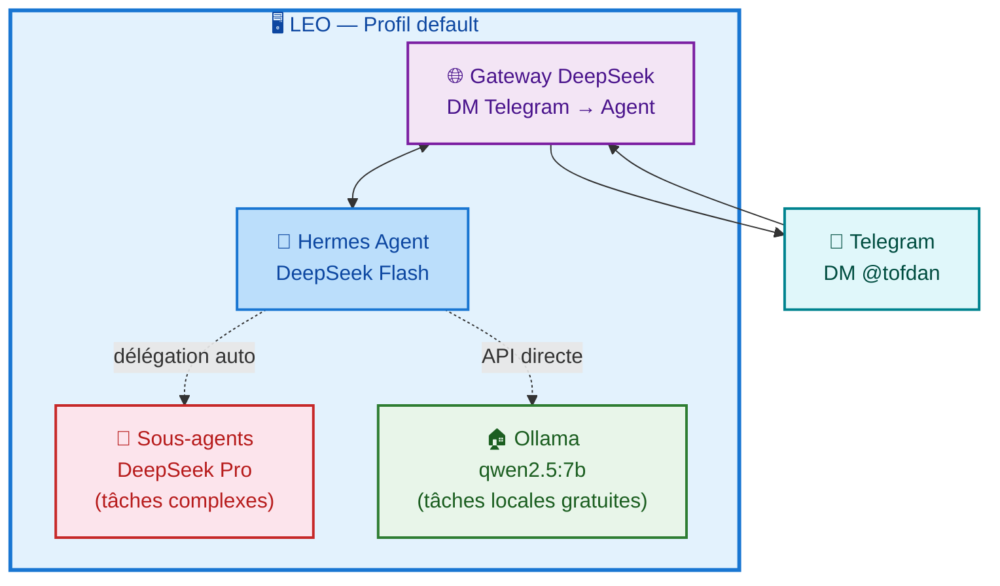
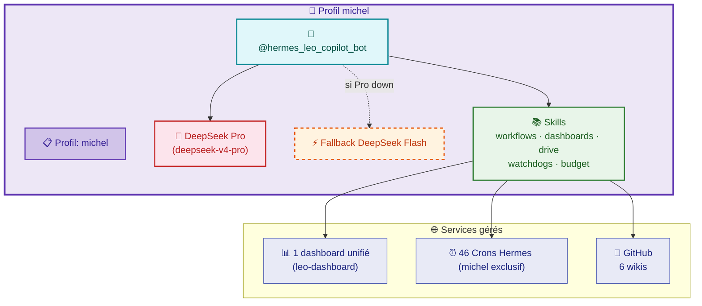
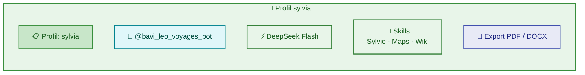
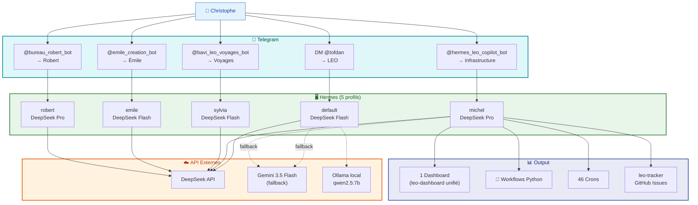

> Dernière mise à jour : **26/07/2026** (corrections architecture, mémoire, crons, prix)

> ⚠️ **Changements 26/07/2026** : mémoire partagée supprimée (11/07/2026), profils indépendants, crons 46, renommage Leo Copilot → Michel, correction prix DeepSeek Pro.

---

## Architecture — Profils, Bots & Communication

```mermaid
flowchart TD
    User["👤 Christophe<br/>━━━━━━━━━━"]

    subgraph LEO_MAIN["🦁 LEO — Agent Hermes Principal"]
        direction LR
        Agent["🤖 Hermes Agent<br/>Profil: default"]
        DS_Flash["⚡ DeepSeek Flash<br/>Dialogue quotidien"]
        DS_Pro_Sub["🧠 DeepSeek Pro<br/>Sous-agents"]
    end

    subgraph MICHEL["🔧 Michel — Infrastructure"]
        direction LR
        Agent2["🤖 Hermes Agent<br/>Profil: michel"]
        DS_Pro["🧠 DeepSeek Pro<br/>Code · Infra · Workflows"]
    end

    subgraph BAVI["🧭 BAVI LEO — Voyages"]
        direction LR
        Agent3["🤖 Hermes Agent<br/>Profil: sylvia"]
        DS_Flash2["⚡ DeepSeek Flash<br/>Roadbooks"]
    end

    subgraph EMILE["🎭 Émile — Création"]
        direction LR
        Agent4["🤖 Hermes Agent<br/>Profil: emile"]
        DS_Flash3["⚡ DeepSeek Flash<br/>Génération contenu"]
    end

    subgraph ROBERT["🎯 Robert — Conseil Stratégique IA"]
        direction LR
        Agent5["🤖 Hermes Agent<br/>Profil: robert"]
        SOPHIE["👩‍💼 Sophie *<br/>Abstraction experte transverse<br/>DeepSeek Pro"]
    end

    User -->|"DM Telegram"| LEO_MAIN
    User -->|"@hermes_leo_copilot_bot"| MICHEL
    User -->|"@bavi_leo_voyages_bot"| BAVI
    User -->|"@emile_creation_bot"| EMILE
    User -->|"@bureau_robert_bot"| ROBERT

    Agent --> DS_Flash
    Agent -.->|"délégation"| DS_Pro_Sub

    Agent2 --> DS_Pro

    Agent3 --> DS_Flash2

    Agent4 --> DS_Flash3

    Agent5 --> SOPHIE

    style User fill:#e3f2fd,stroke:#1976d2,color:#0d47a1
    style LEO_MAIN fill:#e3f2fd,stroke:#1976d2,stroke-width:3px,color:#0d47a1
    style Agent fill:#bbdefb,stroke:#1976d2,color:#0d47a1
    style DS_Flash fill:#e8f5e9,stroke:#2e7d32,color:#1b5e20
    style DS_Pro_Sub fill:#fce4ec,stroke:#c62828,color:#b71c1c
    style MICHEL fill:#ede7f6,stroke:#5e35b1,stroke-width:3px,color:#311b92
    style Agent2 fill:#d1c4e9,stroke:#5e35b1,color:#311b92
    style DS_Pro fill:#fce4ec,stroke:#c62828,color:#b71c1c
    style BAVI fill:#e8f5e9,stroke:#388e3c,stroke-width:3px,color:#1b5e20
    style Agent3 fill:#c8e6c9,stroke:#388e3c,color:#1b5e20
    style DS_Flash2 fill:#e8f5e9,stroke:#2e7d32,color:#1b5e20
    style EMILE fill:#fff3e0,stroke:#e65100,stroke-width:3px,color:#bf360c
    style Agent4 fill:#ffecb3,stroke:#e65100,color:#bf360c
    style DS_Flash3 fill:#e8f5e9,stroke:#2e7d32,color:#1b5e20
    style ROBERT fill:#e0f2f1,stroke:#00695c,stroke-width:3px,color:#004d40
    style Agent5 fill:#b2dfdb,stroke:#00695c,color:#004d40
    style SOPHIE fill:#fce4ec,stroke:#c62828,color:#b71c1c
```

> **\* Sophie** : abstraction représentant la capacité d'expertise transverse du profil robert, pas un agent ou profil séparé.

**Mémoire** : chaque profil a sa propre mémoire indépendante. Plus de mémoire partagée depuis le 11/07/2026.

---

## 1. 🦁 LEO — L'Agent Hermes Principal

**LEO** est l'agent **Hermes Agent** — ton majordome IA. Pas de handle Telegram : tu lui parles en DM, le gateway fait le pont.

```mermaid
flowchart TB
    subgraph SERVEUR["🖥️ LEO — Profil default"]
        direction TB
        Gateway["🌐 Gateway DeepSeek<br/>DM Telegram → Agent"]
        Hermes["🦁 Hermes Agent<br/>DeepSeek Flash"]
        SubAgent["🧠 Sous-agents<br/>DeepSeek Pro<br/>(tâches complexes)"]
        Ollama["🏠 Ollama<br/>qwen2.5:7b<br/>(tâches locales gratuites)"]

        Gateway <--> Hermes
        Hermes -.->|"délégation auto"| SubAgent
        Hermes -.->|"API directe"| Ollama
    end

    TG["📱 Telegram<br/>DM @tofdan"]

    TG --> Gateway
    Gateway --> TG

    style SERVEUR fill:#e3f2fd,stroke:#1976d2,stroke-width:3px,color:#0d47a1
    style Hermes fill:#bbdefb,stroke:#1976d2,stroke-width:2px,color:#0d47a1
    style Gateway fill:#f3e5f5,stroke:#7b1fa2,stroke-width:2px,color:#4a148c
    style SubAgent fill:#fce4ec,stroke:#c62828,stroke-width:2px,color:#b71c1c
    style Ollama fill:#e8f5e9,stroke:#2e7d32,stroke-width:2px,color:#1b5e20
    style TG fill:#e0f7fa,stroke:#00838f,stroke-width:2px,color:#004d40
```

### Comment ça marche

1. **Tu parles à LEO via Telegram** — le Gateway DeepSeek fait le pont
2. **LEO n'a pas de handle** — réponse en DM direct
3. **Tâches complexes** → sous-agents DeepSeek Pro automatiquement
4. **Tâches locales** → Ollama (gratuit, classification, parsing)

---

## 2. 🔧 @hermes_leo_copilot_bot — Infrastructure

Bot spécialisé **infrastructure** (workflows Python, serveurs, déploiements, watchdogs, dashboards). Propulsé par **DeepSeek Pro**.

```mermaid
flowchart TB
    subgraph MICHEL["🔧 Profil michel"]
        direction TB
        P1["📋 Profil: michel"]
        B1["📱 @hermes_leo_copilot_bot"]
        M1["🧠 DeepSeek Pro<br/>(deepseek-v4-pro)"]
        F1["⚡ Fallback DeepSeek Flash"]
        SKILLS["📚 Skills<br/>workflows · dashboards · drive<br/>watchdogs · budget"]
    end

    subgraph EXTERNE["🌐 Services gérés"]
        DASH["📊 1 dashboard unifié<br/>(leo-dashboard)"]
        CRONS["⏰ 46 Crons Hermes (michel exclusif)"]
        GH["🐙 GitHub<br/>6 wikis"]
    end

    B1 --> M1
    B1 -.->|"si Pro down"| F1
    B1 --> SKILLS

    SKILLS --> DASH
    SKILLS --> CRONS
    SKILLS --> GH

    style MICHEL fill:#ede7f6,stroke:#5e35b1,stroke-width:3px,color:#311b92
    style P1 fill:#d1c4e9,stroke:#5e35b1,stroke-width:2px,color:#311b92
    style B1 fill:#e0f7fa,stroke:#00838f,stroke-width:2px,color:#004d40
    style M1 fill:#fce4ec,stroke:#c62828,stroke-width:2px,color:#b71c1c
    style F1 fill:#fff3e0,stroke:#e65100,stroke-width:2px,stroke-dasharray:5,color:#bf360c
    style SKILLS fill:#e8f5e9,stroke:#2e7d32,stroke-width:2px,color:#1b5e20
    style DASH fill:#e8eaf6,stroke:#3949ab,color:#1a237e
    style CRONS fill:#e8eaf6,stroke:#3949ab,color:#1a237e
    style GH fill:#e8eaf6,stroke:#3949ab,color:#1a237e
```

**Particularités :**
- **Mémoire indépendante** : chaque profil a sa propre mémoire. Plus de sync mémoire depuis le 11/07/2026.
- **Moteurs** : DeepSeek V4 Flash ($0.14/$0.28) + DeepSeek V4 Pro ($0.435/$0.87) + fallback deepseek-v4-flash → gemini-3.5-flash → qwen2.5:7b
- **Focus** : infrastructure uniquement, sauf demande explicite de Christophe

---

## 3. 🧭 @bavi_leo_voyages_bot — Voyages

Bot isolé pour les roadbooks camping-car. Les amis et la famille l'utilisent.

```mermaid
flowchart LR
    subgraph BOT2["🧭 Profil sylvia"]
        direction TB
        P2["📋 Profil: sylvia"]
        B2["📱 @bavi_leo_voyages_bot"]
        M2["⚡ DeepSeek Flash"]
        S2["📝 Skills<br/>Sylvie · Maps · Wiki"]
        E2["📄 Export PDF / DOCX"]
    end

    style BOT2 fill:#e8f5e9,stroke:#388e3c,stroke-width:3px,color:#1b5e20
    style P2 fill:#c8e6c9,stroke:#388e3c,stroke-width:2px,color:#1b5e20
    style B2 fill:#e0f7fa,stroke:#00838f,stroke-width:2px,color:#004d40
    style M2 fill:#e8f5e9,stroke:#2e7d32,stroke-width:2px,color:#1b5e20
    style S2 fill:#e8f5e9,stroke:#2e7d32,stroke-width:2px,color:#1b5e20
    style E2 fill:#e8eaf6,stroke:#3949ab,stroke-width:2px,color:#1a237e
```

---

## 4. Schéma complet — Flux de données

```mermaid
flowchart TB
    User["👤 Christophe"]

    subgraph TELEGRAM["📱 Telegram"]
        DM["DM @tofdan<br/>→ LEO"]
        COP["@hermes_leo_copilot_bot<br/>→ Infrastructure"]
        VOY["@bavi_leo_voyages_bot<br/>→ Voyages"]
        EMI["@emile_creation_bot<br/>→ Émile"]
        ROB["@bureau_robert_bot<br/>→ Robert"]
    end

    subgraph HERMES["🖥️ Hermes (5 profils)"]
        DEF["default<br/>DeepSeek Flash"]
        LCP["michel<br/>DeepSeek Pro"]
        BAV["sylvia<br/>DeepSeek Flash"]
        EMILE["emile<br/>DeepSeek Flash"]
        BUR["robert<br/>DeepSeek Pro"]
    end

    subgraph API["☁️ API Externes"]
        DS["DeepSeek API"]
        GEM["Gemini 3.5 Flash<br/>(fallback)"]
        OLL["Ollama local<br/>qwen2.5:7b"]
    end

    subgraph OUTPUT["📊 Output"]
        DASH["1 Dashboard<br/>(leo-dashboard unifié)"]
        WFL["🐍 Workflows Python"]
        CRON["46 Crons"]
        ISSUES["leo-tracker<br/>GitHub Issues"]
    end

    User --> DM
    User --> COP
    User --> VOY
    User --> EMI
    User --> ROB

    DM --> DEF
    COP --> LCP
    VOY --> BAV
    EMI --> EMILE
    ROB --> BUR

    DEF --> DS
    LCP --> DS
    BAV --> DS
    EMILE --> DS
    BUR --> DS

    DEF -.->|"fallback"| GEM
    DEF -.-> OLL
    LCP -.->|"fallback"| GEM

    LCP --> DASH
    LCP --> WFL
    LCP --> CRON
    LCP --> ISSUES

    style User fill:#e3f2fd,stroke:#1976d2,color:#0d47a1
    style TELEGRAM fill:#e0f7fa,stroke:#00838f,stroke-width:2px,color:#004d40
    style HERMES fill:#e8f5e9,stroke:#2e7d32,stroke-width:2px,color:#1b5e20
    style API fill:#fff3e0,stroke:#e65100,stroke-width:2px,color:#bf360c
    style OUTPUT fill:#e8eaf6,stroke:#3949ab,stroke-width:2px,color:#1a237e
```

---

## 5. Routage

| Tâche | Vers qui | Modèle | Profil |
|:------|:---------|:-------|:-------|
| Dialogue général, config, veille | **LEO** (DM) | DeepSeek Flash | `default` |
| Code, API, debug, analyses complexes | Sous-agent auto | DeepSeek Pro | `default` |
| Infrastructure (dashboards, déploiements, crons) | → `@hermes_leo_copilot_bot` | **DeepSeek Pro** | `michel` |
| Roadbooks, voyages camping-car | → `@bavi_leo_voyages_bot` | DeepSeek Flash | `sylvia` |
| Création de contenu, rédaction | → `@emile_creation_bot` | DeepSeek Flash | `emile` |
| Conseil stratégique IA, analyses métier | → `@bureau_robert_bot` | DeepSeek Pro | `robert` |
| Classification emails, parsing local | Ollama (LEO) | qwen2.5:7b | API directe |

---

## Résumé

| Concept | C'est quoi ? | Handle Telegram ? | Moteur | Profil |
|:--------|:-------------|:------------------|:-------|:-------|
| **LEO** | Agent Hermes principal | Non — DM direct | DeepSeek Flash + Pro | `default` |
| **@hermes_leo_copilot_bot** | Bot infrastructure | Oui | **DeepSeek Pro** | `michel` |
| **@bavi_leo_voyages_bot** | Bot voyages | Oui | DeepSeek Flash | `sylvia` |
| **@emile_creation_bot** | Bot création contenu | Oui | DeepSeek Flash | `emile` |
| **@bureau_robert_bot** | Conseil stratégique IA | Oui | DeepSeek Pro | `robert` |

**LEO n'est pas un bot Telegram. LEO est ton majordome IA.** Les bots sont des extensions spécialisées avec leurs propres profils, mémoires et accès.

---

*Document mis à jour le 26/07/2026 — Michel 🔧*

> 🤖 Dernier audit : 26/07/2026 à 12:00 (UTC+2)
