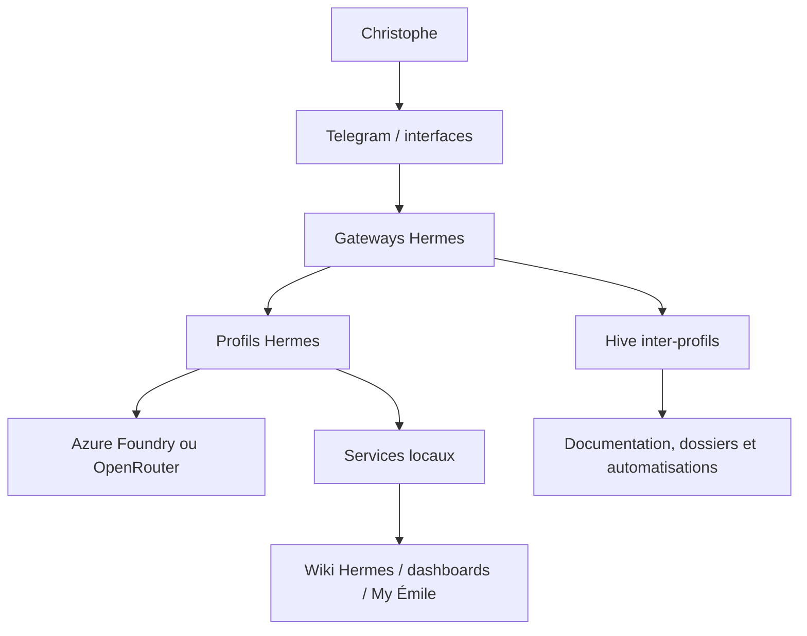

# Architecture Hermes LEO — état de référence

> **Page canonique de l'architecture actuelle.** Mesures vérifiées le **20/09/2026**. Les pages historiques conservent leur contexte et ne doivent pas être lues comme un état courant.

## Périmètre et sources

Cette page décrit l'installation Hermes Agent de Christophe telle qu'observée sur LEO. Les chiffres dynamiques sont des instantanés :

- profils et modèles : `~/.hermes/profiles/*/config.yaml` ;
- jobs planifiés : `~/.hermes/profiles/michel/cron/jobs.json` ;
- services et ports : processus actifs et `ss -ltnp` ;
- version : `/home/tofdan/.hermes/venv/bin/hermes --version` ;
- santé détaillée : dashboards locaux et rapports Michel.

Quand une valeur change, cette page doit être mise à jour avec sa date de mesure et sa source.

## Vue d'ensemble



Hermes Agent est le socle d'exécution. LEO est l'agent principal ; les autres profils sont des agents spécialisés ou des profils opérationnels indépendants. Les gateways relient les profils aux interfaces autorisées.

## Profils et routage mesurés

Six profils opérationnels ont été observés le 20/09/2026 :

| Profil | Rôle | Provider principal | Modèle configuré | Fallback déclaré |
|---|---|---|---|---|
| `default` | LEO, dialogue et pilotage | Azure Foundry | `gpt-5.6-luna` | Google Gemini |
| `michel` | infrastructure, crons et déploiements | Azure Foundry | `gpt-5.6-luna` | Google Gemini |
| `robert` | conseil stratégique | Azure Foundry | `gpt-5.6-luna` | Google Gemini |
| `emile` | assistant professionnel Émilie (My Émile IA Workbench) | Azure Foundry | `gpt-5.6-luna` | Google Gemini |
| `gerard` | astronomie, astrophotographie, site tofdan et documentation | Azure Foundry | `gpt-5.6-luna` | Google Gemini |
| `sylvia` | voyages | OpenRouter | `meta/muse-spark-1.3-contributor` | selon sa configuration |

`leo` est l'alias Hive du profil `default`, pas un septième profil d'exécution. Les profils disposent de leurs propres configurations, sessions et mémoires ; il ne faut pas présenter une mémoire partagée comme architecture actuelle.

> [!NOTE]
> **Évolution des rôles opérationnels :**
> - **Émile** n'est plus un assistant pédagogique ou de mémoire (cette phase initiale de formation étant achevée). Il est l'assistant professionnel d'Émilie au sein de My Émile IA Workbench (développé via Avenyra) pour rédiger, structurer et gérer notes, rapports, activités et documents professionnels (avec validation humaine).
> - **Gérard** n'est pas limité aux dossiers T600/OCA (qui constituent un projet parmi d'autres). Il est l'assistant de Christophe pour ses activités d'astronomie et d'astrophotographie, le wiki et le site tofdan liés à l'astronomie, ainsi que la documentation générale et son étude comme guide astronomie.

Les modèles effectifs doivent être confirmés par la configuration chargée et, lorsque nécessaire, par `session_model_usage`. Un nom de modèle configuré n'est pas à lui seul une preuve d'appel réussi.

## Gateways et interfaces

Les gateways observées sont séparées par profil. Les interfaces et services observés sont :

| Service | Port | Portée observée | Fonction |
|---|---:|---|---|
| Panel LEO | 8765 | accessible réseau | métriques, crons et pilotage |
| Leo Docs | 8766 | accessible réseau | explorateur documentaire |
| Hermes dashboard | 9119 | accessible réseau | interface Hermes |
| My Émile IA | 8793 | localhost | workbench professionnel Émilie (Avenyra) |

La présence d'un processus ne suffit pas à déclarer un service sain : la route HTTP et le contenu servi doivent être contrôlés.

## Automatisations et crons

Le fichier de référence du profil Michel contient, lors de la mesure du 20/09/2026 :

```text
72 jobs
71 activés
70 no_agent
2 jobs pilotés par un agent
```

Ces nombres concernent `profiles/michel/cron/jobs.json` uniquement. Ils ne doivent pas être additionnés avec un crontab hôte sans mesure séparée. Les familles observées comprennent notamment : documentation, doc-watch, synchronisation des crons, auto-commit, collecte KPI, dashboards, sauvegarde, watchdogs et Hive.

Le nombre de jobs est dynamique. Les pages qui affichent un instantané doivent indiquer sa date et son fichier source ; les tableaux exhaustifs doivent être générés depuis le fichier de référence.

## Documentation et synchronisation

Le Wiki Hermes est stocké dans :

```text
/home/tofdan/Projets_Dev/hermes-wiki
```

Les pipelines documentaires observés comprennent :

- `docs-update` ;
- `doc-watch-auto` ;
- `doc-crons-sync` ;
- auto-commit des wikis.

`doc-watch-snapshot.py` surveille notamment le Wiki Hermes, BAVI_LEO, wiki-oca, voyages-wiki et le guide Christophe. Toute modification de périmètre doit être répercutée dans la source du pipeline et vérifiée par un run réel.

## Incident à suivre séparément

Au moment de l'audit, Michel était opérationnel mais son unité systemd tentait aussi de redémarrer un gateway alors qu'un processus Michel existait déjà. Cet état produisait une boucle de redémarrage observée dans les journaux.

Cette anomalie relève du runbook infrastructure Michel. Elle ne doit pas être masquée par la documentation et ne doit pas être corrigée dans le lot éditorial sans mandat infrastructure distinct.

## Règles de maintenance

1. Mettre à jour cette page après toute évolution structurante.
2. Citer la source et la date de mesure pour tout chiffre.
3. Conserver les pages historiques avec un bandeau explicite plutôt que réécrire leur passé.
4. Corriger les fichiers générés dans leur script source, puis régénérer.
5. Vérifier le build MkDocs et la page servie avant de déclarer la mise à jour livrée.

> Dernière mesure : **20/09/2026** — LEO et Michel.
