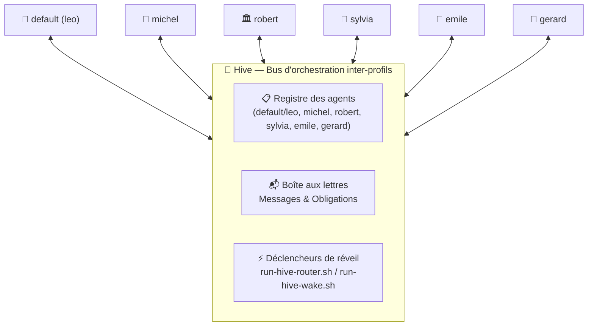
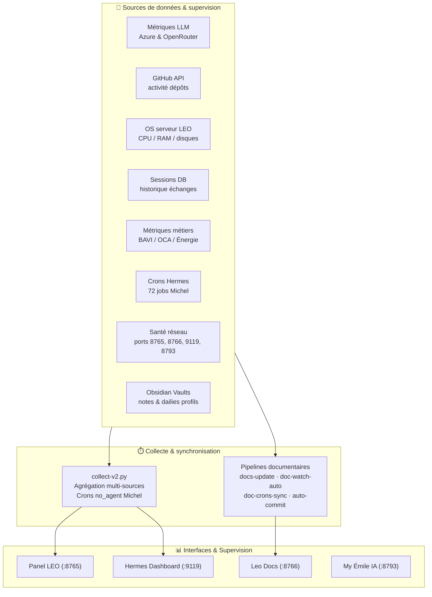

# 🏗️ Architecture Hermes LEO — Référence Complète

> **Page canonique unique de l'architecture actuelle.** Mesures vérifiées le **21/09/2026**.
> Ce document consolide l'ensemble des spécifications d'architecture, des profils, des passerelles de communication, du protocole Hive, des services locaux, des ordonnanceurs et des pipelines de supervision.

---

## 1. Identité Hermes/LEO, profils, bots et gateways

La compréhension du système repose sur une distinction claire entre le moteur d'exécution, l'agent central, les profils opérationnels et leurs interfaces :

```
Telegram (DM Christophe) ──→ Gateway Hermes ──→ Agent LEO (profil default) ──→ Azure Foundry (gpt-5.6-luna)
```

- **Hermes Agent** est le **socle d'exécution unifié** (runtime d'agents IA open-source). Il fournit la gestion des profils, l'exécution des skills, la planification des tâches (cron) et les passerelles (gateways).
- **LEO** est l'**agent Hermes principal** (exécuté sur le profil `default`). Il assume le rôle de coordinateur transverse et de majordome IA pour Christophe.
    - **LEO n'est pas un bot Telegram public** : son interface d'échange est un **DM Telegram direct** avec Christophe via le Gateway Hermes, sans aucun handle public inventé.
    - **`leo`** est l'alias de communication du profil `default` sur le bus Hive, et non un septième profil d'exécution distinct.
- **Les Profils Hermes** sont des **environnements d'exécution isolés et étanches**. Chaque profil dispose de son propre répertoire sous `~/.hermes/profiles/<nom>/`, comprenant sa propre configuration (`config.yaml`), ses sessions, ses compétences spécifiques (*skills*) et sa mémoire dédiée.
- **Les Gateways et Bots Telegram** (`@hermes_leo_copilot_bot`, `@bavi_leo_voyages_bot`, `@Bureau_ia_emilie_bot`, `@bureau_robert_bot`) constituent des passerelles d'accès dédiées à des profils spécialisés isolés. Ils ne doivent jamais être confondus avec LEO.

---

## 2. Vue d'ensemble de l'architecture

Le schéma ci-dessous détaille le flux complet entre l'utilisateur, les passerelles Telegram / CLI, les six profils opérationnels, le bus Hive, les fournisseurs d'inférence LLM et les services locaux :

```mermaid
flowchart TB
    User["👤 Christophe"]

    subgraph TELEGRAM["📱 Interfaces d'accès & Passerelles"]
        DM["DM Telegram direct<br/>→ LEO (default)"]
        COP["@hermes_leo_copilot_bot<br/>→ Michel"]
        VOY["@bavi_leo_voyages_bot<br/>→ Sylvia"]
        EMI["@Bureau_ia_emilie_bot<br/>→ Émile"]
        ROB["@bureau_robert_bot<br/>→ Robert"]
        LOC["CLI / Scripts locaux<br/>→ Gérard"]
    end

    subgraph HERMES["🖥️ Profils Hermes opérationnels (mémoires indépendantes)"]
        DEF["default<br/>(alias Hive: leo)"]
        MIC["michel"]
        SYL["sylvia"]
        EMI_P["emile"]
        ROB_P["robert"]
        GER["gerard"]
    end

    subgraph HIVE_LAYER["🐝 Coordination Hive"]
        HIVE_CORE["Bus Hive inter-profils<br/>Obligations · Messages · Réveils"]
    end

    subgraph LLM["☁️ Providers & Modèles"]
        AF["Azure Foundry<br/>gpt-5.6-luna"]
        OR["OpenRouter<br/>meta/muse-spark-1.3-contributor"]
        GEM["Google Gemini<br/>(fallback déclaré)"]
    end

    subgraph OUTPUT["📊 Services locaux & Automatisations"]
        PANEL["Panel LEO (:8765)<br/>Métriques & crons"]
        DOCS["Leo Docs (:8766)<br/>Explorateur docs"]
        DASH["Hermes Dashboard (:9119)<br/>Interface Hermes"]
        EMILE_APP["My Émile IA (:8793)<br/>Workbench Émilie"]
        CRON["72 jobs Michel<br/>71 activés (70 no_agent)"]
        GH["Wikis & Dépôts Git"]
    end

    User --> DM
    User --> COP
    User --> VOY
    User --> EMI
    User --> ROB
    User --> LOC

    DM --> DEF
    COP --> MIC
    VOY --> SYL
    EMI --> EMI_P
    ROB --> ROB_P
    LOC --> GER

    DEF <--> HIVE_CORE
    MIC <--> HIVE_CORE
    SYL <--> HIVE_CORE
    EMI_P <--> HIVE_CORE
    ROB_P <--> HIVE_CORE
    GER <--> HIVE_CORE

    DEF --> AF
    MIC --> AF
    EMI_P --> AF
    ROB_P --> AF
    GER --> AF
    SYL --> OR

    DEF -.->|"secours"| GEM
    MIC -.->|"secours"| GEM
    EMI_P -.->|"secours"| GEM
    ROB_P -.->|"secours"| GEM
    GER -.->|"secours"| GEM

    MIC --> PANEL
    MIC --> DOCS
    MIC --> DASH
    MIC --> CRON
    MIC --> GH
    EMI_P --> EMILE_APP
```



---

## 3. Profils actuels et routage

Six profils opérationnels ont été mesurés et validés au **20/09/2026** et confirmés au **21/09/2026** :

| Profil | Rôle opérationnel | Provider principal | Modèle configuré | Fallback déclaré |
|---|---|---|---|---|
| `default` | LEO — Dialogue quotidien, pilotage général et arbitrage | Azure Foundry | `gpt-5.6-luna` | Google Gemini |
| `michel` | Infrastructure, ordonnancement crons, sauvegardes, métriques | Azure Foundry | `gpt-5.6-luna` | `custom:google/gemini-3.7-flash` |
| `robert` | Conseil stratégique IT, gouvernance et architecture | Azure Foundry | `gpt-5.6-luna` | Google Gemini |
| `emile` | Assistant professionnel Émilie (My Émile IA Workbench) | Azure Foundry | `gpt-5.6-luna` | Google Gemini |
| `gerard` | Astronomie, astrophotographie, site tofdan astro et documentation | Azure Foundry | `gpt-5.6-luna` | Google Gemini |
| `sylvia` | Voyages, logistique camping-car et roadbooks | OpenRouter | `meta/muse-spark-1.3-contributor` | Selon sa configuration |

### Matrice de routage fonctionnel

| Domaine fonctionnel | Profil destinataire | Interface / Passerelle | Provider & Modèle | Mode de mémoire |
|:---|:---|:---|:---|:---|
| Pilotage global, coordination, demandes transverses | **default** (LEO) | DM Telegram direct (Gateway) | Azure Foundry (`gpt-5.6-luna`) | Dédiée (`profiles/default/memories/`) |
| Exploitation serveur, crons, dashboards, PRA | **michel** | Bot `@hermes_leo_copilot_bot` | Azure Foundry (`gpt-5.6-luna`) | Dédiée (`profiles/michel/memories/`) |
| Conseil stratégique, audits de gouvernance (incl. Sophie) | **robert** | Bot `@bureau_robert_bot` | Azure Foundry (`gpt-5.6-luna`) | Dédiée (`profiles/robert/memories/`) |
| Rédaction, notes et gestion documentaire pro Émilie | **emile** | Bot `@Bureau_ia_emilie_bot` + Workbench | Azure Foundry (`gpt-5.6-luna`) | Dédiée (`profiles/emile/memories/`) |
| Astronomie, astrophotographie, site tofdan, guide d'étude | **gerard** | CLI / scripts / jobs internes | Azure Foundry (`gpt-5.6-luna`) | Dédiée (`profiles/gerard/memories/`) |
| Préparation voyages camping-car, étapes et roadbooks | **sylvia** | Bot `@bavi_leo_voyages_bot` | OpenRouter (`muse-spark-1.3`) | Dédiée (`profiles/sylvia/memories/`) |

---

## 4. Rôles actuels d'Émile et de Gérard

> [!IMPORTANT]
> **Clarification formelle des périmètres métier :**
> - **Émile** : Émile n'est plus un assistant pédagogique ou de rédaction de mémoire universitaire (cette phase initiale de formation étant révolue). Il est l'assistant professionnel d'Émilie intégré au sein du portail **My Émile IA Workbench** (port 8793, développé via Avenyra). Il l'accompagne dans la rédaction, la structuration et la gestion de ses notes, comptes rendus, rapports, synthèses d'activité et documents professionnels, toujours sous validation humaine directe.
> - **Gérard** : Gérard n'est pas restreint au dossier technique T600/OCA (qui n'est qu'un projet spécifique parmi d'autres). Il est l'assistant technique de Christophe pour toutes ses activités d'astronomie et d'astrophotographie, la gestion du wiki astro et du site tofdan, ainsi que la documentation générale et son étude comme guide astronomie. Il fonctionne en profil local (lignes de commande, pipelines Python, scripts sans interface bot publique).

---

## 5. Interfaces Telegram, protocole Hive et étanchéité mémoire

### Synthèse des interfaces opérationnelles

| Profil | Identité | Type d'interface | Canal / Handle | Modèle effectif |
|---|---|---|---|---|
| `default` | **LEO** | Gateway direct Hermes | DM Telegram direct Christophe | `gpt-5.6-luna` |
| `michel` | **Michel** | Bot Telegram dédié | `@hermes_leo_copilot_bot` | `gpt-5.6-luna` |
| `sylvia` | **Sylvia** | Bot Telegram dédié | `@bavi_leo_voyages_bot` | `meta/muse-spark-1.3-contributor` |
| `emile` | **Émile** | Bot Telegram + Web | `@Bureau_ia_emilie_bot` + localhost:8793 | `gpt-5.6-luna` |
| `robert` | **Robert** | Bot Telegram dédié | `@bureau_robert_bot` | `gpt-5.6-luna` |
| `gerard` | **Gérard** | Interface locale | CLI / scripts / crons locaux | `gpt-5.6-luna` |

### Le bus Hive : coordination inter-profils déterministe

Le bus **Hive** constitue le mécanisme asynchrone d'orchestration entre profils Hermes :



1. **Régime des obligations** : lorsqu'un agent délègue une tâche ou émet une requête à un pair via Hive, une obligation formelle est ouverte dans le registre. Elle reste active jusqu'à ce qu'une preuve d'accomplissement valide soit enregistrée.
2. **Réveils ciblés** : le routeur Hive (`run-hive-router.sh`, cron toutes les 2 min) et le worker de réveil (`run-hive-wake.sh`) déposent les requêtes et réveillent de manière autonome les sessions des agents cibles via leurs gateways respectifs.
3. **Absence de fuite mémoire** : Hive transporte des données et des résultats typés. Il n'opère aucune fusion des espaces de contexte ni des mémoires des agents.
4. **Diffusion déterministe** : les messages de diffusion générale sont découpés en obligations individuelles traçables pour éviter toute réouverture parasite de tâche.

### Étanchéité absolue des mémoires

Chaque profil dispose exclusivement de son propre sous-répertoire `memories/` hermétique :
- `~/.hermes/profiles/default/memories/`
- `~/.hermes/profiles/michel/memories/`
- `~/.hermes/profiles/robert/memories/`
- `~/.hermes/profiles/emile/memories/`
- `~/.hermes/profiles/gerard/memories/`
- `~/.hermes/profiles/sylvia/memories/`

Aucune base de mémoire n'est partagée de manière transverse entre les profils.

---

## 6. Services et ports réseau

Les services et ports réels observés sur la machine au **20/09/2026** et audités au **21/09/2026** sont les suivants :

| Service | Port | Portée réseau | Fonction & Description |
|---|---:|---|---|
| **Panel LEO** | 8765 | Accessible réseau local / VPN | Tableau de bord unifié, supervision globale, métriques, crons et pilotage |
| **Leo Docs** | 8766 | Accessible réseau local / VPN | Explorateur documentaire et serveur des wikis locaux (portail doc transverse) |
| **Hermes Dashboard** | 9119 | Accessible réseau local / VPN | Interface web native de Hermes Agent |
| **My Émile IA** | 8793 | Localhost (`127.0.0.1`) | Workbench professionnel d'Émilie (développé sous architecture Avenyra) |

> [!NOTE]
> La présence d'un processus ne suffit pas à déclarer un service sain : la réponse HTTP et la conformité du contenu servi sont systématiquement auditées par les collecteurs de santé réseau.

---

## 7. Dashboards, collecteurs et pipelines de synchronisation

Le système assure la cohérence transverse entre données brutes, métriques, documentation et interfaces de supervision via un réseau de pipelines automatiques :



### Pipelines documentaires actifs

L'écosystème maintient la documentation synchronisée via quatre pipelines majeurs orchestrés par Michel :
1. **`docs-update`** : mise à jour et compilation des documentations structurantes ;
2. **`doc-watch-auto`** : surveillance automatique des référentiels via `doc-watch-snapshot.py` (Wiki Hermes, BAVI_LEO, wiki-oca, voyages-wiki et guide Christophe) ;
3. **`doc-crons-sync`** : synchronisation des tables de crons et détection des écarts ;
4. **Auto-commit wikis** : validation Git locale et traçabilité des modifications éditoriales.

---

## 8. Ordonnanceur Michel (Crons)

Le fichier de référence `~/.hermes/profiles/michel/cron/jobs.json`, mesuré le **20/09/2026** et vérifié le **21/09/2026**, dénombre :

```text
72 jobs planifiés au total
71 jobs activés
70 jobs no_agent (exécutés par scripts directs, 0$ token LLM)
 2 jobs pilotés par un agent LLM
```

> [!WARNING]
> Ces chiffres proviennent exclusivement de l'ordonnanceur Hermes de Michel (`profiles/michel/cron/jobs.json`). Ils ne doivent en aucun cas être amalgamés ou additionnés avec le crontab du système d'exploitation hôte sans mesure séparée et identifiée.

### Familles de jobs observées

- **Supervision & Santé** : supervision globale des crons (`run-cron-supervisor.sh`), auto-heal des crons en échec (`run-cron-autoheal.sh`, */15 min), watchdog santé crons (`run-cron-health-watchdog.sh`), surveillance réseau et borne (`run-reseau-health.sh`, `run-borne-collect.sh`).
- **Collecte & Énergie** : collecteur Eneco (`run-eneco-collect.sh`, 6h), analyse consommation véhicule électrique Enyaq (`run-conso-analyse.sh`, horaire).
- **Sauvegardes & Maintenance** : backup quotidien LEO (`run-leo-backup.sh`, 06:00), maintenance quotidienne (`run-leo-maintenance.sh`, 03:00).
- **Coordination Hive & Événements** : Hive router (`run-hive-router.sh`, 2 min), réveil des profils (`run-hive-wake.sh`, 2 min), dispatch d'événements C2 (`run-event-dispatcher.sh`, 1 min), hub central d'activité (`cron-activity-hub.sh`, 5 min).
- **Exports Vaults & Quotas** : export des sessions Copilot (`run-export-copilot-vault.sh`), export des sessions Agy (`run-export-agy-vault.sh`), export sessions DSH (`run-collect-dsh-sessions.sh`), jauge quotas Gemini/Copilot (`run-collect-agy-quota.sh`, 30 min).
- **Documentation & Veille** : synchronisation documentaire, rapport quotidien d'activité crons (23:55), audit des workflows (23:50), veille IA (07:00).

---

## 9. Vaults Obsidian

Les espaces documentaires Obsidian sont organisés par profil pour garantir l'indépendance de leurs synthèses, fiches et suivis :

| Vault | Profil / Source associée | Vocation opérationnelle |
|---|---|---|
| **`vault-michel`** | `michel` | Exploitation infrastructure, journaux d'interventions, runbooks techniques |
| **`vault-default`** | `default` (LEO) | Notes de pilotage général, feuille de route et synthèses Christophe |
| **`vault-emile`** | `emile` | Notes professionnelles, activités, documents métier d'Émilie |
| **`vault-sylvia`** | `sylvia` | Fiches étapes, roadbooks et documentation voyages camping-car |
| **`vault-robert`** | `robert` | Notes d'orientation stratégique, revues d'architecture et audits IT |
| **`vault-copilot`** | Export automatique (cron) | Archivage structuré des sessions de développement GitHub Copilot CLI |
| **`vault-agy`** | Export automatique (cron) | Archivage des sessions de l'agent de programmation Antigravity (AGY) |
| **`vault-dsh`** | Export automatique (cron) | Archivage des sessions et diagnostics de l'environnement DSH |

---

## 10. Incident de gateway Michel (suivi séparé)

Lors de l'audit infrastructure du 20-21/09/2026, Michel était pleinement opérationnel, mais son unité systemd hôte tentait de relancer un gateway alors qu'un processus Michel actif existait déjà sur la machine. Cet état créait une boucle de redémarrage automatique consignée dans les journaux système.

Cette anomalie fait l'objet d'un suivi séparé dans le **runbook infrastructure de Michel**. Conformément aux principes de rigueur documentaire LEO, elle n'est pas masquée dans la documentation et n'a pas été altérée unilatéralement lors des chantiers documentaires.

---

## 11. Historique des migrations et repères chronologiques

> [!NOTE]
> Les repères ci-dessous consignent l'évolution architecturale de la plateforme pour préserver la traçabilité sans déformer les états historiques :

- **30/06/2026 — Reconstruction post-crash** : Consolidation globale de l'écosystème après incident majeur, adoption du collecteur unifié (`collect-v2.py`) et séparation étanche des profils.
- **11/07/2026 — Suppression définitive de la mémoire partagée** : Abandon complet du concept de mémoire globale transverse. Établissement du principe d'isolation étanche avec répertoires `memories/` dédiés par profil.
- **26/07/2026 — Rationalisation des profils et copilotes** : Renommage du profil `bureau-robert` en `robert` ; centralisation formelle de l'exploitation de l'infrastructure et des crons sous le profil `michel` (succédant à l'ancien profil provisoire `leo-copilot`).
- **Évolution métier des profils Émile et Gérard** :
    - Le profil `emile` a initialement soutenu la formation et le mémoire universitaire d'Émilie avant de basculer en assistant professionnel de production au sein de My Émile IA Workbench (développé avec Avenyra).
    - Le profil `gerard` a été initié sur le projet télescope T600/OCA avant de voir son rôle officialisé comme assistant général d'astronomie, d'astrophotographie, de gestion du site tofdan et de documentation.
- **Évolution de la pile LLM** : Utilisation initiale à l'été 2026 de DeepSeek Direct (`deepseek-v4-pro` / `deepseek-v4-flash`) et Ollama local (`qwen2.5:7b`), avant la transition vers la configuration actuelle Azure Foundry (`gpt-5.6-luna`) et OpenRouter (`meta/muse-spark-1.3-contributor`).
- **Évolution de l'ordonnanceur** : Les volumes historiques de 45, 49 puis 58 crons correspondent à des étapes transitoires documentées à l'été 2026, antérieures à l'inventaire consolidé de **72 jobs** stabilisé au 20-21/09/2026.

---

## 12. Sources et règles de maintenance documentaire

Pour préserver l'intégrité de la documentation, les cinq règles suivantes sont strictement appliquées :

1. **Mise à jour immédiate** : Réviser cette page après toute évolution structurante (changement de modèle, ajout de profil, nouveau service ou job cron).
2. **Attribution et datation** : Mentionner explicitement la date de mesure et le fichier source pour toute donnée chiffrée.
3. **Immutabilité historique** : Conserver les pages et journaux datés avec un bandeau explicite d'archive plutôt que réécrire leur passé.
4. **Correction à la source** : Pour tout document généré automatiquement, corriger le script générateur avant de régénérer la documentation.
5. **Vérification stricte avant validation** : Valider le build MkDocs en mode strict (`mkdocs build --strict`) et vérifier le rendu servi avant de clore tout lot de documentation.

---

> 🤖 Dernière mesure vérifiée : **21/09/2026 03:34** — LEO 🦁 & Michel 🔧.
> Sources de référence : `~/.hermes/profiles/*/config.yaml`, `~/.hermes/profiles/michel/cron/jobs.json`, processus actifs et [`audit-verite-terrain-2026-09-21.md`](audit-verite-terrain-2026-09-21.md).
