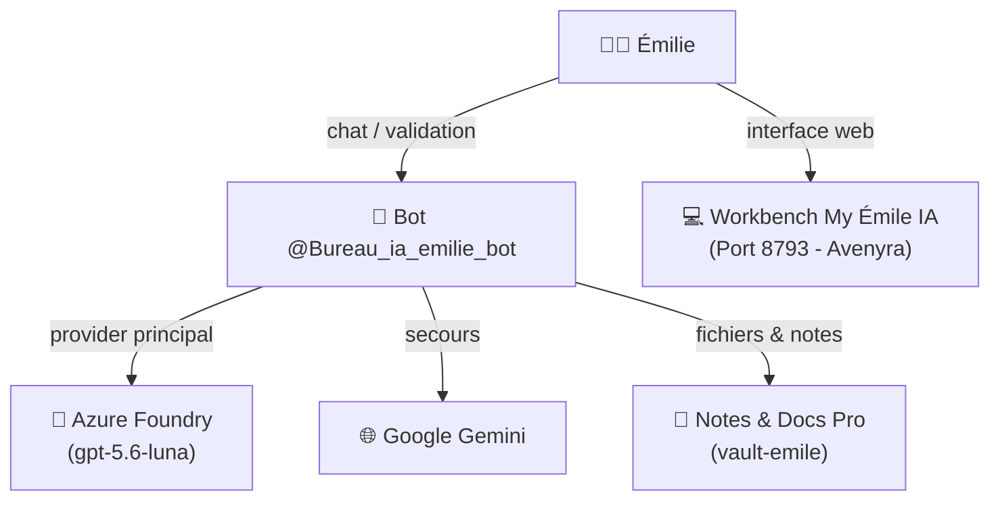

# Chapitre 13 — Bureau Émile : assistant professionnel d'Émilie

Le Bureau Émile est dédié à l'accompagnement professionnel d'Émilie au sein de l'environnement **My Émile IA Workbench** (développé via Avenyra, accessible localement sur le port `8793`).

> 📜 **Contexte historique :** Créé initialement le 25 juin 2026 pour assister Émilie lors de la rédaction de son mémoire de fin d'études en sciences de l'éducation, le profil `emile` a évolué : la phase de formation, de pédagogie et de mémoire universitaire est aujourd'hui terminée. Émile est désormais son assistant professionnel pérenne pour toutes ses activités métier.

---

## Son rôle actuel

Émile est un **partenaire de travail professionnel** qui seconde Émilie au quotidien dans la rédaction, la structuration et le suivi de ses documents professionnels, avec validation humaine systématique :

```
Bureau Émile = assistant professionnel (My Émile IA Workbench)
├── 📝 Rédaction et structuration de notes professionnelles
├── 📊 Préparation et synthèse de rapports d'activité
├── 📁 Gestion, organisation et classement documentaire métier
├── 🔄 Suivi des activités, comptes-rendus et livrables
├── 💡 Suggestions de clarification et relecture stylistique
└── 👤 Validation humaine obligatoire avant toute finalisation
```

---

## Architecture



### Caractéristiques opérationnelles

- **Profil Hermes** : `emile`
- **Bot Telegram** : [@Bureau_ia_emilie_bot](https://t.me/Bureau_ia_emilie_bot)
- **Interface applicative** : Workbench My Émile IA (port local `8793`, développé via Avenyra)
- **Modèle de référence** : Azure Foundry (`gpt-5.6-luna`), secours déclaré Google Gemini (historique sous DeepSeek Flash)
- **Dépôt documentaire** : `emile-wiki` et coffre local `vault-emile`

---

## Principes professionnels

1. **Validation humaine** — l'agent produit des ébauches, synthèses et structurations ; la validation finale relève exclusivement d'Émilie.
2. **Structure et clarté** — chaque note ou rapport privilégie des plans clairs, des points d'action et des synthèses décisionnelles.
3. **Traçabilité** — conservation de l'historique des versions et des documents sources.
4. **Confidentialité** — données confinées au profil professionnel isolé et au poste de travail.

---

## Workflow professionnel typique

```
1. Réception ou collecte de notes brutes d'activité
2. Transmission via le Workbench My Émile IA ou Telegram
3. Structuration automatique : plan, synthèse, points clés, actions
4. Relecture et ajustements interactifs avec Émilie
5. Validation humaine explicite par Émilie
6. Classement dans le dossier d'activité et mise à jour du suivi
```

---

## Intégration avec les autres bureaux

| Bureau | Interaction |
|:-------|:------------|
| 🔧 **Michel** | Hébergement du profil, gestion des scripts système et des watchdogs |
| 🤖 **LEO** | Hub central : routage des communications transverses |
| 🏛️ **Robert** | Conseil sur la gouvernance documentaire et les méthodes |

---

## Genèse et historique : du mémoire universitaire au Workbench métier

À sa création en juin 2026, Émile a été inspiré du modèle du Bureau Sylvia (voyages) pour l'appliquer au cadre académique du mémoire universitaire :

| Aspect | Période initiale (juin-juillet 2026) | Rôle pérenne actuel |
|:-------|:-------------------------------------|:--------------------|
| **Vocation** | Compagnon de mémoire universitaire | Assistant professionnel au quotidien |
| **Interface** | Bot Telegram + synchronisation Drive | Workbench My Émile IA (port 8793) + Telegram |
| **Développement** | Scripts expérimentaux BAVI | Workbench structuré développé via Avenyra |
| **Livrables** | Chapitres et bibliographie du mémoire | Notes, rapports d'activité, documentation pro |
| **Statut de phase** | Formation / études | **Terminée** — activité professionnelle active |

---

## Voir aussi

- **Ch.7** : [Multi-bots](../configurer/ch07-multi-bots.md) — configuration des profils Hermes
- **Ch.10** : [Architecture des bureaux](ch10-architecture-bureaux.md) — organisation BAVI
- **Architecture de référence** : [`hermes/architecture.md`](../architecture.md)
- **Supervision & interfaces** : [`hermes/utilisation/dashboards.md`](../utilisation/dashboards.md)
