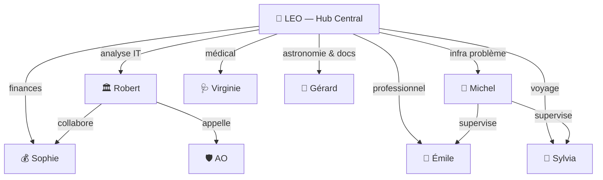

# Chapitre 15 — Bureau LEO et les autres bureaux

Le Bureau LEO est le **hub central** de l'écosystème — votre point d'entrée unique pour tout ce qui ne rentre pas dans les bureaux spécialisés. Et il y a quelques autres bureaux plus discrets mais tout aussi utiles.

## Bureau LEO : le fourre-tout personnel

LEO (le bureau, pas le bot) gère tout ce qui est **personnel, transversal ou ponctuel** : analyses générales, dossiers, études de marché, documentation.

```
Bureau LEO = votre assistant personnel
├── 📝 Analyses et dossiers
├── 📧 Emails (envoi + lecture + classification)
├── 📚 Documentation wikis
├── 🏷️ Classification Gmail (9 catégories)
└── 🗂️ Archives et notes
```

### Chiffres clés

| Métrique | Valeur |
|:---------|:------:|
| Sessions totales | 431 |
| Messages échangés | 13 089 |
| Emails classifiés | 3 240 |
| Skills installés | 112 |
| Wikis gérés | 5 |

### La classification Gmail

LEO classifie automatiquement les emails entrants en 9 catégories via Ollama (modèle local, gratuit) :

| Catégorie | Type |
|:----------|:-----|
| 👑 **VIP** | Christophe, famille, chefs |
| ⚙️ **Admin** | Factures, administrations |
| 💰 **Finances** | Banques, assurances, impôts |
| 🤖 **IA & Tech** | Infos techniques, newsletters |
| 🧭 **Voyages** | Réservations, billets |
| 🛒 **Achats** | Commandes, livraisons |
| 🏠 **Maison** | Énergie, travaux, voisinage |
| 👨‍👩‍👧‍👦 **Famille** | Émilie, Camille, amis |
| 🔭 **Astro** | Observatoire, astronomie |

Règle d'or : **les labels ne sont appliqués qu'une fois**. Pas de re-classification en masse.

## Bureau Sophie : le pilotage financier

Sophie est l'**analyste financière** de l'équipe. Elle calcule des TCO, des ROI, des business cases.

```
Bureau Sophie
├── 💰 TCO/ROI des projets IT
├── 📊 Analyse de rentabilité
├── 📈 3 scenarii (pessimiste/réaliste/optimiste)
└── 📋 Business cases

Experts : Analyste Marché, Modélisateur Financier, Risques & Conformité
```

Actuellement en reconstruction — Sophie reprendra du service quand un nouveau projet financier arrivera.

## Bureau Gérard : astronomie, astrophotographie et documentation

Gérard est l'assistant de Christophe pour l'ensemble de ses activités d'**astronomie et d'astrophotographie**, le wiki et le site tofdan liés à l'astronomie, ainsi que la documentation générale et l'étude comme guide astronomie. Le télescope automatisé T600 de l'Observatoire Centre Ardenne (OCA) constitue l'un de ses chantiers documentaires et techniques parmi d'autres projets.

Gérard opère comme profil opérationnel local (aucun bot Telegram n'est configuré).

```
Bureau Gérard
├── 🔭 Observation astronomique & astrophotographie
├── 🌐 Site tofdan (sections astronomie) & wiki astro
├── 🏗️ Projet T600 / OCA (optique, motorisation, IPX800, Arduino)
├── 💾 Firmware & automatisation (steppers, drivers TB67H303HC)
├── 📝 Rédacteur technique & guide d'étude
└── 👨‍🏫 Vulgarisation et documentation générale
```

Documents et volets couverts :
- **Documentation générale & guide astronomie** — fiches d'étude et observations
- **Site tofdan & wiki** — publication et suivi des ressources astro
- **Dossiers techniques T600/OCA** — Document de Référence, Formation Opérateur, Analyse des Risques

## Bureau Virginie : le médical

Virginie est une **orchestratrice de consultations médicales**. Elle réunit des spécialistes pour un diagnostic pluridisciplinaire.

Une consultation produite à ce jour : **Sylvie Michaux** (v2, finalisée).

Son workflow : dispatch des spécialistes → croisement des diagnostics → synthèse.

## Bureau AO : l'assurance obligatoire

Bureau spécialisé dans le domaine de l'**Assurance Obligatoire** (INAMI, BCSS, eHealth, MyCareNet). Peut fonctionner comme sous-agent de Robert ou en skill autonome.

En attente de missions.

## Bureau Versioning

Gère les **versions et releases** des documents et analyses. Structure prête, pas encore de contenu.

## La gouvernance des bureaux



## En résumé

| Bureau | Rôle | Priorité |
|:-------|:-----|:--------:|
| **LEO** | Hub central, analyses, emails | 🔴 Quotidien |
| **Michel** | Infrastructure technique | 🔴 Quotidien |
| **Sylvia** | Voyages camping-car | 🟡 Hebdomadaire |
| **Robert** | Conseil stratégique IT | 🟡 Hebdomadaire |
| **Gérard** | Astronomie, astrophotographie & documentation | 🟢 Ponctuel |
| **Émile** | Assistant professionnel Émilie (Workbench) | 🟢 Quotidien |
| **Virginie** | Consultations médicales | 🟢 Ponctuel |
| **Sophie** | Pilotage financier | 📝 En attente |
| **AO** | Assurance obligatoire | 📝 En attente |

> 💡 **Note d'évolution :** Les rôles actuels sont consolidés : Émile assiste Émilie dans ses activités professionnelles au sein de My Émile IA Workbench (développé via Avenyra, la phase études/mémoire étant terminée) avec validation humaine ; Gérard est l'assistant de Christophe pour l'astronomie, l'astrophotographie, le site tofdan et la documentation générale (le projet T600/OCA étant un volet parmi d'autres, sans bot Telegram).

## Voir aussi

- **Ch.10** : Architecture des bureaux (concept et workflow 7 étapes)
- **Ch.11** : Bureau Michel (infrastructure)
- **Ch.12** : Bureau Sylvia (voyages)
- **Ch.13** : Bureau Émile (assistant professionnel d'Émilie)
- **Ch.14** : Bureau Robert (conseil stratégique)
*Document mis à jour le 04/07/2026 à 22:48 — Léo 🦁*

> 🤖 Dernier audit : 20/09/2026 — Léo 🦁
