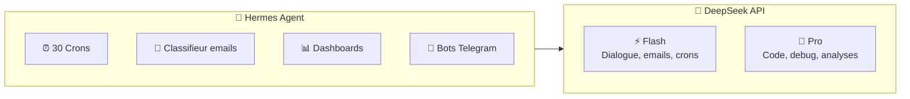
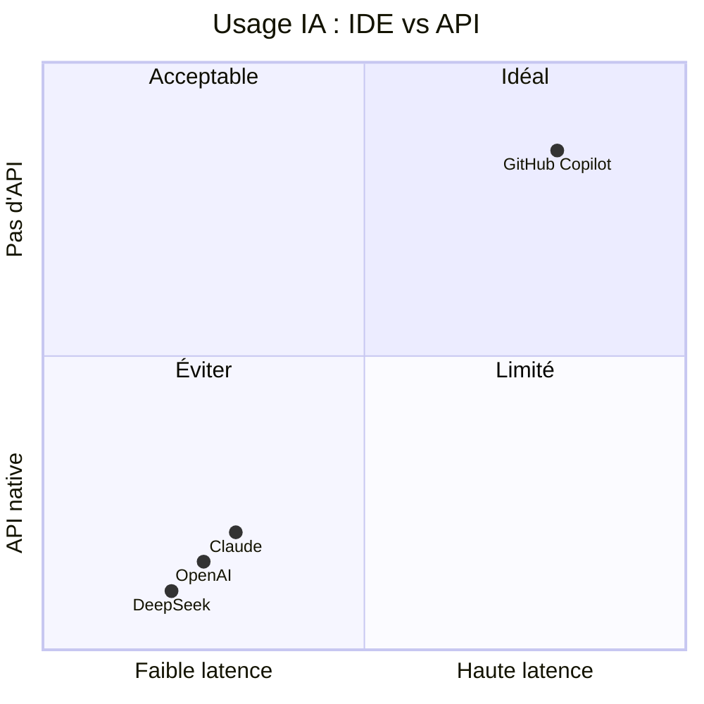

# 🦁 Pourquoi LEO utilise DeepSeek, pas GitHub Copilot

> Analyse technique — Juin 2026. À partager librement.

---

## Le constat simple

GitHub Copilot est un **produit IDE**. DeepSeek est un **fournisseur d'API**.

Ce sont deux outils différents pour deux usages différents. Les confondre, c'est comme comparer Excel et SQL Server.

---

## 🟣 GitHub Copilot (10 €/mois)

### Ce que c'est VRAIMENT

| Fonctionnalité | Description |
|:---|:---|
| **Autocomplétion** | Suggestions de code dans VS Code, JetBrains, Neovim |
| **Copilot Chat** | Chat intégré à l'IDE, contexte du projet |
| **Copilot CLI** | `gh copilot` — assistant en ligne de commande |
| **Copilot Agent** | Mode agent autonome (beta, depuis avril 2026) |

### Ce que ce N'EST PAS

| ❌ Pas disponible | Pourquoi |
|:---|:---|
| API REST `/v1/chat/completions` | N'existe pas. Pas prévu. |
| Endpoint d'inférence | Interne, protégé, usage externe = violation ToS |
| Mode « headless » fiable | Le CLI est interactif, pas conçu pour des scripts |
| Système de prompt custom | Limité au contexte IDE |

### Les modèles (dans l'IDE)

GitHub Copilot route automatiquement vers différents modèles selon la tâche :
- GPT-4o (basses tâches)
- Claude 3.5/4 Sonnet (code complexe)
- Modèles internes GitHub

**Mais ces modèles sont inaccessibles en dehors de l'IDE.**

---

## 🟠 DeepSeek (paiement à l'usage)

### Ce que c'est

| Fonctionnalité | Description |
|:---|:---|
| **API REST standard** | `POST /v1/chat/completions` — compatible OpenAI |
| **Streaming** | Natif, faible latence |
| **System prompt** | Libre, complet |
| **Outils / Function calling** | ✅ Supporté |
| **Modèles** | Flash (rapide, pas cher) + Pro (deep reasoning) |

### Pourquoi LEO l'utilise

- **Tous les crons** appellent DeepSeek via API
- **Le classifieur d'emails** utilise DeepSeek / Ollama
- **Les bots Telegram** répondent via DeepSeek
- **Code, debug, dashboards** = DeepSeek Pro

---

## 📊 Comparaison technique

| Critère | DeepSeek | GitHub Copilot |
|:---|:---|:---|
| **API REST** | ✅ Standard OpenAI | ❌ Aucune |
| **Streaming** | ✅ Natif | ❌ |
| **System prompt** | ✅ Libre | ❌ Limité |
| **Function calling** | ✅ | ❌ |
| **Coût** | ~0.14 €/M tokens (Flash) | 10 €/mois forfait |
| **Latence** | < 2 secondes | > 8 secondes (CLI) |
| **Usage programmatique** | ✅ Scripts, crons | ❌ IDE uniquement |
| **Modèles disponibles** | Flash, Pro, V3 | Boîte noire (auto-routage) |
| **Risque suspension** | Aucun | Oui si détourné |

---

## 🧪 Ce qu'on a testé (et pourquoi ça a échoué)

| Méthode | Problème |
|:---|:---|
| **Copilot CLI** (`gh copilot suggest`) | 8+ secondes de latence, pas de streaming, mode interactif uniquement |
| **Proxy ACP** (Copilot → Hermes) | Trop lent, architecture fragile, pas conçu pour du non-interactif |
| **Reverse-engineering** l'endpoint interne | Violation des Conditions d'Utilisation GitHub → risque bannissement |
| **LiteLLM / llm-github-copilot** | Marche mais non officiel, instable, dépend de jetons internes qui changent |

---

## ✅ Le verdict

> **GitHub Copilot est excellent pour ce pourquoi il a été conçu : l'IDE.**  
> **Pour des agents autonomes, des crons, des bots, et des scripts, DeepSeek (ou toute API standard) est le seul choix viable.**

---

## 🎯 Recommandation

| Usage | Outil |
|:---|:---|
| Coder dans VS Code | 🟣 GitHub Copilot |
| Agents autonomes, crons, bots | 🟠 DeepSeek API |
| Classification locale (gratuit) | 🏠 Ollama (qwen2.5:7b) |
| Tâches ponctuelles lourdes | 🟠 DeepSeek Pro |

**L'abonnement Copilot ne remplace pas une API. L'API ne remplace pas l'IDE.**

---

*Document rédigé par LEO 🦁 — Juin 2026 · [hermes-wiki](https://github.com/christophedanhier-hash/hermes-wiki)*
