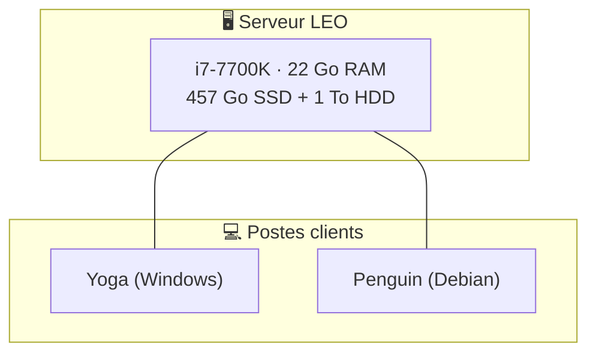

# Chapitre 3 — L'architecture LEO

> *Comment Christophe a construit un assistant IA qui tourne 24h/24*

---

LEO n'est pas un simple script lancé sur un Raspberry Pi. C'est un écosystème complet qui mobilise plusieurs machines, services cloud, et une infrastructure résiliente. Ce chapitre vous montre les plans — comme si vous ouvriez la boîte noire.

## Vue d'ensemble

```
Telegram ──→ Gateway Hermes ──→ Profil default ──→ DeepSeek Flash (dialogue)
                                    │
                                    ├──→ @hermes_leo_copilot_bot → DeepSeek V4 Pro (code/infra)
                                    │
                                    ├──→ Ollama API locale (batch, gratuit)
                                    │
                                    └──→ Gemini (fallback automatique)
```

### Les 3 bots Telegram

| Bot | Profil | Provider | Rôle | Latence | Coût |
|:----|:-------|:---------|:-----|:-------:|:----:|
| 🤖 @hermes_leo_bot | `default` | DeepSeek Flash | Chat quotidien | < 2s | Payant |
| 🟪 @hermes_leo_copilot_bot | `leo-copilot` | DeepSeek V4 Pro | Code, infra, n8n | < 2s | Payant |
| 🧭 @bavi_leo_voyages_bot | `bavi-leo` | DeepSeek Flash | Voyages camping-car | < 2s | Payant |

Chaque bot est un **profil Hermes** isolé — son propre gateway, ses propres skills, sa propre mémoire. Mais ils partagent un fichier de configuration commun et peuvent échanger des informations.

## La hiérarchie des providers

L'un des atouts d'Hermès est de pouvoir utiliser **plusieurs LLMs** et de choisir le meilleur pour chaque tâche :

| Ordre | Provider | Coût | Quand |
|:-----:|:---------|:----:|:------|
| 🥇 | **DeepSeek Flash** | Payant | Réponse Telegram, conversation, raisonnement |
| 🥈 | **DeepSeek V4 Pro** (leo-copilot) | Payant | Code, infra, debug système |
| 🥉 | **Ollama** (qwen2.5:7b, local) | **Gratuit** 🏠 | Traitement batch, tâches privées |
| 4e | **Gemini** (fallback) | **Gratuit** ☁️ | Secours si DeepSeek indisponible |

**Le principe économique :** 95% des tâches planifiées (crons) tournent en `no_agent` = 0 token LLM consommé. Les 5% restants utilisent d'abord Ollama (gratuit), puis DeepSeek seulement si nécessaire.

## L'infrastructure physique

LEO tourne sur **1 machine serveur**. Les autres postes (Yoga, Penguin) sont des stations de travail clientes — elles n'hébergent aucun service de la plateforme.



## L'écosystème logiciel

### Docker et s6

Tout tourne dans un **conteneur Docker** supervisé par **s6** :

```
Docker Container
├── hermes-gateway (s6 supervisé)
│   ├── default (profil principal)
│   ├── leo-copilot (infra)
│   ├── bavi-leo (voyages)
│   └── emile (pédagogie)
├── s6-log (gestion des logs)
│   └── rotation automatique
├── cron scheduler (Hermes natif)
└── s6 supervision (auto-restart)
```

Avantage de s6 : si un gateway crashe, il redémarre automatiquement en moins d'une seconde.

### Les 7 dashboards

Tous en **HTML statique** hébergés sur **GitHub Pages** — zéro backend, zéro base de données :

| Dashboard | URL | Contenu | Màj |
|:----------|:----|:--------|:---:|
| 🌍 **Global LEO** | [lien](https://christophedanhier-hash.github.io/leo-dashboard/) | Portail agrégé | H:05 |
| 📊 **LEO KPI** | [lien](https://christophedanhier-hash.github.io/leo-dashboard/) | Sessions, budget, tokens | H:10 |
| 🏛️ **BAVI LEO** | [lien](https://christophedanhier-hash.github.io/leo-dashboard/) | KPIs BAVI | H:05 |
| 💻 **Machine** | [lien](https://christophedanhier-hash.github.io/leo-dashboard/) | CPU/RAM/disque serveur unique | */15 |
| ⏱️ **Crons** | [lien](https://christophedanhier-hash.github.io/leo-dashboard/) | 14 crons, historique 7j | H:20 |
| 🐙 **GitHub** | [lien](https://christophedanhier-hash.github.io/leo-dashboard/) | Activité 22 repos | H:25 |
| 🔧 **n8n** | [lien](https://christophedanhier-hash.github.io/leo-dashboard/) | Workflows n8n | */15 |

### Les 14 crons (tâches planifiées)

> 13 sur 14 sont en `no_agent` = **0$ par mois** de consommation LLM pour les tâches répétitives.

| Vague | Horaires | Crons |
|:------|:---------|:------|
| **Horaire** | H:00-H:30 staggerés | machines-kpi, budget, dashboards (4), wiki-sync |
| **15 min** | */15 | n8n healthcheck, classifieur emails |
| **2h** | */2 | auto-commit repos, dashboard-watch |
| **Quotidien** | 06:00, 08:00, 18:00 | backup, veille IA, drive sync |
| **Autres** | Hebdo, 6h | credentials-check, doc-watch |

### Les 5 wikis MkDocs

Chaque domaine a son propre wiki, hébergé sur GitHub Pages :

| Wiki | Pages | Contenu |
|:-----|:-----:|:--------|
| 🌐 **BAVI LEO** (portail central) | 40 | Portail + documentation bureaux |
| 📚 **Hermès Wiki** | 31 | Docs techniques Hermes |
| 🧭 **Voyages Wiki** | 7 | Roadbooks camping-car |
| 🔧 **Wiki OCA** | 10 | Documentation T600 |
| 🎓 **Emile Wiki** | 10 | Pédagogie et études |

### Les 10 bureaux BAVI

BAVI = l'organisation des connaissances de LEO en bureaux spécialisés :

| Bureau | Rôle | Privé/Pro |
|:-------|:-----|:---------:|
| 🦁 **LEO** | Dossiers personnels, analyses | Privé |
| 🔧 **Michel** | Infrastructure Hermes | Privé |
| 🧭 **Sylvia** | Voyages camping-car | Privé |
| 🎓 **Emile** | Pédagogie, mémoire | Privé |
| 🩺 **Virginie** | Médical | Privé |
| 🏛️ **Robert** | Conseil stratégique IT | **PRO** |
| 💰 **Sophie** | Pilotage économique | **PRO** |
| 📋 **Gérard** | Documentation T600 | Technique |
| 🛡️ **AO** | Assurance Obligatoire | **PRO** |
| 📦 **Versioning** | Gestion des versions | Technique |

## Les leçons apprises

### 12/06 — Trop de profils tue le profil

**Erreur :** Création d'un profil `local` pour Ollama. Arrêt du gateway `local` = perte totale d'accès Telegram.

**Leçon :** Unifier dans un seul profil, Ollama par API directe. **Fiabilité > flexibilité.**

### 13/06 — La précipitation coûte cher

**Erreur :** Actions sans réflexion préalable = régressions multiples (mauvais token, OAuth expiré, envoi multiple d'email).

**Leçon :** Avant chaque action, identifier 2-3 approches, peser le pour/contre, choisir.

### 14/06 — Les crons doivent être robustes

**Erreur :** Crons qui utilisaient le mauvais Python, scripts introuvables, identité Git manquante.

**Leçon :** Uniformisation — wrappers shell + no_agent + chemins absolus + identité Git dans le script.

### 24/06 — Gemini API directe, pas de proxy

**Erreur :** Un proxy Copilot compliqué et instable entre Hermes et Gemini.

**Leçon :** API directe (OpenAI-compatible). Moins de couches = moins de pannes. Latence passée de ~15s à < 2s.

## 📊 Chiffres clés

| Métrique | Valeur |
|:---------|:-------|
| Crons actifs | **25** (23 no_agent) |
| Skills installés | **126** |
| Dashboards | **1** (central 4 onglets) |
| Wikis | **5** (98 pages total) |
| Repos GitHub | **20** |
| Consommation DeepSeek/jour | **~quelques centimes** |
| Machine hôte | **1** (serveur LEO) |

## 📝 À retenir

- LEO = 1 serveur principal + 4 bots Telegram + 1 dashboard central (4 onglets) + 14 crons + 126 skills
- Tout tourne sur Hermes Agent dans un conteneur Docker supervisé par s6
- Le secret : une organisation stricte (profils, bureaux, skills) qui permet à l'agent de gérer la complexité
- Les erreurs du passé ont forgé les règles du présent

---

**[Chapitre suivant → Installation rapide](ch04-installation-rapide.md)**
