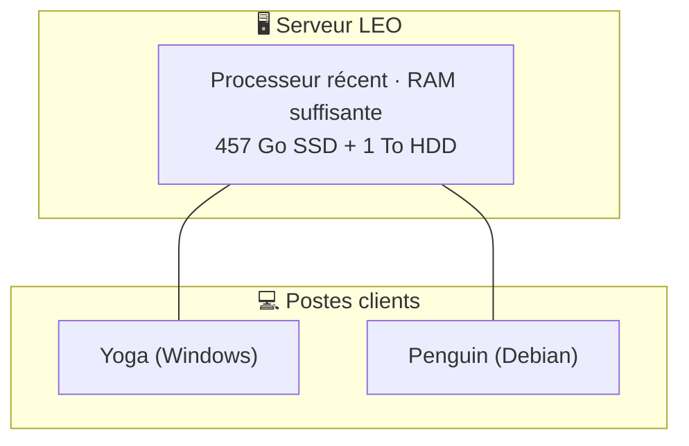

# Chapitre 3 — L'architecture LEO

> *Comment Christophe a construit un assistant IA qui tourne 24h/24*

---

LEO n'est pas un simple script lancé sur un Raspberry Pi. C'est un écosystème complet qui mobilise plusieurs machines, services cloud, et une infrastructure résiliente. Ce chapitre vous montre les plans — comme si vous ouvriez la boîte noire.

## Vue d'ensemble

```
Telegram ──→ Gateway Hermes ──→ Profil default ──→ DeepSeek Flash (dialogue)
                                    │
                                    ├──→ Profil michel → DeepSeek V4 Pro (code/infra)
                                    │
                                    ├──→ Ollama API locale (batch, gratuit)
                                    │
                                    └──→ Gemini (fallback automatique)
```

### Les 5 bots Telegram

| Bot | Profil | Provider | Rôle | Latence | Coût |
|:----|:-------|:---------|:-----|:-------:|:----:|
| 🤖 @hermes_leo_bot | `default` | DeepSeek Flash | Chat quotidien | < 2s | Payant |
| 🟪 @hermes_leo_copilot_bot | `michel` | DeepSeek V4 Pro | Code, infra | < 2s | Payant |
| 🧭 @bavi_leo_voyages_bot | `sylvia` | DeepSeek Flash | Voyages camping-car | < 2s | Payant |
| 🎓 @Bureau_ia_emilie_bot | `emile` | DeepSeek Flash | Pédagogie, mémoire | < 2s | Payant |
| 🏛️ @bureau_robert_bot | `robert` | DeepSeek Pro | Conseil IT stratégique | < 2s | Payant |

Chaque bot est un **profil Hermes** isolé — son propre gateway, ses propres skills. Les profils default et michel partagent une mémoire unifiée.

## La hiérarchie des providers

L'un des atouts d'Hermès est de pouvoir utiliser **plusieurs LLMs** et de choisir le meilleur pour chaque tâche :

| Ordre | Provider | Coût | Quand |
|:-----:|:---------|:----:|:------|
| 🥇 | **DeepSeek Flash** | Payant | Réponse Telegram, conversation, raisonnement |
| 🥈 | **DeepSeek V4 Pro** (profil michel) | Payant | Code, infra, debug système |
| 🥉 | **Ollama** (qwen2.5:7b, local) | **Gratuit** 🏠 | Traitement batch, tâches privées |
| 4e | **Gemini 3.5 Flash** (fallback) | **Gratuit** ☁️ | Secours si DeepSeek indisponible |

**Le principe économique :** 95% des tâches planifiées (crons) tournent en `no_agent` = 0 token LLM consommé. Les 5% restants utilisent d'abord Ollama (gratuit), puis DeepSeek seulement si nécessaire.

## L'infrastructure physique

LEO tourne sur **1 machine serveur**. Les autres postes (Yoga, Penguin) sont des stations de travail clientes — elles n'hébergent aucun service de la plateforme.



## L'écosystème logiciel

### Docker et s6

Tout tourne dans un **conteneur Docker** supervisé par **s6** :

```
Docker Container
├── hermes-gateway (s6 supervisé)
│   ├── default (profil principal)
│   ├── michel (infrastructure)
│   ├── sylvia (voyages)
│   ├── emile (pédagogie)
│   └── robert (conseil stratégique)
├── s6-log (gestion des logs)
│   └── rotation automatique
├── cron scheduler (Hermes natif)
└── s6 supervision (auto-restart)
```

Avantage de s6 : si un gateway crashe, il redémarre automatiquement en moins d'une seconde.

### Les dashboards

Tous en **HTML statique** hébergés sur **GitHub Pages** — zéro backend, zéro base de données :

> ⚠️ **Mise à jour 04/07/2026** : les 7 dashboards pré-crash ont été consolidés en **un seul dashboard unifié**.

| Dashboard | URL | Contenu | Màj |
|:----------|:----|:--------|:---:|
| 🖥️ **Panel LEO** | `http://localhost:8765` (local) | Pilotage, API crons, métriques | Horaire (collect-v2.py) |
| 🤖 **Dashboard Hermes** | `http://localhost:9119` (local) | Chat, sessions, fichiers, crons, config | Temps réel |

La collecte unifiée utilise `collect-v2.py` : 8 sources (sessions, budget, crons, infra, github, bavi, services, vaults) → panel local. (n8n retiré 13/07/2026)

### Les crons (tâches planifiées)

> **41 crons (tous actifs)** — quasi tous en `no_agent` = **0$ par mois** de consommation LLM pour les tâches répétitives.

| Vague | Horaires | Crons |
|:------|:---------|:------|
| **Horaire** | H:00-H:30 staggerés | machines-kpi, budget, dashboards (4), wiki-sync |
| **15 min** | */15 | classifieur emails, dashboard deploys |
| **2h** | */2 | auto-commit repos, dashboard-watch |
| **Quotidien** | 06:00, 08:00, 18:00 | backup, veille IA, drive sync |
| **Autres** | Hebdo, 6h | credentials-check, doc-watch |

### Les wikis MkDocs

Chaque domaine a son propre wiki, hébergé localement (pas de déploiement GitHub Pages public) :

| Wiki | Pages approx. | Contenu |
|:-----|:-----:|:--------|
| 🌐 **BAVI LEO** (portail central) | 40+ | Portail + documentation bureaux |
| 📚 **Hermès Wiki** | 35+ | Docs techniques Hermes |

### Les 10 bureaux BAVI

BAVI = l'organisation des connaissances de LEO en bureaux spécialisés :

| Bureau | Rôle | Privé/Pro |
|:-------|:-----|:---------:|
| 🦁 **LEO** | Dossiers personnels, analyses | Privé |
| 🔧 **Michel** | Infrastructure Hermes | Privé |
| 🧭 **Sylvia** | Voyages camping-car | Privé |
| 🎓 **Emile** | Pédagogie, mémoire | Privé |
| 🩺 **Virginie** | Médical | Privé |
| 🏛️ **Robert** | Conseil stratégique IT | **PRO** |
| 💰 **Sophie** | Pilotage économique | **PRO** |
| 📋 **Gérard** | Documentation T600 | Technique |
| 🛡️ **AO** | Assurance Obligatoire | **PRO** |
| 📦 **Versioning** | Gestion des versions | Technique |

## Les leçons apprises

### 12/06 — Trop de profils tue le profil

**Erreur :** Création d'un profil `local` pour Ollama. Arrêt du gateway `local` = perte totale d'accès Telegram.

**Leçon :** Unifier dans un seul profil, Ollama par API directe. **Fiabilité > flexibilité.**

### 13/06 — La précipitation coûte cher

**Erreur :** Actions sans réflexion préalable = régressions multiples (mauvais token, OAuth expiré, envoi multiple d'email).

**Leçon :** Avant chaque action, identifier 2-3 approches, peser le pour/contre, choisir.

### 14/06 — Les crons doivent être robustes

**Erreur :** Crons qui utilisaient le mauvais Python, scripts introuvables, identité Git manquante.

**Leçon :** Uniformisation — wrappers shell + no_agent + chemins absolus + identité Git dans le script.

### 24/06 — Gemini API directe, pas de proxy

**Erreur :** Un proxy Copilot compliqué et instable entre Hermes et Gemini.

**Leçon :** API directe (OpenAI-compatible). Moins de couches = moins de pannes. Latence passée de ~15s à < 2s.

## 📊 Chiffres clés

| Métrique | Valeur |
|:---------|:-------|
| Crons actifs | **41 (tous actifs)** |
| Skills installés | **28** |
| Dashboards | **2** (panel local 8765 + Hermes 9119) |
| Wikis | **2** (hermes-wiki + BAVI_LEO, servis localement) |
| Repos GitHub | **20+** |
| Consommation DeepSeek | **variable** (~$20 constaté) |
| Machine hôte | **1** (serveur LEO) |

## 📝 À retenir

- LEO = 1 serveur principal + 5 bots Telegram + 1 dashboard unifié + collecte horaire unique + 28 skills
- Tout tourne sur Hermes Agent dans un conteneur Docker supervisé par s6
- Les 5 profils : default (dialogue), michel (infra), sylvia (voyages), emile (pédagogie), robert (conseil)
- Le secret : une organisation stricte (profils, bureaux, skills) qui permet à l'agent de gérer la complexité
- Les erreurs du passé ont forgé les règles du présent

---

**[Chapitre suivant → Installation rapide](ch04-installation-rapide.md)**
*Document mis à jour le 04/07/2026 à 22:48 — Léo 🦁*

> 🤖 Dernier audit : 23/07/2026 à 05:00 (UTC+2)

