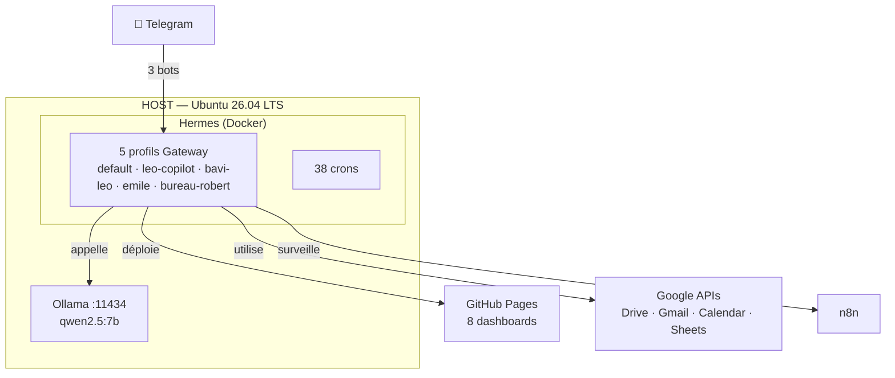

# Installation sur Linux (Debian/Ubuntu)

## 🎯 Objectif

Ce guide vous permet d'installer Hermes Agent sur Linux. Deux approches :

| Méthode | Difficulté | Usage | Idéal pour |
|:--------|:-----------|:------|:-----------|
| **Directe** (officielle) | ⭐ Facile | Poste personnel, test | Débutants, usage individuel |
| **Docker** (conteneur) | ⭐⭐ Intermédiaire | Serveur 24/7, gateway | Usage serveur, production |

---

## 📦 Méthode 1 : Installation directe (officielle)

### 1. Prérequis

- **Python 3.11+**
- **Git**
- **Curl**
- Un compte chez un fournisseur LLM (DeepSeek, OpenAI, Anthropic…)

```bash
# Installer les dépendances système
sudo apt update && sudo apt install -y python3 python3-venv python3-pip git curl
```

### 2. Installer Hermes

```bash
# Méthode recommandée — script officiel
curl -fsSL https://hermes-agent.nousresearch.com/install.sh | bash

# Alternative : depuis les sources
git clone https://github.com/NousResearch/hermes-agent.git
cd hermes-agent
python3 -m venv .venv
source .venv/bin/activate
pip install -e .
```

### 3. Configuration

```bash
# Assistant de configuration
hermes setup

# Vérifier que tout est OK
hermes doctor
```

Le wizard vous guide pour :
- Choisir votre fournisseur LLM (DeepSeek, Ollama, OpenAI…)
- Configurer Telegram (optionnel)
- Créer votre profil

### 4. Connecter un LLM

**DeepSeek** (recommandé pour débuter) :
```bash
hermes config set DEEPSEEK_API_KEY "votre_clé"
hermes model
# → Choisir deepseek dans la liste
```

**Ollama** (local, gratuit) :
```bash
curl -fsSL https://ollama.com/install.sh | sh
ollama pull qwen2.5:7b
hermes config set providers.custom.ollama.base_url "http://localhost:11434/v1"
```

### 5. Lancer

```bash
# Mode interactif
hermes

# Avec Telegram
hermes gateway start
```

---

## 🐳 Méthode 2 : Installation via Docker

### 1. Installer Docker

```bash
# Docker Engine
curl -fsSL https://get.docker.com | sh
sudo usermod -aG docker $USER
# Déconnectez-vous / reconnectez-vous
```

### 2. Lancer Hermes

```bash
# Méthode simple — tout-en-un
docker run -d \
  --name hermes \
  --restart unless-stopped \
  -v ~/.hermes:/opt/data \
  -e HERMES_UID=$(id -u) \
  -e HERMES_GID=$(id -g) \
  nousresearch/hermes-agent:latest
```

> ⚠️ **Important** : le conteneur utilise `network_mode: host` pour le gateway Telegram.
> Sur macOS/Windows, des adaptations de ports sont nécessaires.

### 3. Configuration initiale

```bash
# Entrer dans le conteneur pour configurer
docker exec -it hermes hermes setup
```

---

## 🔧 Exemple : LEO (serveur de production)

LEO est l'assistant personnel de Christophe. Il tourne sur un **serveur Debian 13 Trixie** en conteneur Docker, accessible 24/7. Le serveur est équipé d'un processeur moderne avec mémoire suffisante pour l'inférence IA locale.

### Architecture



### docker-compose.yml

```yaml
services:
  gateway:
    image: nousresearch/hermes-agent:latest
    container_name: hermes
    restart: unless-stopped
    network_mode: host
    volumes:
      - ~/.hermes:/opt/data
    environment:
      - HERMES_UID=${HERMES_UID:-1000}
      - HERMES_GID=${HERMES_GID:-1000}
    command: ["gateway", "run"]

  dashboard:
    image: nousresearch/hermes-agent:latest
    container_name: hermes-dashboard
    restart: unless-stopped
    network_mode: host
    depends_on:
      - gateway
    volumes:
      - ~/.hermes:/opt/data
    environment:
      - HERMES_UID=${HERMES_UID:-1000}
      - HERMES_GID=${HERMES_GID:-1000}
    command: ["dashboard", "--host", "127.0.0.1", "--no-open"]
```

> **Pourquoi conteneurisé ?**  
> - Service 24/7 : redémarrage automatique en cas de panne  
> - Isolation : Hermes et ses dépendances ne polluent pas le système hôte  
> - Mise à jour simple : `docker pull nousresearch/hermes-agent:latest && docker restart hermes`  
> - Portabilité : même config sur n'importe quel serveur Linux

### Services connectés

| Service | Rôle | Connexion |
|:--------|:-----|:----------|
| **Ollama** | LLM local (qwen2.5:7b) | API `http://host:11434/v1` |
| **DeepSeek** | LLM principal (via Telegram) | Clé API |
| **Tailscale** | Réseau privé (VPN mesh) | IPs 100.x.x.x |

---

## Dépannage

| Problème | Solution |
|----------|----------|
| `ModuleNotFoundError` | Vérifier que le venv est activé (`source .venv/bin/activate`) |
| Permission docker | `sudo usermod -aG docker $USER` puis déconnexion/reconnexion |
| Port déjà utilisé | `docker stop hermes && docker rm hermes` puis relancer |
| Gateway ne démarre pas | Vérifier `~/.hermes/logs/gateway.log` |

## Ressources

- [Documentation officielle](https://hermes-agent.nousresearch.com/docs)
- [GitHub](https://github.com/NousResearch/hermes-agent)
- [Docker Hub](https://hub.docker.com/r/nousresearch/hermes-agent)
*Document mis à jour le 04/07/2026 — 22:48:00 — Léo 🦁*
