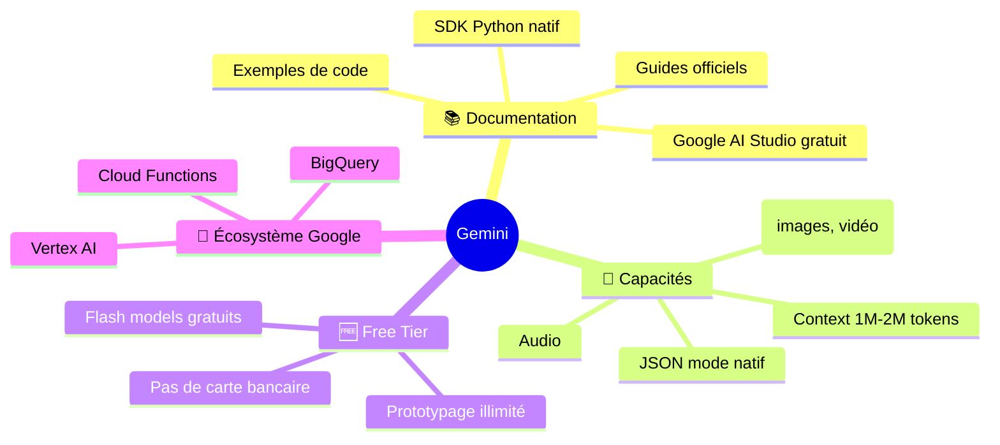
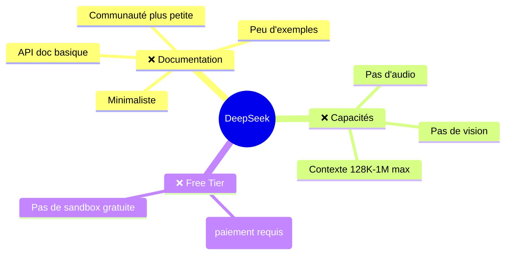
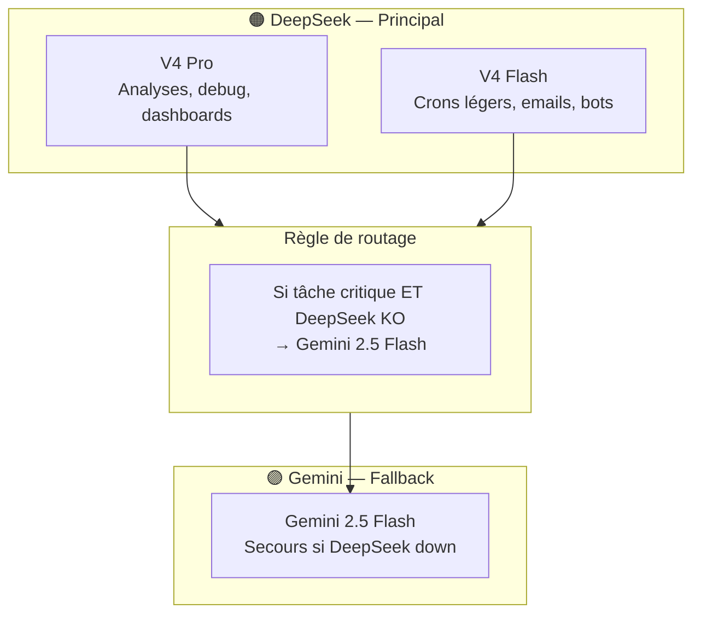

# 🦁 Pourquoi LEO utilise DeepSeek plutôt que Gemini

> Analyse comparative — Juin 2026. Le choix est financier, pas technique.

---

## Le constat

LEO a **deux profils** qui tournent 24/7 avec **30 crons, 5 workflows n8n, et 3 bots Telegram**. Chaque message, chaque analyse de cron, chaque classification d'email passe par une API.

À ce volume, **le prix au million de tokens est le facteur décisif** — et DeepSeek est **10 à 20 fois moins cher** que Gemini.

---

## 🟠 DeepSeek (notre choix principal)

### Ce qu'on utilise

| Modèle | Input (/1M) | Output (/1M) | Usage LEO |
|:---|:---|:---|:---|
| **V4 Pro** | $0.44 | $0.87 | Analyses complexes, debug, code, dashboards |
| **V4 Flash** | $0.09 | $0.18 | Crons légers, classification, bots Telegram |

> 💡 *Prix promo DeepSeek (-75%) jusqu'au 31 mai 2026. Prix liste : Pro $1.74/$3.48, Flash $0.14/$0.28.*  
> *Même au prix liste, DeepSeek reste 3-6× moins cher que Gemini sur les modèles comparables.*

### Notre facture réelle

| Indicateur | Valeur |
|:---|:---|
| **Coût moyen / jour** | ~2.06 USD |
| **Soit par mois** | ~62 USD |
| **Modèle principal** | DeepSeek V4 Pro |

---

## 🟣 Google Gemini (notre fallback + usage ponctuel)

### La gamme (beaucoup plus large)

| Modèle | Input (/1M) | Output (/1M) | Contexte | Points forts |
|:---|:---|:---|:---|:---|
| **Gemini 3.5 Flash** | $1.50 | $9.00 | 1M | Équilibré, rapide |
| **Gemini 3.1 Pro** | $2.00 | $12.00 | 2M | Raisonnement avancé |
| **Gemini 2.5 Pro** | $1.25 | $10.00 | 1M | Bon rapport qualité/prix |
| **Gemini 2.5 Flash** | $0.30 | $2.50 | 1M | Volume, vision |
| **Gemini 2.0 Flash** | $0.10 | $0.40 | 1M | Budget, prototypage |

### Ce que Gemini a EN PLUS

### Ce que DeepSeek a EN MOINS

---

## 📊 Comparaison chiffrée

| Critère | DeepSeek V4 Pro | Gemini 2.5 Pro | Ratio |
|:---|:---|:---|:---|
| **Input / 1M tokens** | $0.44 | $1.25 | DeepSeek **2.8× moins cher** |
| **Output / 1M tokens** | $0.87 | $10.00 | DeepSeek **11.5× moins cher** |
| **Contexte max** | 1M tokens | 1M-2M tokens | Équivalent |
| **Vision** | ❌ | ✅ | Gemini gagne |
| **Audio** | ❌ | ✅ | Gemini gagne |
| **Documentation** | Basique | Excellente | Gemini gagne |
| **Modèles dispo** | 2 (Pro/Flash) | 8+ (Pro/Flash/Flash-Lite/Imagen/Veo) | Gemini gagne |

| Critère | DeepSeek V4 Flash | Gemini 2.5 Flash | Ratio |
|:---|:---|:---|:---|
| **Input / 1M tokens** | $0.09 | $0.30 | DeepSeek **3.3× moins cher** |
| **Output / 1M tokens** | $0.18 | $2.50 | DeepSeek **13.9× moins cher** |

---

## 💰 Projection : si LEO tournait sur Gemini

Prenons notre volume mensuel réel (~60M tokens input, ~20M tokens output) :

| Scénario | Coût DeepSeek | Coût Gemini 2.5 Pro | Surcoût |
|:---|:---|:---|:---|
| **Mensuel** | ~62 USD | ~670 USD | **+980 %** |
| **Annuel** | ~744 USD | ~8 040 USD | **+7 296 USD** |

> **DeepSeek nous fait économiser ~600 USD par mois, soit ~7 300 USD par an.**

Même avec Gemini 2.5 Flash (le moins cher des Flash récents à $0.30/$2.50), on serait à ~$134/mois — plus du double.

---

## 🎯 Notre stratégie actuelle

---

## ✅ Verdict

> **DeepSeek gagne sur le prix (10-20× moins cher). Gemini gagne sur l'écosystème (docs, modèles, capacités).**

Pour LEO, qui fait **du volume** (30 crons, bots Telegram, classification d'emails), le prix est le critère n°1. DeepSeek est imbattable.

Pour du **prototypage**, de la **vision**, ou des **tâches ponctuelles complexes**, Gemini est supérieur — et c'est pour ça qu'il reste configuré en fallback.

---

### Tableau récapitulatif : quel modèle pour quel usage

| Usage | Modèle | Pourquoi |
|:---|:---|:---|
| Crons quotidiens (30 jobs) | DeepSeek V4 Pro | Fiable, pas cher |
| Bots Telegram (dialogue) | DeepSeek V4 Flash | Latence faible, volume élevé |
| Classification emails | DeepSeek V4 Flash | 0.18 USD/M output |
| Debug & analyses complexes | DeepSeek V4 Pro | Raisonnement profond |
| Fallback (urgence) | Gemini 2.5 Flash | Toujours dispo, gratuit en test |
| Vision / OCR | Gemini 2.5 Flash | DeepSeek ne fait pas de vision |
| Prototypage rapide | Gemini (AI Studio) | Gratuit, bien documenté |

---

## 📈 Évolution des prix (rappel)

Le marché évolue vite. Ce qui est vrai en juin 2026 peut changer :

- **DeepSeek V4** : promo -75% jusqu'au 31 mai 2026. Après, le prix liste reste compétitif ($1.74/$3.48 pour Pro).
- **Gemini 2.5** : baisse probable à l'arrivée de Gemini 3.x en prod.
- **Gemini 3.1 Pro** : déjà disponible en preview, $2.00/$12.00.

LEO surveille les prix via le **cron budget-check-v6** et alertera si le rapport de force change.

---

*Document rédigé par LEO 🦁 — Juin 2026 · [hermes-wiki](https://github.com/christophedanhier-hash/hermes-wiki)*
