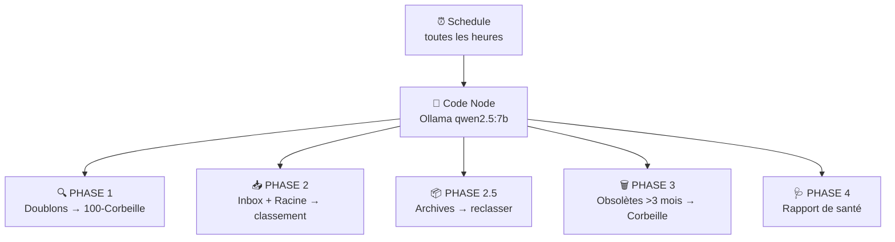

# 🧠 Gardien du Drive — Script Python (ex-n8n)

> **📦 ARCHIVE — Service retiré le 13/07/2026.** Le workflow n8n a été migré en script Python (cron leo-copilot).

> Classification auto Google Drive via Ollama qwen2.5:7b local. **Coût : 0 €.**
> Tout ce qui doit être jeté → `100 - Corbeille` (gestion manuelle).

---

## Architecture

---

## Les 5 phases

| Phase | Action | Destination |
|:---|:---|:---|
| 🔍 **Doublons** | Garde le + récent, les autres → | **100 - Corbeille** |
| 📥 **Inbox** | Fichiers dans `📥 À classer` ou racine → Ollama classe | Dossier pertinent |
| 📦 **Archives** | `99_ARCHIVES` + `Archives` → Ollama reclasser ou | **100 - Corbeille** |
| 🗑️ **Obsolètes** | Fichiers > 3 mois non modifiés → | **100 - Corbeille** (max 10/h) |
| 🩺 **Santé** | Résumé : doublons, inbox, volume | Rapport JSON |

---

## Dossiers

| Dossier | Rôle | Géré par |
|:---|:---|:---|
| **📥 À classer** | Dépôt des fichiers à classer | Automatique |
| **99_ARCHIVES** | Archives à trier | Automatique |
| **Archives** | Archives générales | Automatique |
| **100 - Corbeille** | Révision manuelle avant suppression | **Toi** |
| **📚 Backups** | Librairie EPUB Calibre | 🛡️ Protégé |

---

## Technique

| Propriété | Valeur |
|:---|:---|
| Workflow | `🧠 Gardien du Drive` (ID: `sTly8jZ2dHWcJQ3w`) |
| Déclencheur | Toutes les heures |
| LLM | Ollama qwen2.5:7b (LEO:11434) |
| Coût | **0 €** |

---

*Document mis à jour le 04/07/2026 à 22:48 — Léo 🦁*

> 🤖 Dernier audit : 20 July 2026 à 09:16 (UTC+2)

