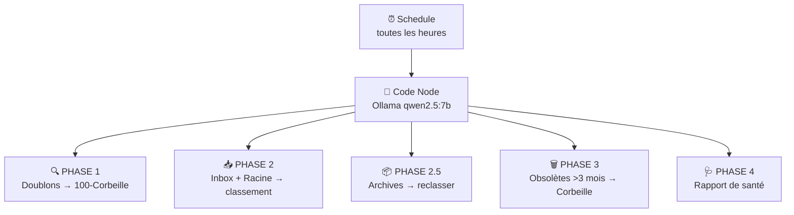

# 🧠 Gardien du Drive — 📦 ARCHIVÉ

> **Ce workflow a été migré en script Python le 13/07/2026.** Le service équivalent tourne désormais en cron Hermes no_agent.
> Cette page est conservée pour référence historique.

---

## Architecture (historique)

```mermaid
graph TD
    SCHEDULE["⏰ Schedule<br/>toutes les heures"] --> CODE["🧠 Code Node<br/>Ollama qwen2.5:7b"]
    CODE --> P1["🔍 PHASE 1<br/>Doublons → 100-Corbeille"]
    CODE --> P2["📥 PHASE 2<br/>Inbox + Racine → classement"]
    CODE --> P2B["📦 PHASE 2.5<br/>Archives → reclasser"]
    CODE --> P3["🗑️ PHASE 3<br/>Obsolètes >3 mois → Corbeille"]
    CODE --> P4["🩺 PHASE 4<br/>Rapport de santé"]
```

## Les 5 phases (historique)

| Phase | Action | Destination |
|:---|:---|:---|
| 🔍 **Doublons** | Garde le + récent, les autres → | **100 - Corbeille** |
| 📥 **Inbox** | Fichiers dans `📥 À classer` ou racine → Ollama classe | Dossier pertinent |
| 📦 **Archives** | `99_ARCHIVES` + `Archives` → Ollama reclasser ou | **100 - Corbeille** |
| 🗑️ **Obsolètes** | Fichiers > 3 mois non modifiés → | **100 - Corbeille** (max 10/h) |
| 🩺 **Santé** | Résumé : doublons, inbox, volume | Rapport JSON |

## Technique (historique)

| Propriété | Valeur |
|:---|:---|
| Workflow | `🧠 Gardien du Drive` (ID: `sTly8jZ2dHWcJQ3w`) — ❌ supprimé |
| Déclencheur | Toutes les heures |
| LLM | Ollama qwen2.5:7b (LEO:11434) |
| Coût | **0 €** |
| Remplacé par | Cron Hermes no_agent (13/07/2026) |

---

*Document archivé le 31/07/2026 — Léo 🦁*

> 🤖 Dernier audit : 31/07/2026 (archivage)
