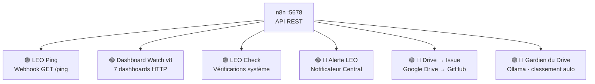

# 🔧 n8n — Automatisation LEO

## 🌐 Pourquoi n8n

[n8n](https://n8n.io) (v2.26.8, Community Edition) est notre orchestrateur de workflows auto-hébergé. Il tourne **en direct sur LEO** (pas de Docker) et gère les automatisations qui nécessitent des **intégrations natives** (Telegram, Google Drive, GitHub) ou une **logique événementielle** (webhooks).

> **Doctrine LEO** : Hermes gère les scripts planifiés (crons no_agent), n8n gère les workflows événementiels et les intégrations complexes.

---

## 🏗️ Architecture



### Accès

| Info | Valeur |
|:-----|:-------|
| URL | http://100.92.102.28:5678 |
| Email | leodanhier@proton.me |
| Version | 2.26.8 |
| Mode | Direct (`npx n8n start`), pas Docker |

---

## ⚡ Workflows Actifs (6)

<!-- AUTO:START gmail-classifier -->
> Mise a jour : 25/06/2026 12:00
> (X) 🔗 Drive → Issue GitHub
> (X) 🚨 Alerte LEO — Notificateur Central
> (X) LEO Ping
> (X) LEO Check
> (X) 🧠 Gardien du Drive
> (X) 🛡️ Dashboard Watch v8 (Gemini)
<!-- AUTO:END gmail-classifier -->

### 1. 🟢 LEO Ping
- **ID** : `MwT0XLeN6hFjzkxS`
- **Déclencheur** : Webhook GET `/ping`
- **Réponse** : `{"response":"pong"}`
- **Utilité** : Healthcheck uptime n8n

### 2. 🟢 Dashboard Watch v8 (Gemini)
- **ID** : `uwvOESa6Xk0jaYJO`
- **Déclencheur** : Toutes les heures
- **Fonction** : Vérifie les 7 dashboards (HTTP 200 + contenu), détecte les mismatches
- **Retry** : 3x natif n8n
- **Backup Hermes** : `dashboard-watch` (toutes les 2h)

### 3. 🟢 LEO Check
- **ID** : `UdUuH8EgAvjMrCh3`
- **Déclencheur** : Webhook
- **Fonction** : Vérifications système à la demande

### 4. 🟢 🚨 Alerte LEO — Notificateur Central
- **ID** : `Jvf4Lbus10jdmjlN`
- **Déclencheur** : Webhook POST `/webhook/leo-alert`
- **Fonction** : Reçoit les alertes des scripts Hermes et les transmet en temps réel sur Telegram
- **Architecture** : Webhook → Code (build message) → HTTP Telegram API
- **Payload attendu** : `{"script": "...", "error": "...", "timestamp": "..."}`

**Exemple d'appel :**
```bash
curl -X POST http://100.92.102.28:5678/webhook/leo-alert \
  -H 'Content-Type: application/json' \
  -d '{"script":"budget-check-v6","error":"Token expiré","timestamp":"2026-06-23T10:00:00"}'
```

### 5. 🟢 🔗 Drive → Issue GitHub
- **ID** : `Aa492uNCEHJy6fsn`
- **Déclencheur** : Webhook POST `/webhook/drive-change-v2`
- **Fonction** : Crée automatiquement une issue dans `leo-tracker` quand un fichier est modifié sur Google Drive
- **Architecture** : Webhook → Code (Process Change) → HTTP GitHub API
- **Payload** : `{"file", "folder", "modified", "driveUrl", "mimeType"}`
- **Labels** : `drive-sync`, `automatique`

### Scripts intégrés avec l'alerte

Les scripts critiques suivants envoient automatiquement une alerte au Notificateur Central en cas d'erreur :
- `dashboard-watch.py` — alertes sur dashboards stale ou budget mismatch
- `deploy_leo_global.py` — échec de push Git
- `collect_bavi_leo_kpi.py` — erreur fatale de collecte

Pour intégrer l'alerte dans un nouveau script :
```python
import sys, os
sys.path.insert(0, os.path.dirname(os.path.abspath(__file__)))
from leo_alert import send_alert

# En cas d'erreur :
send_alert("mon_script.py", f"Erreur: {e}")
```

---

## 📊 Monitoring

| Dashboard | URL | Mise à jour |
|:----------|:----|:-----------|
| 🔧 n8n | [dashboard-n8n](https://christophedanhier-hash.github.io/dashboard-n8n/) | Toutes les 15 min |
| ⏱️ Crons LEO | [crons-dashboard](https://christophedanhier-hash.github.io/crons-dashboard/) | Toutes les heures |
| 🌍 Global | [leo-global-dashboard](https://christophedanhier-hash.github.io/leo-global-dashboard/) | Toutes les heures |

---

## 🛡️ Maintenance

| Tâche | Cron/Commande |
|:------|:--------------|
| Dashboard n8n | `dashboard-n8n` — */15 min |
| Doc Watch | `doc-watch-auto` — toutes les 6h |

---

*Documentation maintenue par LEO Copilote 🦁 · Dernière mise à jour : 23/06/2026*
