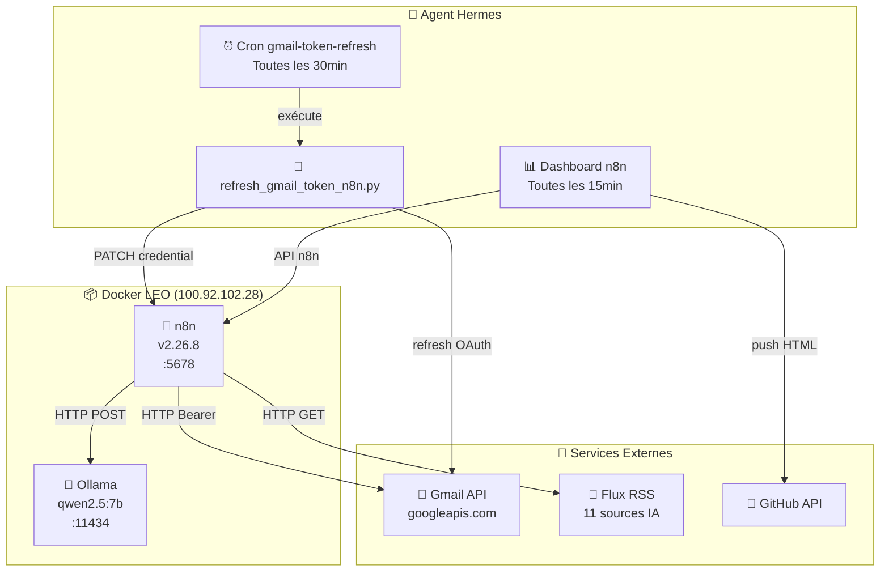

# 🔧 n8n — Automatisation LEO

## 🌐 Pourquoi n8n

**Problème :** Les workflows métier (classement emails, veille IA, rapports hebdo) étaient éparpillés entre crons Hermes, scripts Python, et tâches manuelles. Fragile, maintenance lourde, pas de supervision centralisée.

**Solution :** [n8n](https://n8n.io) (Fair-code, v2.26.8) — orchestrateur visuel de workflows auto-hébergé sur LEO :

- ✅ **Orchestration visuelle** — workflows auditables et modifiables sans code
- ✅ **Pas de dépendance cloud** — tout tourne localement (Docker, `--network host`)
- ✅ **API REST** — 100% automatisable (création, activation, monitoring)
- ✅ **Credentials Gmail via Bearer token** — compatible CE (googleOAuth2Api bloqué par API REST)
- ✅ **Ollama intégré** — analyse IA locale via qwen2.5:7b

---

## 🏗️ Architecture



---

## 🔌 Installation & Déploiement

### Docker Compose (`/opt/data/n8n/docker-compose.yml`)

```yaml
services:
  n8n:
    image: docker.n8n.io/n8nio/n8n:latest
    container_name: n8n
    restart: unless-stopped
    network_mode: host
    environment:
      - N8N_SECURE_COOKIE=false
      - N8N_HOST=100.92.102.28
      - N8N_PROTOCOL=http
      - N8N_PORT=5678
      - N8N_LISTEN_ADDRESS=0.0.0.0
      - WEBHOOK_URL=http://100.92.102.28:5678/
      - N8N_RUNNERS_ENABLED=true
      - GENERIC_TIMEZONE=Europe/Paris
    volumes:
      - n8n_data:/home/node/.n8n
volumes:
  n8n_data:
```

### Accès

| Info | Valeur |
|:-----|:-------|
| URL | http://100.92.102.28:5678 |
| Email | leodanhier@proton.me |
| Version | 2.26.8 |
| Propriétaire | `ea1ce0e6-f282-428a-86d6-9ab5e30b0374` |
| Projet | `opCrVdtfvJhGWzK7` |
| API Key *(optionnelle)* | Définie dans `.env` (scopes: create, read, update, list) |

---

## 📋 Credentials

| Nom | Type | ID | Usage |
|:----|:----|:---|:------|
| **Gmail LEO Bearer Token** | `httpBearerAuth` | `IYACYoqL5skamxym` *(stable)* | Tous les appels Gmail API |
| **Ollama LEO** | `ollamaApi` | `L23MxlJFmeINg1Cz` | Analyse IA locale |
| **Hermes Agent - Ollama LEO** | `ollamaApi` | `VOmM3VrDS93897R4` | Réservé Hermes |
| Gmail LEO | `googleOAuth2Api` | `ayWDZcN46YpzB3CG` | Inutilisable via API REST CE |
| Gmail OAuth2 Generic | `oAuth2Api` | `aw266MRMsTtTTA3P` | Legacy |

> **⚠️ Gmail Bearer Token** : Le credential `httpBearerAuth` est **PATCHé** toutes les 30 min (pas recréé). L'ID reste stable. Le script de refresh est dans `/opt/data/scripts/refresh_gmail_token_n8n.py`.

---

## ⚡ Workflows Actifs

### 1. LEO Ping — `MwT0XLeN6hFjzkxS`
**Statut :** ✅ Actif  
**Déclencheur :** Webhook GET `/webhook/ping`  
**Réponse :** `{"response":"pong"}`  
**Utilité :** Healthcheck — monitoring uptime n8n

### 2. Gmail Classifier v3 — `FbrNhCwLzBDGNf6u`
**Statut :** ✅ Actif  
**Déclencheur :** Toutes les 30 minutes  
**Workflow :** 9 nœuds — classification sémantique via Ollama + labelling Gmail

| # | Nœud | Type | Description |
|:-:|:-----|:-----|:-----------|
| 1 | Schedule | `scheduleTrigger` | Toutes les 30 min |
| 2 | Gmail - Lister INBOX | `httpRequest` | `GET /gmail/v1/users/me/messages?maxResults=5&labelIds=INBOX` |
| 3 | Extraire IDs | `code` | Parse la réponse → 1 item par email |
| 4 | Gmail - Détail email | `httpRequest` | `GET /gmail/v1/users/me/messages/{id}?format=metadata` |
| 5 | Extraire + Filtrer + Prompt | `code` | Vérifie si déjà classifié (Label_1-8), prépare prompt Ollama |
| 6 | Ollama Analyse | `httpRequest` | POST qwen2.5:7b → catégorise en ADMIN/FINANCES/IA/VOYAGES/FAMILLE/ACHATS/MAISON/VIP |
| 7 | Parser + Mapper labels | `code` | Parse réponse Ollama → associe chaque email à son label Gmail |
| 8 | Gmail Appliquer Label | `httpRequest` | POST `modify` → ajoute label + retire INBOX |
| 9 | Rapport final | `code` | Résumé des classements effectués |

**Labels Gmail utilisés :**

| Label | ID | Catégorie |
|:------|:--:|:----------|
| CATEGORY_ADMIN | `Label_1` | Administration Solidaris |
| CATEGORY_FINANCES | `Label_2` | Factures, banque, paie |
| CATEGORY_IA | `Label_3` | IA, ML, Hermes Agent |
| CATEGORY_VOYAGES | `Label_4` | Road trips, vacances |
| CATEGORY_FAMILLE | `Label_5` | Vie privée, enfants |
| CATEGORY_ACHATS | `Label_6` | Commandes, livraisons |
| CATEGORY_MAISON | `Label_7` | Travaux, bricolage |
| CATEGORY_VIP | `Label_8` | Urgent, action immédiate |

### 3. Veille IA - n8n — `Qvm3agl0odLJnLm3`
**Statut :** ✅ Actif  
**Déclencheur :** Quotidien à 08:00  
**Workflow :** 7 nœuds

| # | Nœud | Type | Description |
|:-:|:-----|:-----|:-----------|
| 1 | Schedule | `scheduleTrigger` | 0 8 * * * |
| 2 | Sources RSS | `code` | 5 sources : HN, AI News, ScienceDaily, Google AI, NYT Tech |
| 3 | Fetch RSS | `httpRequest` | GET sur chaque flux |
| 4 | Parser RSS | `code` | Regex XML → title, link, description, source |
| 5 | Formater pour Résumé | `code` | Compile les 20 articles en 1 prompt |
| 6 | Ollama Résumé | `httpRequest` | POST `qwen2.5:7b` → résumé 4-5 phrases |
| 7 | Résultat Final | `code` | Date, résumé, status |

### 4. LEO Dev Log — `sAU24vPIqRsdPLPB`
**Statut :** ✅ Actif  
**Déclencheur :** Tous les lundis à 09:00  
**Workflow :** 1 nœud Code + résult  

| # | Nœud | Type | Description |
|:-:|:-----|:-----|:-----------|
| 1 | Schedule | `scheduleTrigger` | 0 9 * * 1 |
| 2 | Rapport Dev Hebdo | `code` | Génère rapport avec date + résumé |

---

## 🔄 Maintenance

### Refresh Token Gmail (Automatique)

Le token Gmail OAuth expire toutes les 1h. Un cron Hermes le rafraîchit toutes les 30 min :

```
Cron : gmail-token-refresh (e9540f01db57)
Schedule : */30 * * * *
Script : scripts/refresh_gmail_token_n8n.py
Type : no_agent
```

**Ce que fait le script :**
1. Refresh Gmail OAuth → nouveau `access_token`
2. Login n8n
3. **PATCH** le credential `Gmail LEO Bearer Token` (ID `IYACYoqL5skamxym` stable)
4. Trouve dynamiquement les workflows par nom (Gmail, Veille, Dev Log)
5. **PATCH** la référence `httpBearerAuth` dans chaque nœud HTTP si changé
6. Réactive le workflow si nécessaire

> **⚠️ Règle critique :** Le script ne **SUPPRIME JAMAIS** les workflows. Il PATCH le credential existant et les nœuds. Cette règle a été instaurée après une régression le 20/06/2026 où l'ancien script (DELETE+RECREATE + IDs hardcodés) a perdu les 3 workflows.

### Dashboard n8n (Automatique)

```
Cron : dashboard-n8n (2a0806224c6b)
Schedule : */15 * * * *
Script : scripts/run-n8n-dashboard.sh
Type : no_agent
```

Collecte les données via API n8n → génère `index.html` (style crons-dashboard) → push vers GitHub Pages.

Disponible : [Dashboard n8n LEO](https://christophedanhier-hash.github.io/dashboard-n8n/)

### Healthcheck

```
Cron : n8n-healthcheck (17f34eb1ce9c)
Schedule : */15 * * * *
Script : scripts/collect-n8n-status.py
Type : no_agent
```

Vérifie que l'API n8n répond et que les 4 workflows sont actifs.

---

## 📊 Monitoring

| Dashboard | URL | Mise à jour |
|:----------|:----|:-----------|
| 🔧 n8n | [dashboard-n8n](https://christophedanhier-hash.github.io/dashboard-n8n/) | Toutes les 15 min |
| ⏱️ Crons LEO | [crons-dashboard](https://christophedanhier-hash.github.io/crons-dashboard/) | Toutes les 4h |

Le dashboard n8n affiche :
- 🎴 4 stats cards (Workflows, Actifs, Exécutions, Credentials)
- 📈 Bar chart exécutions / 7 jours (Chart.js)
- ⚡ Cartes workflows (statut, dernier run, durée, badges)
- 🔑 Credentials (types, IDs)
- 📅 Heatmap 7 jours (✅/❌ par workflow)

---

## 🛡️ Plan de Reprise d'Activité (PRA)

| Scénario | Procédure |
|:---------|:----------|
| **n8n planté** | `docker restart n8n` — les données sont persistées dans le volume `n8n_data` |
| **Volume perdu** | Restauration depuis le backup quotidien (`daily-backup` à 06:00) qui dump les scripts n8n + secrets |
| **Token Gmail expiré** | Le cron `gmail-token-refresh` s'en charge automatiquement toutes les 30 min |
| **Workflow désactivé** | Vérifier le credential Bearer Token — le script de refresh le PATCH et réactive |
| **Reconstruction complète** | Suivre le deployment checklist (skill bavi-leo/deployment-checklist) |

---

## 🧠 Leçons apprises

1. **Jamais DELETE+RECREATE les workflows** (API n8n CE ne supporte pas le PATCH `active: true` sur archive). Toujours PATCH le credential directement.
2. **IDs stables pour credentials** — le credential Bearer doit être PATCHé (pas recréé) pour garder le même ID. Sinon les références dans les nœuds HTTP cassent.
3. **Workflows trouvés par nom** — ne jamais hardcoder les IDs. Le script de refresh les trouve dynamiquement avec `find_target_workflows()`.
4. **googleOAuth2Api bloqué en CE** — n8n Community Edition ne peut pas créer/modifier ce type de credential via l'API REST. Solution : httpBearerAuth.
5. **Rate limiting API n8n** — attendre 2s entre chaque appel API.

---

*Documentation générée par LEO 🦁 · Dernière mise à jour : 2026-06-20*
