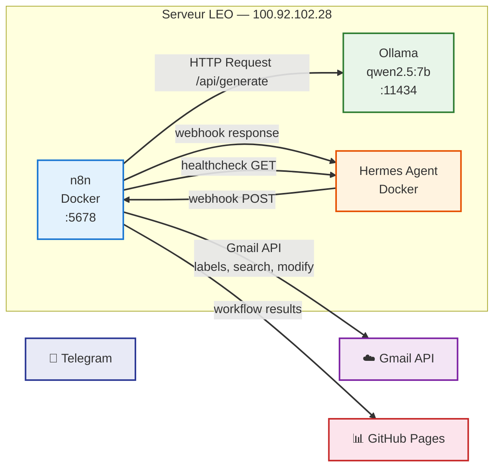
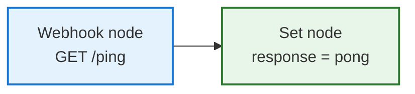
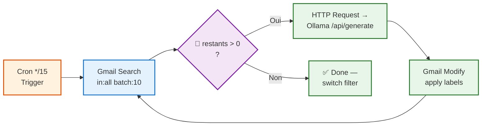

# 🔧 n8n — Automatisation LEO

## 🌐 Pourquoi n8n

**Problème :** Le classifieur Gmail initial fonctionnait par règles regex — fragile, maintenance lourde, pas de classification sémantique. Les automations (veille IA, emails, webhooks) étaient éparpillées entre crons Hermes et scripts manuels.

**Solution :** [n8n](https://n8n.io) (Fair-code) — orchestrateur visuel de workflows, auto-hébergé sur LEO :
- ✅ **Classification sémantique** via Ollama (qwen2.5:7b) — labels Gmail intelligents
- ✅ **Pas de dépendance cloud** — tout tourne localement
- ✅ **Webhooks** — endpoints déclenchables par Hermes ou des services externes
- ✅ **UI visuelle** — création et debugging de pipelines sans code

n8n est **complémentaire** à Hermes :
- **Hermes** = raisonnement, dispatch, décision
- **n8n** = pipelines automatisés, intégrations API, transformations data

---

## 🏗️ Architecture



### Composants

| Service | Technologie | Port | Accès |
|---------|------------|:----:|-------|
| **n8n** | Docker (n8nio/n8n:latest) | `5678` | `http://100.92.102.28:5678` |
| **Base de données** | SQLite (intégrée Docker) | — | Volume `n8n_data` |
| **Modèle LLM** | Ollama qwen2.5:7b (4.7 GB) | `11434` | HTTP via n8n |
| **Réseau** | `network_mode: host` | — | Accès direct à tous les services |

---

## ⚙️ Installation

### Docker

```bash
docker run -d \
  --name n8n \
  --network host \
  -e N8N_SECURE_COOKIE=false \
  -e WEBHOOK_URL=http://100.92.102.28:5678/ \
  -e N8N_SKIP_WEBHOOK_DEREGISTRATION_SHUTDOWN=true \
  -e EXECUTIONS_DATA_PRUNE=true \
  -e EXECUTIONS_DATA_MAX_AGE=168 \
  -v n8n_data:/home/node/.n8n \
  --restart unless-stopped \
  n8nio/n8n:latest
```

### Variables d'environnement

| Variable | Valeur | Raison |
|----------|--------|--------|
| `N8N_SECURE_COOKIE` | `false` | Contexte réseau local uniquement |
| `WEBHOOK_URL` | `http://100.92.102.28:5678/` | URL publique des webhooks |
| `N8N_SKIP_WEBHOOK_DEREGISTRATION_SHUTDOWN` | `true` | Évite timeout à l'arrêt |
| `EXECUTIONS_DATA_PRUNE` | `true` | Auto-nettoyage historique |
| `EXECUTIONS_DATA_MAX_AGE` | `168` | Rétention 7 jours (heures) |

---

## 🔐 Credentials

### n8n (créés dans l'interface)

| Credential | Type | Usage |
|-----------|------|-------|
| **Ollama — LEO** | HTTP Request | Workflows Hermes |
| **Ollama — Utilisateur** | HTTP Request | Workflows manuels |
| **Gmail OAuth LEO** | OAuth2 | Classification emails |
| **Hermes Agent** | API Key Hermes | Automation workflows |

> ⚠️ Credentials stockés dans n8n (chiffrés). Le mot de passe admin et l'API key Hermes sont dans `BAVI/AGENT-PRO/bureau-michel/n8n/secrets.txt` (local uniquement — pas dans git).

---

## 📋 Catalogue des Workflows

### 🔵 `LEO Ping` — Webhook de santé

| Propriété | Valeur |
|-----------|--------|
| **ID** | `JQ3C2RKBJJX6Zz1f` |
| **Déclencheur** | Webhook GET |
| **Endpoint** | `http://100.92.102.28:5678/webhook/ping` |
| **Réponse** | `{"response": "pong"}` HTTP 200 |
| **Statut** | ✅ Actif |
| **Usage** | Healthcheck — appelé par le cron `n8n-healthcheck` toutes les 15min |

**Architecture :**


**Note technique :** utilise `typeVersion: 2` avec `responseMode: "lastNode"` — pas besoin de nœud "Respond to Webhook".

---

### 🟢 `Gmail Classifier v2 — LLM` — Classification sémantique

| Propriété | Valeur |
|-----------|--------|
| **Déclencheur** | Cron — toutes les 15 min |
| **Filtre** | `in:all` (catch-up) → `newer_than:7d` (incrémental) |
| **Modèle** | Ollama qwen2.5:7b via HTTP Request |
| **Batch** | 10 emails par appel API |
| **Limite** | 500 emails par run |
| **Statut** | ✅ Actif |

**Architecture :**


**Prompt utilisé pour la classification :**

```
Tu es un assistant qui classe les emails Gmail. Analyse le sujet et le corps du message ci-dessous.

Labels disponibles :
- Admin — Administration, courrier officiel, assurances, mutuelle
- Finances — Banque, placements, factures, impôts, comptabilité
- IA&Tech — Intelligence artificielle, technologie, informatique
- Voyages — Réservations, itinéraires, campings
- Famille — Communications personnelles, famille, amis
- Achats — Achats en ligne, colis, livraisons
- Maison — Travaux, immobilier, énergie, jardin
- VIP — Expéditeurs importants (chef, direction)

Réponds UNIQUEMENT par le nom du label, rien d'autre.
```

**Labels Gmail gérés :**

| Label | Couleur | Type |
|-------|:-------:|:----:|
| 📁 **Admin** | Bleu | Système |
| 📁 **Finances** | Vert | Système |
| 📁 **IA&Tech** | Violet | Système |
| 📁 **Voyages** | Orange | Système |
| 📁 **Famille** | Jaune | Système |
| 📁 **Achats** | Rouge | Système |
| 📁 **Maison** | Cyan | Système |
| ⭐ **VIP** | Jaune vif | Spécial |

---

### 🧩 Workflows à venir

| Workflow | Priorité | Statut |
|----------|:--------:|:------:|
| **Veille IA → Email** | Haute | 📋 Planifié |
| **Sync Dashboards** | Basse | 📋 Planifié |
| **Auto-réponse Gmail (VIP)** | Basse | 📋 Idée |

---

## 🔄 Maintenance

### Mise à jour

```bash
docker pull n8nio/n8n:latest
docker stop n8n
docker rm n8n
# relancer avec la commande d'installation ci-dessus
```

### Backup

Les données n8n sont sauvegardées quotidiennement à **06:00** par `leo-backup.py` :

| Élément | Méthode |
|---------|---------|
| **Workflows (scénarios export)** | Script dédié |
| **Credentials (API key, secrets)** | Fichier texte (hors git) |
| **Volume Docker** | `docker run --rm -v n8n_data:/data ... tar czf` |

Procédure de restauration complète dans [Backup & Recovery](../utilisation/backup-recovery.md).

### Logs

```bash
docker logs n8n
docker logs -f n8n  # suivi temps réel
```

---

## 📊 Monitoring

| Outil | Description | Fréquence |
|-------|-------------|:---------:|
| **`n8n-healthcheck`** (cron no_agent) | `GET /webhook/ping` → `pong` | Toutes les 15 min |
| **Dashboard LEO** | Carte n8n : version, uptime, workflows | Chaque heure |
| **`gmail-classifier-v2-followup`** (cron agent) | Vérifie progression classification et bascule filtre | Toutes les 30 min |
| **Backup** | Sauvegarde volume + scripts | Quotidien 06:00 |

---

## 🚨 PRA

En cas de perte du serveur LEO :

1. **Restaurer le volume Docker** `n8n_data` depuis la dernière sauvegarde
2. **Relancer** le conteneur avec la commande d'installation
3. **Re-créer les credentials** OAuth si le chiffrement a changé
4. **Vérifier** le webhook ping
5. **Activer** le cron `gmail-classifier` (regex) en fallback si Ollama pas encore restauré

---

## 🔗 Références

- [Interface n8n](http://100.92.102.28:5678) (réseau local uniquement)
- [Webhook santé](http://100.92.102.28:5678/webhook/ping)
- [Documentation n8n](https://docs.n8n.io)
- [Dashboard LEO](https://christophedanhier-hash.github.io/dashboard-leo/)
- [État des lieux Hermes](../etat-des-lieux.md)
- [Backup & Recovery](../utilisation/backup-recovery.md)
