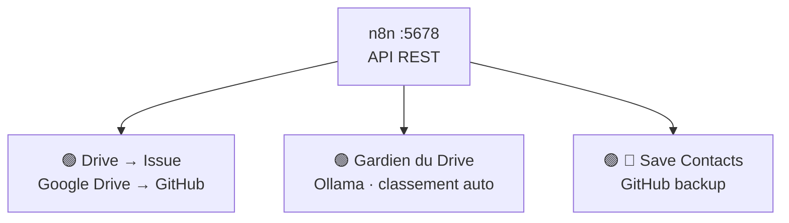

# 🔧 n8n — Automatisation LEO

> **📦 ARCHIVE — Service retiré le 13/07/2026.** n8n Docker a été arrêté et supprimé. Les workflows (Drive→Issue, Gardien du Drive, Save Contacts) ont été migrés vers des crons Hermes no_agent. Cette page est conservée pour référence historique.

## 🌐 Historique

[n8n](https://n8n.io) (v2.26.8, Community Edition) était notre orchestrateur de workflows auto-hébergé. Il tournait **dans un conteneur Docker** (`docker.n8n.io/n8nio/n8n:latest`) et gérait les automatisations nécessitant des **intégrations natives** (Google Drive, GitHub).

> **Doctrine LEO (obsolète)** : ~~Hermes gère les scripts planifiés (crons no_agent), n8n gère les workflows événementiels et les intégrations complexes.~~ → Depuis le 13/07/2026, tout est géré par les crons Hermes.

---

## 🏗️ Architecture

### Accès

| Info | Valeur |
|:-----|:-------|
| URL locale | http://localhost:5678 |
| URL Tailscale | http://100.92.102.28:5678 |
| Email | leodanhieria@gmail.com |
| Password | `/opt/data/.n8n_pass` |
| Version | 2.26.8 |
| Mode | Docker (`docker.n8n.io/n8nio/n8n:latest`) |

> **Note** : Le collecteur `collect-v2.py` utilise `localhost:5678` (corrigé le 04/07/2026, était `100.92.102.28:5678`).

---

## ⚡ Workflows Actifs (3)

### 1. 🟢 🔗 Drive → Issue GitHub
- **ID** : `KPoilIuXhkw0pjGU`
- **Déclencheur** : Webhook POST
- **Fonction** : Crée automatiquement une issue dans `leo-tracker` quand un fichier est modifié sur Google Drive
- **Architecture** : Webhook → Code → HTTP GitHub API

### 2. 🟢 🧠 Gardien du Drive
- **ID** : `aRNg1FQMfptLu9Wt`
- **Déclencheur** : Planifié
- **Fonction** : Surveillance et classement automatique des fichiers Drive via Ollama

### 3. 🟢 💾 Save Contacts to GitHub
- **ID** : `G73KASTP4EyUneMX`
- **Déclencheur** : Planifié
- **Fonction** : Sauvegarde des contacts Google vers GitHub

---

## 📊 Monitoring

Le statut n8n est intégré au **leo-dashboard** (source `n8n` dans `collect-v2.py`) :

| Métrique | Source |
|:---------|:-------|
| 🟢/🔴 En ligne | Healthcheck `/healthz` |
| Nombre de workflows | API REST `/rest/workflows` |
| Statut par workflow | API REST `/rest/executions` |
| Exécutions 7j | API REST `/rest/executions?limit=500` |

Accès : [leo-dashboard](https://christophedanhier-hash.github.io/leo-dashboard/) → onglet ⚙️ Infra → section n8n

---

## 🛡️ Maintenance

| Tâche | Commande |
|:------|:---------|
| Vérifier le conteneur | `docker ps --filter name=n8n` |
| Voir les logs | `docker logs n8n --tail 50` |
| Healthcheck | `curl -s http://localhost:5678/healthz` |
| Refresh credentials | Login via API : `curl -X POST http://localhost:5678/rest/login` |

---

*Document mis à jour le 04/07/2026 à 22:48 — Léo 🦁*

---

> 🤖 Dernier audit : 18/07/2026 à 12:00 (UTC+2) — archivé, n8n retiré 13/07/2026
