# 🏛️ Architecture LEO — Dashboards, Crons & n8n

> Document vivant — mis à jour le 23/06/2026. Détaille la vision globale et l'ordonnancement de l'écosystème LEO : qui produit quoi, comment les données circulent, et quels filets de sécurité protègent l'ensemble.

---

## 1. Vue d'ensemble (Topologie)

```mermaid
flowchart TB
    subgraph Sources["📡 Sources de données"]
        DS["DeepSeek API<br/>api.deepseek.com"]
        GH_API["GitHub API<br/>api.github.com"]
        OS["OS 3 machines<br/>LEO / Yoga / Penguin"]
        N8N_API["n8n API<br/>localhost:5678"]
    end

    subgraph Collecte["⏱️ Collecte (28 Crons Hermes default)"]
        BC["budget-check-v6<br/>H:05"]
        MK["machines-kpi<br/>H:00"]
        CD["crons-dashboard<br/>H:20"]
        GD["github-dashboard<br/>H:25"]
        ND["dashboard-n8n<br/>*/15"]
        WD["dashboard-watch<br/>30 */2h"]
        DW["doc-watch-auto<br/>00/06/12/18"]
        BAVI["bavi-leo-dashboard<br/>H:05"]
        LD["dashboard-leo<br/>H:10"]
        MM["leo-metrics<br/>H:15"]
        NC["n8n-healthcheck<br/>*/15"]
        VEILLE["Veille IA<br/>05:30/06:00"]
        SYNC["drive-sync<br/>18:00"]
        GLOB["🌍 Global Dashboard<br/>H:05"]
        AH["🛡️ Auto-Heal<br/>H:45 · dashboard-watch"]
        SM["🔄 sync-memory<br/>*/30"]
    end

    subgraph n8n["🤖 Workflows n8n (3)"]
        DW_N8N["🛡️ Dashboard Watch v5<br/>1h"]
        PING["🟢 LEO Ping<br/>15min"]
        BUDGET["💰 Budget Check v4<br/>1h"]
    end

    subgraph Transit["🌉 Transit"]
        BJ["budget.json<br/>/opt/data/metrics/"]
        WD_Script["dashboard-watch.py<br/>vérification budget<br/>+ contenu dashboards"]
    end

    subgraph Dashboards["📊 GitHub Pages (7)"]
        LEO["📊 LEO KPI<br/>sessions · budget · tokens"]
        BAVI_D["🏛️ BAVI LEO<br/>KPIs BAVI · budget"]
        MACHINES["💻 Machines<br/>CPU · RAM · Disque"]
        CRONS_D["⏱️ Crons<br/>30 crons · historique 7j"]
        GITHUB_D["🐙 GitHub<br/>repos · activité"]
        N8N_D["🔧 n8n<br/>workflows · exécutions"]
        GLOBAL_D["🌍 Global<br/>portail agrégé unique"]
    end

    subgraph Securite["🛡️ Filets de sécurité"]
        DOC_WATCH["doc-watch-auto<br/>snapshot → commit"]
        HERMES_BACKUP["Crons Hermes<br/>backup n8n"]
        CONTENT_CHECK["dashboard-watch<br/>vérification contenu<br/>+ auto-redeploy"]
    end

    subgraph Notifications["📨 Communications"]
        TG["Telegram<br/>Christophe (Tofdan)"]
        EMAIL_COWORK["Email leodanhieria<br/>Veille IA"]
    end

    %% Connexions Hermes → Dashboards
    BC -->|écrit| BJ
    LD -->|déploie| LEO
    BAVI -->|déploie| BAVI_D
    MM -->|déploie| MACHINES
    CD -->|déploie| CRONS_D
    GD -->|déploie| GITHUB_D
    ND -->|déploie| N8N_D
    GLOB -->|déploie| GLOBAL_D

    %% Sources → Crons
    DS --> BC
    OS --> MK
    GH_API --> GD
    N8N_API --> ND
    N8N_API --> NC

    %% Filets
    WD -->|vérifie HTTP + contenu| Dashboards
    WD -->|vérifie budget| BJ
    CONTENT_CHECK -->|auto-redeploy| Dashboards
    HERMES_BACKUP -->|backup si n8n down| Transit

    %% Doc
    DW -->|commit auto| DOC_WATCH

    %% Veille
    VEILLE -->|"envoi"| EMAIL_COWORK
```



---

## 2. Les 7 Dashboards de Surveillance

Chaque dashboard est une page statique hébergée sur GitHub Pages, rafraîchie automatiquement par un script d'arrière-plan sans surcharge de base de données.

| Dashboard | URL | Contenu | Généré par | Fréquence | Coût |
| :--- | :--- | :--- | :--- | :---: | :---: |
| **🌍 Global** | [leo-global-dashboard](https://christophedanhier-hash.github.io/leo-global-dashboard/) | **Portail agrégé unique** (KPIs, crons, budgets, n8n, machines) | `deploy_leo_global.py` | H:05 | **0$** |
| **📊 LEO KPI** | [dashboard-leo](https://christophedanhier-hash.github.io/dashboard-leo/) | Sessions, tokens, budget DeepSeek, statuts | `deploy_leo_dashboard.py` | H:10 | **0$** |
| **🏛️ BAVI LEO** | [bavi-leo-dashboard](https://christophedanhier-hash.github.io/bavi-leo-dashboard/) | Sessions BAVI, jetons, graphiques d'activité | `deploy_bavi_leo_dashboard.py` | H:05 (every 60m) | **0$** |
| **💻 Machines** | [leo-metrics](https://christophedanhier-hash.github.io/leo-metrics/) | CPU/RAM/Disque des machines LEO, Yoga, Penguin | `deploy_machines.py` | H:15 | **0$** |
| **⏱️ Crons** | [crons-dashboard](https://christophedanhier-hash.github.io/crons-dashboard/) | État d'exécution des 28 crons, historique 7 jours | `deploy-crons-dashboard.py` | H:20 | **0$** |
| **🐙 GitHub** | [github-dashboard](https://christophedanhier-hash.github.io/github-dashboard/) | Activité et commits des dépôts de l'écosystème | `deploy-github-dashboard.py` | H:25 | **0$** |
| **🔧 n8n** | [dashboard-n8n](https://christophedanhier-hash.github.io/dashboard-n8n/) | Statut des workflows, exécutions et credentials n8n | `collect_n8n_dashboard.py` | H:15 (*/15) | **0$** |

---

## 3. Les Crons Hermes (28 Actifs)

Tous les crons sont configurés sous le profil `default` en mode `no_agent=True` (à l'exception de la classification d'emails et de la veille IA), ce qui garantit **0$ de coûts d'inférence LLM** pour les tâches de routine.

### ⏱️ Ordonnancement Staggered (Minute par minute)

Pour éviter les embouteillages d'accès disque ou réseau, les exécutions horaires sont harmonieusement décalées :

```
H:00 ── H:05 ── H:10 ── H:15 ── H:20 ── H:25 ── H:30 ── H:35 ── H:36
 │       │       │       │       │       │       │       │       │
 │       │       │       │       │       │       │       │       └── t600-drive-sync
 │       │       │       │       │       │       │       └────────── wiki-oca-sync
 │       │       │       │       │       │       └────────────────── wiki-sync
 │       │       │       │       │       └────────────────────────── github-dashboard
 │       │       │       │       └────────────────────────────────── crons-dashboard
 │       │       │       └────────────────────────────────────────── leo-metrics (machines)
 │       │       └────────────────────────────────────────────────── dashboard-leo
 │       └────────────────────────────────────────────────────────── budget-check-v6 & Global
 └────────────────────────────────────────────────────────────────── machines-kpi
```

### Liste complète des Crons actifs

| Cron | Horaires | Script associé | Rôle principal |
| :--- | :---: | :--- | :--- |
| `daily-backup` | **06:00** | `run-backup.sh` | Sauvegarde compressée des données critiques de configuration. |
| `docs-update` | **08:00** | `run-docs-update.sh` | Génération et mise à jour de la documentation via LLM local. |
| `machines-kpi` | **H:00** | `run-machines-kpi.sh` | Collecte brute des indicateurs CPU/RAM/Disque de l'OS. |
| `budget-check-v6` | **H:05** | `run-budget.sh` | Récupère le solde DeepSeek, met à jour Sheets et `budget.json`. |
| `🌍 Global Dashboard` | **H:05** | `deploy_leo_global.py` | Génère et pousse le portail agrégé de surveillance sur GitHub Pages. |
| `dashboard-leo` | **H:10** | `run-dashboard.sh` | Génère et déploie le dashboard 📊 LEO KPI. |
| `leo-metrics` | **H:15** | `run-leo-metrics.sh` | Génère et déploie le dashboard 💻 Machines. |
| `crons-dashboard` | **H:20** | `run-crons-dashboard.sh` | Génère et déploie le dashboard ⏱️ Crons. |
| `github-dashboard` | **H:25** | `run-github-dashboard.sh` | Génère et déploie le dashboard 🐙 GitHub. |
| `bavi-leo-dashboard` | **60 min** | `run-bavi-leo-dashboard.sh` | Génère et déploie le dashboard d'activité 🏛️ BAVI LEO. |
| `wiki-sync` | **H:30** | `run-wiki-sync.sh` | Synchronise et publie les wikis sur GitHub Pages (MkDocs). |
| `wiki-oca-sync` | **H:35** | `run-wiki-oca-sync.sh` | Synchronise et publie la documentation T600/OCA. |
| `t600-drive-sync` | **H:36** | `run-t600-drive-sync.sh` | Synchronisation de la documentation T600 depuis Google Drive. |
| `drive-sync` | **18:00** | `drive-sync.sh` | Miroir bidirectionnel global Google Drive ↔ Dépôts GitHub. |
| `n8n-healthcheck` | **\*/15** | `collect-n8n-status.py` | Analyse la disponibilité de l'instance locale n8n et son Docker. |
| `dashboard-n8n` | **\*/15** | `run-n8n-dashboard.sh` | Génère et déploie le dashboard 🔧 n8n. |
| `Classifieur emails` | **30 min** | `gmail-classifier` | Labelisation intelligente de l'inbox via Ollama local (0$). |
| `Veille IA phase 1` | **05:30** | `collect_veille_rss.py` | Moissonnage des flux RSS de 11 sources technologiques majeures. |
| `Veille IA phase 2` | **06:00** | `veille_ia.py` | Analyse IA des flux moissonnés et envoi par email HTML à 8:00. |
| `doc-watch-auto` | **00/06/12/18** | `doc-watch-auto.py` | Scanne l'état des wikis, détecte les changements et commit. |
| `auto-commit-repos` | **30 \*/2h** | `auto-commit-repos.sh` | Valide et pousse toute modification locale vers nos dépôts GitHub. |
| `sync-memory` | **\*/30** | `sync-memory.py` | **Réplication de mémoire transversale** entre nos 3 profils Hermes. |
| `dashboard-watch` | **30 \*/2h** | `dashboard-watch.py` | Scanne la santé des dashboards et déclenche un auto-reploy si stale. |
| `🛡️ Auto-Heal` | **45 \*/1h** | `dashboard-watch.py` | Watchdog auto-cicatrisant (PATH gh, imports Python, webhooks down). |
| `watchdog-code-server`| **\*/5** | `watchdog-code-server.sh` | Garantit que Code-Server reste accessible sur le port 8081. |
| `watchdog-cs-tunnel` | **\*/5** | `watchdog-tunnel-cs.sh` | Maintient le tunnel de développement de Code-Server en ligne. |
| `credentials-check` | **Lun 09:00** | `check-credentials.py` | Audit hebdomadaire de la validité des tokens Google OAuth2. |
| `check-hermes-update`| **09:00** | `check_hermes_update.py`| Alerte si une mise à jour d'Hermes Agent est disponible. |

---

## 4. Les 3 Workflows n8n

N8n est hébergé localement sur `100.92.102.28:5678` et agit comme un orchestrateur visuel avec retry natif.

*   **🟢 LEO Ping** (Toutes les 15 min) : Assure que le serveur est bien vivant.
*   **🛡️ Dashboard Watch v5** (Toutes les heures) : Vérifie la validité des requêtes HTTP des dashboards et alerte en cas de non-réponse.
*   **💰 Budget Check v4** (Toutes les heures) : Complète le tracking financier.

---

## 5. Filets de Sécurité (Résilience)

| Défaillance détectée | Détecté par | Action corrective immédiate |
| :--- | :--- | :--- |
| **Dashboard HTTP 404 / figé** | `dashboard-watch` | Déclenche un **auto-redeploy** immédiat via le script associé. |
| **Fichiers locaux non commit** | `auto-commit-repos` | Exécute un commit/push automatique vers GitHub toutes les 2 heures. |
| **Mémoire divergente** | `sync-memory` | Écrase les versions obsolètes par la version `MEMORY.md` la plus récente. |
| **Processus Code-Server planté** | `watchdog-code-server`| Relance le serveur de développement en arrière-plan. |
| **Token GitHub expiré** | `credentials-check` | Envoie une notification et bascule en lecture seule sécurisée. |

---

## 6. Cycle de vie d'une métrique

```
📡 API Source ──→ ⏱️ Cron Hermes (H:XX) ──→ 📝 Fichier local (.json) ──→ 🌍 Global Dashboard ──→ 🐙 GitHub Pages
                                                                                                      │
                                                                                                🛡️ Watchdogs
                                                                                          (Auto-Heal si stale)
```

---

*Document maintenu automatiquement par LEO — dernière révision complète : 23/06/2026.*
