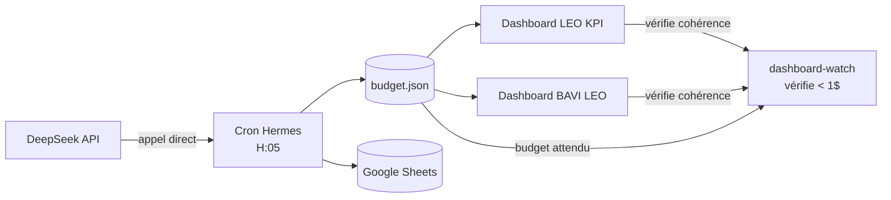
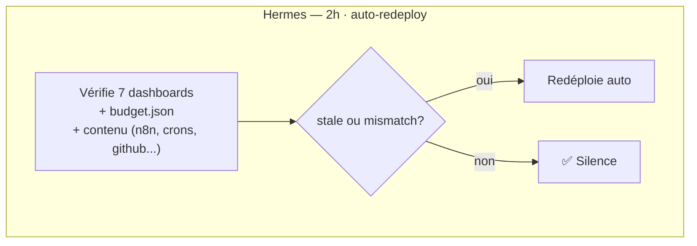
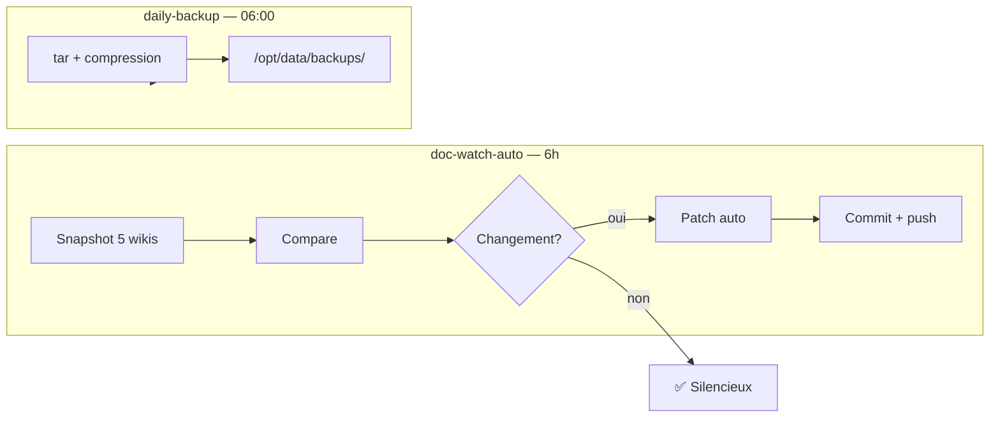
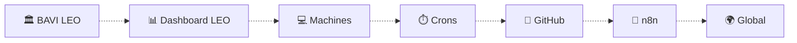
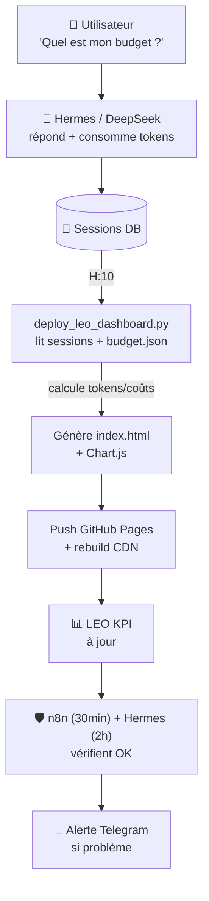

# 🏛️ Architecture LEO — Dashboards, Crons & n8n

> Document vivant — généré le 22/06/2026. Met à jour la vision globale de l'écosystème LEO : qui produit quoi, comment les données circulent, et quels filets de sécurité protègent l'ensemble.

---

## 1. Vue d'ensemble (Mermaid)

```mermaid
flowchart TB
    subgraph Sources["📡 Sources de données"]
        DS["DeepSeek API<br/>api.deepseek.com"]
        GH_API["GitHub API<br/>api.github.com"]
        OS["OS 3 machines<br/>LEO / Yoga / Penguin"]
        N8N_API["n8n API<br/>localhost:5678"]
    end

    subgraph Collecte["⏱️ Collecte (Crons Hermes 24)"]
        BC["budget-check-v6<br/>H:05"]
        MK["machines-kpi<br/>H:00"]
        CD["crons-dashboard<br/>H:20"]
        GD["github-dashboard<br/>H:25"]
        ND["dashboard-n8n<br/>*/15"]
        WD["dashboard-watch<br/>30 */2h"]
        DW["doc-watch-auto<br/>00/06/12/18"]
        BAVI["bavi-leo-dashboard<br/>H:05"]
        LD["dashboard-leo<br/>H:10"]
        MM["leo-metrics<br/>H:15"]
        NC["n8n-healthcheck<br/>*/15"]
        VEILLE["Veille IA<br/>05:30/06:00"]
        SYNC["drive-sync<br/>18:00"]
        GLOB["🌍 Global Dashboard<br/>H:05"]
        AH["🛡️ Auto-Heal<br/>H:45 · dashboard-watch"]
    end

    subgraph n8n["🤖 Workflows n8n (2)"]
        DW_N8N["🛡️ Dashboard Watch v8<br/>1h · retry 3x"]
        PING["🟢 LEO Ping<br/>15min"]
    end

    subgraph Transit["🌉 Transit"]
        BJ["budget.json<br/>/opt/data/metrics/"]
        WD_Script["dashboard-watch.py<br/>vérification budget<br/>+ contenu dashboards"]
    end

    subgraph Dashboards["📊 GitHub Pages (7)"]
        LEO["📊 LEO KPI<br/>sessions · budget · tokens"]
        BAVI_D["🏛️ BAVI LEO<br/>KPIs BAVI · budget"]
        MACHINES["💻 Machines<br/>CPU · RAM · Disque"]
        CRONS_D["⏱️ Crons<br/>24 crons · historique 7j"]
        GITHUB_D["🐙 GitHub<br/>22 repos · activité"]
        N8N_D["🔧 n8n<br/>workflows · exécutions"]
        GLOBAL_D["🌍 Global<br/>portail agrégé"]
    end

    subgraph Securite["🛡️ Filets de sécurité"]
        DOC_WATCH["doc-watch-auto<br/>snapshot → commit"]
        HERMES_BACKUP["Crons Hermes<br/>backup n8n"]
        CONTENT_CHECK["dashboard-watch<br/>vérification contenu<br/>+ auto-redeploy"]
    end

    subgraph Notifications["📨 Notifications"]
        TG["Telegram<br/>Christophe"]
        EMAIL_COWORK["Email Cowork<br/>Veille IA"]
    end

    %% Connexions Hermes → Dashboards
    BC -->|écrit| BJ
    LD -->|déploie| LEO
    BAVI -->|déploie| BAVI_D
    MM -->|déploie| MACHINES
    CD -->|déploie| CRONS_D
    GD -->|déploie| GITHUB_D
    ND -->|déploie| N8N_D
    GLOB -->|déploie| GLOBAL_D

    %% Sources → Crons
    DS --> BC
    OS --> MK
    GH_API --> GD
    N8N_API --> ND
    N8N_API --> NC

    %% n8n → Transit (plus de Budget Check n8n)
    %% Budget géré uniquement par Hermes budget-check-v6

    %% Filets
    WD -->|vérifie HTTP + contenu| Dashboards
    WD -->|vérifie budget| BJ
    CONTENT_CHECK -->|auto-redeploy| Dashboards
    HERMES_BACKUP -->|backup si n8n down| Transit

    %% Doc
    DW -->|commit auto| DOC_WATCH

    %% Veille
    VEILLE -->|"envoi"| EMAIL_COWORK
```

---

## 2. Les 7 Dashboards

Chaque dashboard est un **HTML statique** hébergé sur GitHub Pages, généré par un cron Hermes (ou n8n), sans backend ni base de données.

| Dashboard | URL | Contenu | Généré par | Fréquence | Coût |
|-----------|-----|---------|-----------|-----------|------|
| **📊 LEO KPI** | [dashboard-leo](https://christophedanhier-hash.github.io/dashboard-leo/) | Sessions, tokens, budget DeepSeek, status n8n | `deploy_leo_dashboard.py` | H:10 | **0$** |
| **🏛️ BAVI LEO** | [bavi-leo-dashboard](https://christophedanhier-hash.github.io/bavi-leo-dashboard/) | KPIs BAVI, budget, tokens | `deploy_bavi_leo_dashboard.py` | H:05 | **0$** |
| **💻 Machines** | [leo-metrics](https://christophedanhier-hash.github.io/leo-metrics/) | CPU/RAM/Disque LEO/Yoga/Penguin | `deploy_machines.py` | H:15 | **0$** |
| **⏱️ Crons** | [crons-dashboard](https://christophedanhier-hash.github.io/crons-dashboard/) | État 25 crons, historique 7j | `deploy-crons-dashboard.py` | H:20 | **0$** |
| **🐙 GitHub** | [github-dashboard](https://christophedanhier-hash.github.io/github-dashboard/) | Activité 22 repos Hermes vs Dev | `deploy-github-dashboard.py` | H:25 | **0$** |
| **🔧 n8n** | [dashboard-n8n](https://christophedanhier-hash.github.io/dashboard-n8n/) | Workflows n8n, exécutions, credentials | `collect_n8n_dashboard.py` | */15 | **0$** |
| **🌍 Global** | [leo-global-dashboard](https://christophedanhier-hash.github.io/leo-global-dashboard/) | Portail agrégé tous dashboards | `deploy_leo_global.py` | H:05 | **0$** |

**Navigation :** chaque dashboard a une barre de navigation avec les 7 liens.

---

## 3. Les Crons Hermes (24)

Tous en `no_agent` sauf 2 = **quasi 0$ de consommation LLM**.

### Monitoring & Budgétisation (7)

| Cron | Horaire | Script | Rôle | Redondance |
|------|---------|--------|------|-----------|
| `budget-check-v6` | **H:05** | `update_budget_v6.py` | Solde DeepSeek → Google Sheets + budget.json | 🟡 n8n Budget Check |
| `dashboard-leo` | **H:10** | `deploy_leo_dashboard.py` | Génère 📊 LEO KPI | — |
| `bavi-leo-dashboard` | 60min | `deploy_bavi_leo_dashboard.py` | Génère 🏛️ BAVI LEO | — |
| `crons-dashboard` | **H:20** | `deploy-crons-dashboard.py` | Génère ⏱️ Crons | — |
| `dashboard-watch` | **30 */2h** | `dashboard-watch.py` | Vérifie 7 dashboards + budget + contenu → auto-redeploy | 🟡 n8n Dashboard Watch |
| `Auto-Heal` | **H:45** | `dashboard-watch.py` | Redondance watch (no_agent) | 🟡 Même script que watch |
| `Global Dashboard` | **H:05** | `deploy_leo_global.py` | Génère 🌍 Global Dashboard | — |

### Infra & Machines (3)

| Cron | Horaire | Script | Rôle | Redondance |
|------|---------|--------|------|-----------|
| `machines-kpi` | **H:00** | `update_machines_kpi.py` | Collecte CPU/RAM/Disque 3 machines | — |
| `leo-metrics` | **H:15** | `deploy_machines.py` | Génère 💻 Machines | — |
| `n8n-healthcheck` | ***/15** | `collect-n8n-status.py` | Ping API n8n + Docker | — |

### Données & Sync (5)

| Cron | Horaire | Script | Rôle |
|------|---------|--------|------|
| `daily-backup` | **06:00** | `run-backup.sh` | Backup fichiers critiques |
| `drive-sync` | **18:00** | `drive-sync.sh` | Sync bidirectionnelle Drive ↔ GitHub |
| `t600-drive-sync` | **H:36** | `run-t600-drive-sync.sh` | Sync documents T600 |
| `wiki-sync` | **H:30** | `run-wiki-sync.sh` | Sources → Wiki MkDocs |
| `wiki-oca-sync` | **H:35** | `run-wiki-oca-sync.sh` | Sources OCA → Wiki |

### Intelligence & Veille (3)

| Cron | Horaire | Script | Rôle | Coût |
|------|---------|--------|------|------|
| `Classifieur emails` | **30min** | Classifieur Ollama | Classification Gmail → labels | **0$** 🏠 Ollama |
| Veille IA phase 1 | **07:30** | `collect_veille_rss.py` | Collecte RSS 11 sources IA | **0$** |
| Veille IA phase 2 | **08:00** | Analyse DeepSeek → email | Résumé + envoi Cowork Copilote | **~0.05$** |

### Sécurité & Maintenance (4)

| Cron | Horaire | Script | Rôle |
|------|---------|--------|------|
| `credentials-check` | **Lun 09:00** | `check-credentials.py` | Vérification tokens OAuth |
| `check-hermes-update` | **09:00** | `check_hermes_update.py` | Nouvelle version Hermes ? |
| `doc-watch-auto` | **00/06/12/18** | `doc-watch-auto.py` | Snapshot docs → patch auto → commit |

### GitHub (1)

| Cron | Horaire | Script | Rôle |
|------|---------|--------|------|
| `github-dashboard` | **H:25** | `deploy-github-dashboard.py` | Génère 🐙 GitHub |

---

## 4. Les Workflows n8n (2)

n8n tourne sur `100.92.102.28:5678` (même machine que Hermes). Il offre **retry natif + monitoring visuel**.

| Workflow | Horaire | Étapes | Retry | Backup Hermes | Statut |
|----------|---------|--------|-------|--------------|--------|
| **🟢 LEO Ping** | 15min | Ping API n8n health | — | `n8n-healthcheck` | ✅ OK |
| **🛡️ Dashboard Watch v8** | **1h** | GET 7 dashboards HTTP + Code node jsCode (Gemini) | **3x** | `dashboard-watch` (2h) | ✅ OK |

**Pattern :** n8n = exécution garantie (retry), Hermes = backup si n8n down. Double filet.

> ℹ️ **💰 Budget Check supprimé** le 22/06/2026 — workflow vide (0 nœuds). Budget géré uniquement par `budget-check-v6` (Hermes).

---

## 5. Flux de données détaillé

### 5.1 Budget (flux simplifié)

### 5.2 Dashboard Watch (vérification complète)

### 5.3 Sauvegarde & Documentation

---

## 6. Filets de sécurité

| Filet | Quoi | Activation | Action si problème |
|-------|------|-----------|-------------------|
| **n8n Dashboard Watch v8** | Ping 7 dashboards HTTP + Code node jsCode | 1h (retry 3x) | Log dans n8n |
| **Hermes dashboard-watch** | Idem + budget.json + **vérification contenu** | 2h → auto-redeploy | **Redéploiement auto** |
| **Hermes Auto-Heal** | Redondance du dashboard-watch | H:45 (no_agent) | Redéploiement auto |
| **Hermes budget-check-v6** | Appel DeepSeek API → budget.json | H:05 | Source unique |
| **doc-watch-auto** | Snapshot → compare → patch | 6h | Commit automatique |
| **n8n healthcheck** | Ping n8n API | 15min | — |

---

## 7. Barre de navigation dashboards

Tous les dashboards partagent la même barre de navigation (7 liens). Le dashboard actif est surligné.

---

## 8. Cycle de vie d'une donnée

Prenons l'exemple d'une **session de chat** sur Telegram :

---

## 9. Statistiques clés

| Métrique | Valeur |
|----------|--------|
| Crons Hermes | **24** (dont 22 en no_agent = quasi 0$) |
| Workflows n8n | **2** ✅ |
| Dashboards | **7** (tous HTTP 200) |
| Budget DeepSeek | **26.24$** |
| Consommation/jour | **~1.88$** |
| Autonomie restante | **~14 jours** |
| Wiks surveillés | **5** (BAVI, Pro, OCA, Voyages, Général) |
| Alertes configurées | **3** (dashboard-watch + doc-watch + auto-heal) |

---

> **Document maintenu par doc-watch-auto** — dernière mise à jour : 22/06/2026 11:30.
