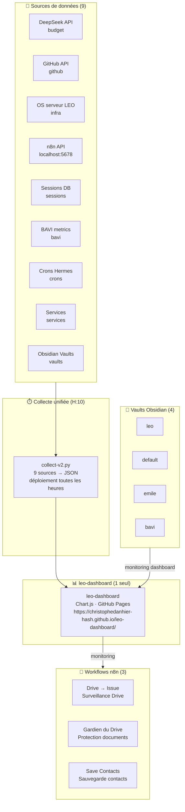

# 🏛️ Architecture LEO — Dashboards, Crons & n8n

> Document vivant — mis à jour le **04/07/2026** suite à la consolidation post-crash.

> ⚠️ **Changements 04/07/2026** : les 7 dashboards pré-crash ont été consolidés en **1 dashboard unifié** (leo-dashboard). La collecte utilise `collect-v2.py` (9 sources unifiées). Déploiement toutes les heures (`10 * * * *`) via leo-copilot. 3 workflows n8n actifs.

---

## 1. Vue d'ensemble



---

## 2. Dashboard unique

Depuis la reconstruction post-crash du 30/06/2026, **un seul dashboard** existe :

| Dashboard | URL | Contenu | Généré par | Fréquence |
|-----------|-----|---------|-----------|-----------|
| **🌍 leo-dashboard** | [leo-dashboard](https://christophedanhier-hash.github.io/leo-dashboard/) | Sessions, budget, machines, crons, GitHub, n8n, BAVI, services, vaults | `collect-v2.py` | H:10 (déploiement leo-copilot) |

**Collecteur unifié** : `collect-v2.py` agrège 9 sources de données :
1. Sessions — nombre de sessions et messages
2. Budget — solde DeepSeek (~$19.97)
3. Crons — statut des tâches planifiées
4. Infra — CPU/RAM/disque du serveur LEO
5. n8n — workflows et exécutions
6. GitHub — activité des repos
7. BAVI — métriques bureaux
8. Services — statut des services (Ollama, Docker, etc.)
9. Vaults — monitoring des 4 vaults Obsidian

---

## 3. Déploiement

Le déploiement du dashboard est assuré par un cron unique :

```
10 * * * *  →  collect-v2.py (via leo-copilot, no_agent)
```

Changement clé du 04/07/2026 :
- **Avant** : 7 crons séparés (un par dashboard) + Auto-Fix Daemon
- **Après** : 1 cron unique `collect-v2.py` (déploiement toutes les heures)

---

## 4. Les Workflows n8n (3)

n8n tourne sur `localhost:5678` (même machine que Hermes).

| Workflow | Rôle | Description |
|----------|------|-------------|
| **Drive → Issue** | Surveillance Drive | Crée une issue GitHub quand un fichier Drive est modifié |
| **Gardien du Drive** | Protection documents | Surveille l'intégrité des documents Google Docs |
| **Save Contacts** | Sauvegarde contacts | Sauvegarde les contacts Google vers un fichier JSON |

Accès n8n : [http://localhost:5678](http://localhost:5678) (Tailscale : `100.92.102.28:5678`)

---

## 5. Vaults Obsidian (4)

| Vault | Usage | Monitoring |
|-------|-------|------------|
| **leo** | Vault personnel LEO | ✅ Dashboard monitoring |
| **default** | Vault par défaut Hermes | ✅ Dashboard monitoring |
| **emile** | Vault pédagogie Émile | ✅ Dashboard monitoring |
| **bavi** | Vault bureaux BAVI | ✅ Dashboard monitoring |

Les 4 vaults sont surveillés via le dashboard unifié.

---

## 6. Budget

| Métrique | Valeur |
|----------|--------|
| Budget réel constaté | **~$19.97** |
| Seuil d'alerte | $30 |
| Seuil d'arrêt | $10 |

---

## 7. Statistiques clés

| Métrique | Valeur |
|----------|--------|
| Workflows n8n | **3** ✅ |
| Dashboards | **1** (unifié) |
| Sources de collecte | **9** |
| Vaults Obsidian | **4** |
| Budget DeepSeek | **~$19.97** |
| Déploiement | Toutes les heures via leo-copilot |

---

> **Document mis à jour le 04/07/2026** — reflet des changements post-crash.
*Document mis à jour le 04/07/2026 — 22:48:00 — Léo 🦁*
