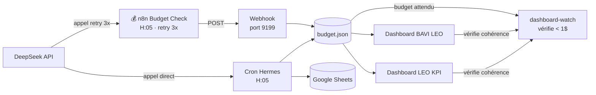
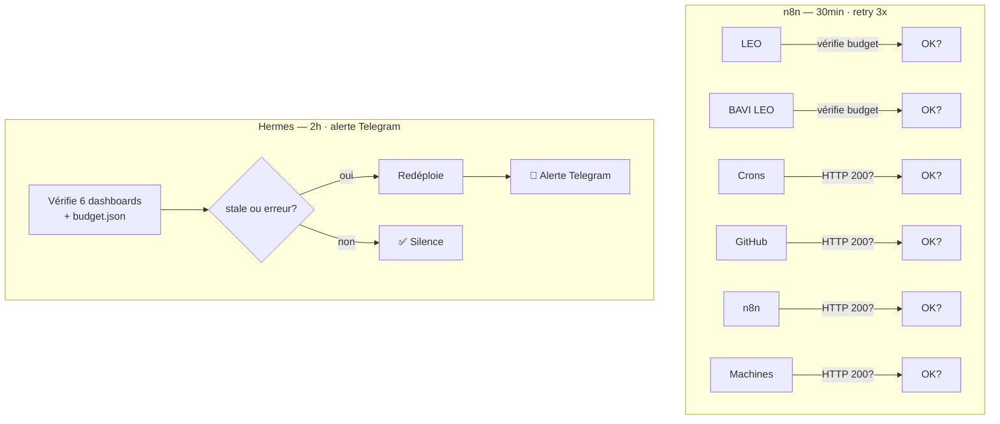
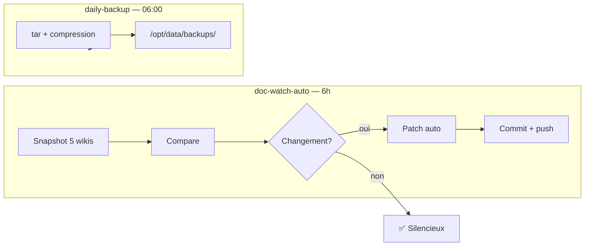
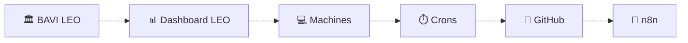
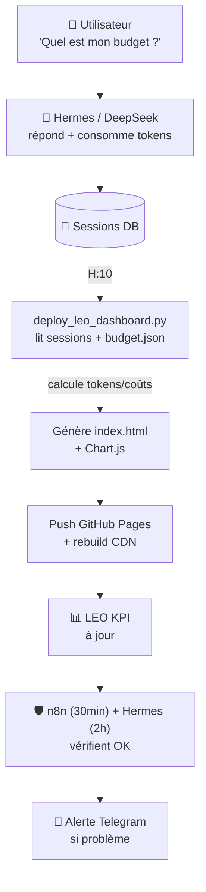

# 🏛️ Architecture LEO — Dashboards, Crons & n8n

> Document vivant — généré le 21/06/2026. Met à jour la vision globale de l'écosystème LEO : qui produit quoi, comment les données circulent, et quels filets de sécurité protègent l'ensemble.

---

## 1. Vue d'ensemble (Mermaid)

```mermaid
flowchart TB
    subgraph Sources["📡 Sources de données"]
        DS["DeepSeek API<br/>api.deepseek.com"]
        GH_API["GitHub API<br/>api.github.com"]
        OS["OS 3 machines<br/>LEO / Yoga / Penguin"]
        N8N_API["n8n API<br/>localhost:5678"]
    end

    subgraph Collecte["⏱️ Collecte (Crons Hermes 23)"]
        BC["budget-check-v6<br/>H:05"]
        MK["machines-kpi<br/>H:00"]
        CD["crons-dashboard<br/>H:20"]
        GD["github-dashboard<br/>H:25"]
        ND["dashboard-n8n<br/>*/15"]
        WD["dashboard-watch<br/>30 */2h"]
        DOC["doc-watch-auto<br/>00/06/12/18"]
        BAVI["bavi-leo-dashboard<br/>H:05"]
        LD["dashboard-leo<br/>H:10"]
        MM["leo-metrics<br/>H:15"]
        NC["n8n-healthcheck<br/>*/15"]
        VEILLE["Veille IA<br/>07:30/08:00"]
        SYNC["drive-sync<br/>18:00"]
    end

    subgraph n8n["🤖 Workflows n8n (3)"]
        BC_N8N["💰 Budget Check<br/>H:05 · retry 3x"]
        DW_N8N["🛡️ Dashboard Watch v2<br/>30min · retry 3x"]
        PING["🟢 LEO Ping<br/>15min"]
    end

    subgraph Transit["🌉 Transit & Webhooks"]
        WH["Webhook budget<br/>port 9199"]
        BJ["budget.json<br/>/opt/data/metrics/"]
        WD_Script["dashboard-watch.py<br/>vérification budget"]
    end

    subgraph Dashboards["📊 GitHub Pages (6)"]
        LEO["📊 LEO KPI<br/>sessions · budget · tokens"]
        BAVI_D["🏛️ BAVI LEO<br/>KPIs BAVI · budget"]
        MACHINES["💻 Machines<br/>CPU · RAM · Disque"]
        CRONS_D["⏱️ Crons<br/>23 crons · historique 7j"]
        GITHUB_D["🐙 GitHub<br/>22 repos · activité"]
        N8N_D["🔧 n8n<br/>workflows · exécutions"]
    end

    subgraph Securite["🛡️ Filets de sécurité"]
        WATCHDOG["Watchdog webhook<br/>*/5min"]
        ALERTE["Alerte Telegram<br/>(dashboard-watch)"]
        DOC_WATCH["doc-watch-auto<br/>snapshot → commit"]
        HERMES_BACKUP["Crons Hermes<br/>backup n8n"]
    end

    subgraph Notifications["📨 Notifications"]
        TG["Telegram<br/>Christophe"]
        EMAIL_COWORK["Email Cowork<br/>Veille IA"]
    end

    %% Connexions Hermes → Dashboards
    BC -->|"écrit"| BJ
    LD -->|"déploie"| LEO
    BAVI -->|"déploie"| BAVI_D
    MM -->|"déploie"| MACHINES
    CD -->|"déploie"| CRONS_D
    GD -->|"déploie"| GITHUB_D
    ND -->|"déploie"| N8N_D

    %% Sources → Crons
    DS --> BC
    OS --> MK
    GH_API --> GD
    N8N_API --> ND
    N8N_API --> NC

    %% n8n → Transit
    DS --> BC_N8N
    BC_N8N -->|"POST"| WH
    WH -->|"écrit"| BJ

    DW_N8N -->|"GET (retry 3x)"| LEO
    DW_N8N -->|"GET (retry 3x)"| BAVI_D
    DW_N8N -->|"GET (retry 3x)"| MACHINES
    DW_N8N -->|"GET (retry 3x)"| CRONS_D
    DW_N8N -->|"GET (retry 3x)"| GITHUB_D
    DW_N8N -->|"GET (retry 3x)"| N8N_D
    DW_N8N -->|"GET /health"| WH
    WH -->|"budget attendu"| DW_N8N

    %% Filets
    WATCHDOG -->|"relance si down"| WH
    WD -->|"vérifie + alerte"| Dashboards
    WD -->|"vérifie budget"| BJ
    WD -->|"🚨 si problème"| TG
    HERMES_BACKUP -->|"backup si n8n down"| Transit

    %% Doc
    DOC -->|"commit auto"| DOC_WATCH

    %% Veille
    VEILLE -->|"envoi"| EMAIL_COWORK
```

---

## 2. Les 6 Dashboards

Chaque dashboard est un **HTML statique** hébergé sur GitHub Pages, généré par un cron Hermes (ou n8n), sans backend ni base de données.

| Dashboard | URL | Contenu | Généré par | Fréquence | Coût |
|-----------|-----|---------|-----------|-----------|------|
| **📊 LEO KPI** | [dashboard-leo](https://christophedanhier-hash.github.io/dashboard-leo/) | Sessions, tokens, budget DeepSeek, status n8n | `deploy_leo_dashboard.py` | H:10 | **0$** |
| **🏛️ BAVI LEO** | [bavi-leo-dashboard](https://christophedanhier-hash.github.io/bavi-leo-dashboard/) | KPIs BAVI, budget, tokens | `deploy_bavi_leo_dashboard.py` | H:05 | **0$** |
| **💻 Machines** | [leo-metrics](https://christophedanhier-hash.github.io/leo-metrics/) | CPU/RAM/Disque LEO/Yoga/Penguin | `deploy_machines.py` | H:15 | **0$** |
| **⏱️ Crons** | [crons-dashboard](https://christophedanhier-hash.github.io/crons-dashboard/) | État 23 crons, historique 7j | `deploy-crons-dashboard.py` | H:20 | **0$** |
| **🐙 GitHub** | [github-dashboard](https://christophedanhier-hash.github.io/github-dashboard/) | Activité 22 repos Hermes vs Dev | `deploy-github-dashboard.py` | H:25 | **0$** |
| **🔧 n8n** | [dashboard-n8n](https://christophedanhier-hash.github.io/dashboard-n8n/) | Workflows n8n, exécutions, credentials | `collect_n8n_dashboard.py` | */15 | **0$** |

**Navigation :** chaque dashboard a une barre de navigation avec les 6 liens. Tous les scripts de déploiement partagent la même nav.

---

## 3. Les Crons Hermes (23)

Tous en `no_agent` = **0$ de consommation LLM**.

### Monitoring & Budgétisation (5)

| Cron | Horaire | Script | Rôle | Redondance |
|------|---------|--------|------|-----------|
| `budget-check-v6` | **H:05** | `update_budget_v6.py` | Solde DeepSeek → Google Sheets + budget.json | 🟡 n8n Budget Check |
| `dashboard-leo` | **H:10** | `deploy_leo_dashboard.py` | Génère 📊 LEO KPI | — |
| `bavi-leo-dashboard` | 60min | `deploy_bavi_leo_dashboard.py` | Génère 🏛️ BAVI LEO | — |
| `crons-dashboard` | **H:20** | `deploy-crons-dashboard.py` | Génère ⏱️ Crons | — |
| `dashboard-watch` | **30 */2h** | `dashboard-watch.py` | Vérifie 6 dashboards + budget → alerte TG | 🟡 n8n Dashboard Watch |

### Infra & Machines (3)

| Cron | Horaire | Script | Rôle | Redondance |
|------|---------|--------|------|-----------|
| `machines-kpi` | **H:00** | `update_machines_kpi.py` | Collecte CPU/RAM/Disque 3 machines | — |
| `leo-metrics` | **H:15** | `deploy_machines.py` | Génère 💻 Machines | — |
| `n8n-healthcheck` | ***/15** | `collect-n8n-status.py` | Ping API n8n + Docker | — |

### Données & Sync (5)

| Cron | Horaire | Script | Rôle |
|------|---------|--------|------|
| `daily-backup` | **06:00** | `run-backup.sh` | Backup fichiers critiques |
| `drive-sync` | **18:00** | `drive-sync.sh` | Sync bidirectionnelle Drive ↔ GitHub |
| `t600-drive-sync` | **H:36** | `run-t600-drive-sync.sh` | Sync documents T600 |
| `wiki-sync` | **H:30** | `run-wiki-sync.sh` | Sources → Wiki MkDocs |
| `wiki-oca-sync` | **H:35** | `run-wiki-oca-sync.sh` | Sources OCA → Wiki |

### Intelligence & Veille (3)

| Cron | Horaire | Script | Rôle | Coût |
|------|---------|--------|------|------|
| `Classifieur emails` | **30min** | Classifieur Ollama | Classification Gmail → labels | **0$** 🏠 Ollama |
| Veille IA phase 1 | **07:30** | `collect_veille_rss.py` | Collecte RSS 11 sources IA | **0$** |
| Veille IA phase 2 | **08:00** | Analyse DeepSeek → email | Résumé + envoi Cowork Copilote | **~0.05$** |

### Sécurité & Maintenance (4)

| Cron | Horaire | Script | Rôle |
|------|---------|--------|------|
| `credentials-check` | **Lun 09:00** | `check-credentials.py` | Vérification tokens OAuth |
| `check-hermes-update` | **09:00** | `check_hermes_update.py` | Nouvelle version Hermes ? |
| `doc-watch-auto` | **00/06/12/18** | `doc-watch-auto.py` | Snapshot docs → patch auto → commit |
| `budget-webhook-watchdog` | ***/5** | `budget-webhook-watchdog.sh` | Relance webhook budget si down |

### GitHub (1)

| Cron | Horaire | Script | Rôle |
|------|---------|--------|------|
| `github-dashboard` | **H:25** | `deploy-github-dashboard.py` | Génère 🐙 GitHub |

---

## 4. Les Workflows n8n (3)

n8n tourne sur `100.92.102.28:5678` (même machine que Hermes). Il offre **retry natif + monitoring visuel**.

| Workflow | Horaire | Étapes | Retry | Backup Hermes |
|----------|---------|--------|-------|--------------|
| **🟢 LEO Ping** | 15min | Ping API n8n health | — | `n8n-healthcheck` |
| **💰 Budget Check** | **H:05** | DeepSeek API → parse → POST webhook → budget.json | **3x** | `budget-check-v6` |
| **🛡️ Dashboard Watch v2** | **30min** | GET 6 dashboards HTTP + vérif budget via webhook | **3x** | `dashboard-watch` (2h) |

**Pattern :** n8n = exécution garantie (retry), Hermes = backup si n8n down. Double filet.

---

## 5. Flux de données détaillé

### 5.1 Budget (le flux le plus critique)

### 5.2 Dashboard Watch (vérification complète)

### 5.3 Sauvegarde & Documentation

---

## 6. Filets de sécurité

| Filet | Quoi | Activation | Action si problème |
|-------|------|-----------|-------------------|
| **n8n Dashboard Watch** | Ping 6 dashboards + vérif budget | 30min (retry 3x) | Log dans n8n |
| **Hermes dashboard-watch** | Idem + budget.json | 2h → Telegram si problème | **🚨 Alerte Telegram** + redéploiement auto |
| **n8n Budget Check** | Appel DeepSeek API | H:05 (retry 3x) | Retry automatique |
| **Hermes budget-check-v6** | Idem (backup) | H:05 | Prend le relais si n8n down |
| **Watchdog webhook** | Vérifie port 9199 | 5min | Relance le webhook |
| **doc-watch-auto** | Snapshot → compare → patch | 6h | Commit automatique |
| **n8n healthcheck** | Ping n8n API | 15min | — |

---

## 7. Barre de navigation dashboards

Tous les dashboards partagent la même barre de navigation. Le dashboard actif est surligné.

---

## 8. Cycle de vie d'une donnée

Prenons l'exemple d'une **session de chat** sur Telegram :

---

## 9. Statistiques clés

| Métrique | Valeur |
|----------|--------|
| Crons Hermes | **23** (dont 22 en no_agent = 0$) |
| Workflows n8n | **3** (2 avec retry) |
| Dashboards | **6** (tous HTTP 200) |
| Budget DeepSeek | **27.60$** |
| Consommation/jour | **~2.21$** |
| Autonomie restante | **~13 jours** |
| Wiks surveillés | **5** (BAVI, Pro, OCA, Voyages, Général) |
| Alertes configurées | **3** (TG + doc-watch + dashboard-watch) |

---

> **Document maintenu par doc-watch-auto** — dernière mise à jour : 21/06/2026 22:00.
