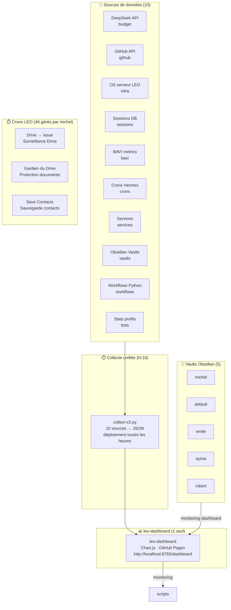

Ajouter '(Post-crash reconstruction)' dans le titre.

> Document vivant — mis à jour le **26/07/2026** (corrections architecture).

---

## 0. Architecture Profil / Bot / Gateway

LEO n'est pas un bot Telegram. LEO est un **agent Hermes** accessible via le **Gateway Hermes** qui fait le pont entre Telegram et l'agent.

```
Telegram ──→ Gateway Hermes ──→ Agent LEO (profil default) ──→ DeepSeek Flash
```

Chaque **profil Hermes** est un agent indépendant avec sa propre configuration, ses sessions et sa mémoire. Certains profils sont exposés sur Telegram via un bot dédié :

| Profil | Bot Telegram | Rôle | Provider |
|--------|-------------|------|----------|
| **default** | `@hermes_leo_bot` | Chat quotidien LEO (Christophe) | DeepSeek Flash |
| **michel** | `@hermes_leo_copilot_bot` | Infra, crons, scripts | DeepSeek V4 Pro |
| **sylvia** | `@bavi_leo_voyages_bot` | Voyages camping-car | DeepSeek Flash |
| **emile** | Profil local | Pédagogie, mémoire | DeepSeek Flash |
| **robert** | Profil local | Conseil stratégique IA | DeepSeek Flash |

> **LEO = Hermes Agent**, pas un bot. Les bots Telegram sont des profils Hermes isolés. La communication passe par le Gateway, pas par un handle Telegram direct.

### Dashboard unique

Le dashboard `leo-dashboard` agglomère les métriques de **tous les profils** (sessions, budget, crons, services, vaults) en une seule vue.

---

## 1. Vue d'ensemble


```mermaid
flowchart TB
    subgraph Sources["📡 Sources de données (10)"]
        DS["DeepSeek API<br/>budget"]
        GH_API["GitHub API<br/>github"]
        OS["OS serveur LEO<br/>infra"]
        SESS["Sessions DB<br/>sessions"]
        BAVI_M["BAVI metrics<br/>bavi"]
        CRONS_M["Crons Hermes<br/>crons"]
        SVCS["Services<br/>services"]
        VAULTS["Obsidian Vaults<br/>vaults"]
        WKFL["Workflows Python<br/>workflows"]
        BOTS["Stats profils<br/>bots"]
    end

    subgraph Collecte["⏱️ Collecte unifiée (H:10)"]
        COLLECT["collect-v2.py<br/>10 sources → JSON<br/>déploiement toutes les heures"]
    end

    subgraph Dashboard["📊 leo-dashboard (1 seul)"]
        DASH["leo-dashboard<br/>Chart.js · GitHub Pages<br/>http://localhost:8765/dashboard"]
    end

    subgraph crons["⏱️ Crons LEO (46 gérés par michel)"]
        DRIVE_ISSUE["Drive → Issue<br/>Surveillance Drive"]
        GARDIEN["Gardien du Drive<br/>Protection documents"]
        SAVE_CONTACTS["Save Contacts<br/>Sauvegarde contacts"]
    end

    subgraph Vaults["📒 Vaults Obsidian (5)"]
        MICHEL_VAULT["michel"]
        DEFAULT_VAULT["default"]
        EMILE_VAULT["emile"]
        SYLVIA_VAULT["sylvia"]
        ROBERT_VAULT["robert"]
    end

    Sources --> COLLECT
    COLLECT --> DASH
    DASH -->|monitoring| scripts
    Vaults -->|monitoring dashboard| DASH
```

---

## 2. Dashboard unique

Depuis la reconstruction post-crash du 30/06/2026, **un seul dashboard** existe :

| Dashboard | URL | Contenu | Généré par | Fréquence |
|-----------|-----|---------|-----------|-----------|
| **🌍 leo-dashboard** | [leo-dashboard](http://localhost:8765/dashboard) | Sessions, budget, machines, crons, GitHub, BAVI, services, vaults, workflows, bots | `collect-v2.py` | H:10 (déploiement michel) |

**Collecteur unifié** : `collect-v2.py` agrège 10 sources de données (n8n retiré 13/07/2026) :
1. Sessions — nombre de sessions et messages
2. Budget — solde DeepSeek (~$19.97 de coût cumulé, $41.83 de solde)
3. Crons — statut des tâches planifiées
4. Infra — CPU/RAM/disque du serveur LEO
5. GitHub — activité des repos
6. BAVI — métriques bureaux
7. Services — statut des services (Ollama, Docker, etc.)
8. Vaults — monitoring des 5 vaults Obsidian
9. Workflows Python — santé des workflows de remplacement n8n
10. Bots — statistiques par profil Telegram (sessions, messages, coût)

---

## 3. Déploiement

Le déploiement du dashboard fait partie d'un ensemble de 47 crons gérés par michel. Le cron spécifique pour le dashboard est :

```
10 * * * *  →  collect-v2.py (via michel, no_agent)
```

Changement clé du 04/07/2026 :
- **Avant** : 7 crons séparés (un par dashboard) + Auto-Fix Daemon
- **Après** : 1 cron unique `collect-v2.py` pour le dashboard, parmi 47 crons gérés par michel.

---

## 4. Les Workflows n8n (3) — ❌ RETIRÉS

> ⚠️ **n8n a été retiré le 13/07/2026.** Les 3 workflows ont été migrés vers des crons Hermes no_agent. Cette section est conservée pour référence historique.

n8n tournait sur `localhost:5678` (même machine que Hermes).

| Workflow | Rôle | Description | Statut |
|----------|------|-------------|--------|
| **Drive → Issue** | Surveillance Drive | Créait une issue GitHub quand un fichier Drive était modifié | → Cron `drive-to-issue` |
| **Gardien du Drive** | Protection documents | Surveillait l'intégrité des documents Google Docs | → Cron `gardien-drive` |
| **Save Contacts** | Sauvegarde contacts | Sauvegardait les contacts Google vers un fichier JSON | → Cron `save-contacts` |

---

## 5. Vaults Obsidian (5)

| Vault | Usage | Profil associé | Monitoring |
|-------|-------|----------------|------------|
| **michel** | Vault infra Michel | `michel` | ✅ Dashboard monitoring |
| **default** | Vault par défaut Christophe | `default` | ✅ Dashboard monitoring |
| **emile** | Vault pédagogie Émile | `emile` | ✅ Dashboard monitoring |
| **sylvia** | Vault voyages Sylvia | `sylvia` | ✅ Dashboard monitoring |
| **robert** | Vault conseil stratégique Robert | `robert` | ✅ Dashboard monitoring |

Les 5 vaults sont surveillés via le dashboard unifié.

---

## 6. Budget

| Métrique | Valeur |
|----------|--------|
| Budget réel constaté | **~$19.97** |
| Seuil d'alerte | $30 |
| Seuil d'arrêt | $10 |

---

## 7. Statistiques clés

| Métrique | Valeur |
|----------|--------|
| **Workflows n8n** | ❌ Retiré (13/07/2026) |
| Dashboards | **1** (unifié) |
| Sources de collecte | **10** |
| Profils Hermes | **5** |
| Vaults Obsidian | **5** |
| Crons LEO | **46** |
| Budget DeepSeek | **~$19.97** |
| Déploiement | Toutes les heures via michel |

---

> **Document mis à jour le 26/07/2026** — correction architecture : profils, vaults, sources.
*Document mis à jour le 26/07/2026 — Léo 🦁*

> 🤖 Dernier audit : 30/07/2026 à 06:00 (UTC+2)
