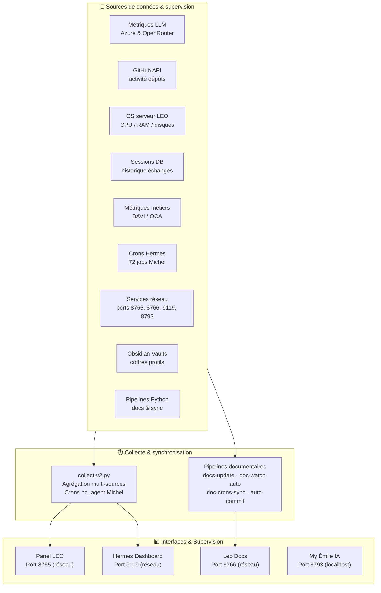

# 🏛️ Architecture LEO

> **Page canonique de référence :** [`hermes/architecture.md`](../architecture.md). Mesures vérifiées le **20/09/2026**.

## 0. Architecture Profil / Gateway / Agent

**LEO n'est pas un bot Telegram autonome** : LEO est l'**agent Hermes principal** (exécuté sur le profil `default`), accessible via le **Gateway Hermes** qui assure la passerelle entre l'interface utilisateur (DM Telegram de Christophe) et l'agent.

```
Telegram (DM Christophe) ──→ Gateway Hermes ──→ Agent LEO (profil default) ──→ Azure Foundry (gpt-5.6-luna)
```

Chaque **profil Hermes** est un environnement d'exécution isolé disposant de sa propre configuration, de ses sessions, de ses compétences (skills) et de sa mémoire.

Six profils opérationnels ont été mesurés au 20/09/2026 :

| Profil | Rôle | Interface / Gateway | Provider principal | Modèle | Fallback |
|---|---|---|---|---|---|
| `default` | LEO — Dialogue quotidien, pilotage | Gateway Hermes (DM direct) | Azure Foundry | `gpt-5.6-luna` | Google Gemini |
| `michel` | Infrastructure, crons & déploiements | `@hermes_leo_copilot_bot` | Azure Foundry | `gpt-5.6-luna` | `custom:google/gemini-3.7-flash` |
| `robert` | Conseil stratégique IT & architecture | `@bureau_robert_bot` | Azure Foundry | `gpt-5.6-luna` | Google Gemini |
| `sylvia` | Voyages, itinéraires & roadbooks | `@bavi_leo_voyages_bot` | OpenRouter | `meta/muse-spark-1.3-contributor` | Selon config |
| `emile` | Assistant professionnel Émilie (Workbench) | `@Bureau_ia_emilie_bot` | Azure Foundry | `gpt-5.6-luna` | Google Gemini |
| `gerard` | Astronomie, astrophotographie & documentation | Profil opérationnel | Azure Foundry | `gpt-5.6-luna` | Google Gemini |

> [!NOTE]
> - `leo` est l'alias Hive du profil `default`, et non un profil d'exécution supplémentaire.
> - Gérard est un profil opérationnel dédié à l'astronomie, à l'astrophotographie, au site tofdan et à la documentation générale (le dossier T600/OCA étant un volet parmi d'autres ; pas de bot Telegram inventé si non prouvé).
> - L'accès à `default` n'utilise aucun handle public inventé.

---

## 1. Vue d'ensemble du système


```mermaid
flowchart TB
    subgraph Sources["📡 Sources de données & supervision"]
        LLM_M["Métriques LLM<br/>Azure & OpenRouter"]
        GH_API["GitHub API<br/>activité dépôts"]
        OS["OS serveur LEO<br/>CPU / RAM / disques"]
        SESS["Sessions DB<br/>historique échanges"]
        BAVI_M["Métriques métiers<br/>BAVI / OCA"]
        CRONS_M["Crons Hermes<br/>72 jobs Michel"]
        SVCS["Services réseau<br/>ports 8765, 8766, 9119, 8793"]
        VAULTS["Obsidian Vaults<br/>coffres profils"]
        WKFL["Pipelines Python<br/>docs & sync"]
    end

    subgraph Collecte["⏱️ Collecte & synchronisation"]
        COLLECT["collect-v2.py<br/>Agrégation multi-sources<br/>Crons no_agent Michel"]
        PIPES["Pipelines documentaires<br/>docs-update · doc-watch-auto<br/>doc-crons-sync · auto-commit"]
    end

    subgraph Dashboards["📊 Interfaces & Supervision"]
        PANEL["Panel LEO<br/>Port 8765 (réseau)"]
        DOCS["Leo Docs<br/>Port 8766 (réseau)"]
        HDASH["Hermes Dashboard<br/>Port 9119 (réseau)"]
        EMILE_UI["My Émile IA<br/>Port 8793 (localhost)"]
    end

    Sources --> COLLECT
    Sources --> PIPES
    COLLECT --> PANEL
    COLLECT --> HDASH
    PIPES --> DOCS
```

---

## 2. Services et interfaces réseau

Les ports et services réels observés sur la machine au 20/09/2026 sont les suivants :

| Service | Port | Portée | Rôle |
|---|---:|---|---|
| **Panel LEO** | 8765 | Accessible réseau | Métriques globales, crons, supervision des profils |
| **Leo Docs** | 8766 | Accessible réseau | Explorateur documentaire et wikis |
| **Hermes Dashboard** | 9119 | Accessible réseau | Interface native Hermes Agent |
| **My Émile IA** | 8793 | Localhost | Workbench professionnel Émilie (Avenyra) |

---

## 3. Planification et pipelines d'automatisation

### Jobs planifiés Michel

Au 20/09/2026, le fichier de référence `~/.hermes/profiles/michel/cron/jobs.json` dénombre :
- **72 jobs planifiés au total** ;
- **71 jobs activés** ;
- **70 jobs `no_agent`** (exécutés par scripts directs, 0$ de consommation LLM) ;
- **2 jobs pilotés par agent LLM**.

Ces chiffres sont propres à l'ordonnanceur Hermes de Michel et ne doivent pas être confondus avec un crontab système hôte.

### Pipelines documentaires actifs

L'écosystème maintient la documentation synchronisée via quatre pipelines majeurs :
1. **`docs-update`** : mise à jour des documentations structurantes ;
2. **`doc-watch-auto`** : surveillance automatique des référentiels (dont le wiki Hermes et BAVI_LEO via `doc-watch-snapshot.py`) ;
3. **`doc-crons-sync`** : synchronisation des tables de crons ;
4. **Auto-commit wiki** : validation et traçabilité des modifications.

### Incident en cours (suivi infrastructure)

L'unité systemd du profil Michel a été observée en boucle de redémarrage automatique en raison d'un conflit de processus (PID déjà actif). Cet état est suivi dans le runbook infrastructure de Michel et n'est pas masqué dans la documentation.

---

## 4. Vaults Obsidian

Chaque profil s'appuie sur son propre espace documentaire pour ses notes et synthèses :

| Vault | Profil associé | Vocation |
|---|---|---|
| **michel** | `michel` | Exploitation infra, journaux d'interventions, runbooks |
| **default** | `default` | Notes de pilotage général et échanges Christophe |
| **emile** | `emile` | Notes professionnelles, activités et documentation métier |
| **sylvia** | `sylvia` | Fiches étapes, roadbooks et documentation camping-car |
| **robert** | `robert` | Notes stratégiques, audits de systèmes, analyses |

---

## Contexte historique (daté)

> 📜 **Historique post-crash (juillet - août 2026) :**
>
> - **Reconstruction du 30/06/2026 :** Après le crash de fin juin 2026, l'architecture a été consolidée autour d'un collecteur unifié (`collect-v2.py`) et de profils étanches avec mémoires indépendantes.
> - **Évolution des profils Émile et Gérard :** Le profil `emile` a initialement soutenu la formation et le mémoire de fin d'études d'Émilie avant de devenir son assistant professionnel au quotidien. Le profil `gerard` a été documenté initialement sur le dossier technique T600/OCA avant d'englober l'ensemble des activités d'astronomie, le site tofdan et son étude comme guide astronomie.
> - **Fournisseurs initiaux :** Les configurations de juillet 2026 utilisaient initialement DeepSeek Direct (`deepseek-v4-flash` / `deepseek-v4-pro`) avec un budget initial constaté de ~$19.97, avant la bascule ultérieure vers Azure Foundry (`gpt-5.6-luna`).
> - **Crons intermédiaires :** Les paliers à 45, 49 puis 58 crons documentés à l'été 2026 représentent des états historiques antérieurs à l'inventaire stabilisé de 72 jobs au 20/09/2026.

---

## Pour aller plus loin

- Consulter [`architecture.md`](../architecture.md) pour la vue canonique complète
- Consulter [`dashboards.md`](dashboards.md) pour le détail des dashboards et de la supervision
- Consulter [`bots-telegram.md`](bots-telegram.md) pour les interfaces Telegram et profils
- Consulter [`profiles.md`](../configuration/profiles.md) pour la gestion des profils Hermes

---

> 🤖 Dernière mesure vérifiée : **20/09/2026** — LEO et Michel. Source de vérité : `~/.hermes/profiles/*/config.yaml`, `~/.hermes/profiles/michel/cron/jobs.json` et `architecture.md`.
