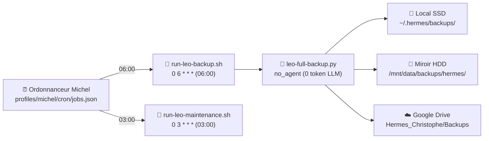

# 💾 Sauvegardes & Plan de Reprise d'Activité (PRA) — LEO

> **Document de référence opérationnelle.** Mesures vérifiées le **21/09/2026** (revue du 21/09/2026).<br/>
> Ce document décrit la stratégie de sauvegarde intégrale, l'ordonnancement des tâches, le contenu archivé, le Recovery Kit et la procédure indicative de restauration après sinistre.

---

## 1. Synthèse opérationnelle

| Indicateur | Donnée observée & mesurée | Source de vérité |
|---|---|---|
| **Dernier backup mesuré** | **2026-09-21 06:00:17 CEST** (`leo-full-backup-2026-09-21.tar.gz`) ; exit_code `0`, durée `2121 s` (~35 min 21 s) | `/home/tofdan/.hermes/cron/output/leo-full-backup.status.json` |
| **Taille mesurée** | **3550.9 MB** dans stdout / **3 723 383 924 octets** (~3,72 Go sur disque) | `leo-full-backup.stdout`, local SSD et miroir HDD |
| **Périmètre sauvegardé** | 6 profils, 9 vaults, mémoires, configurations, credentials, fichiers OAuth, bases SQLite, cron, scripts, métriques et projets métiers | Script `leo-full-backup.py` |
| **Destinations vérifiées** | Local SSD + Miroir HDD (1 To) + Google Drive | `/home/tofdan/.hermes/backups/`, `/mnt/data/backups/hermes/` et journal stdout |
| **Destination cloud** | Google Drive (`Hermes_Christophe/Backups`) | Script d'upload OAuth et journal stdout |
| **État distant GDrive** | Téléversement confirmé (`upload OK`) et suppression d'un backup expiré au 21/09 | `/home/tofdan/.hermes/cron/output/leo-full-backup.stdout` |
| **Rétention réelle** | `RETENTION_DAYS = 5` (archives des 5 derniers jours présentes selon le calcul d'âge) | Script `leo-full-backup.py` |
| **RTO** | **Non mesuré** (aucune durée garantie ; procédure indicative dépendante des transferts et de la décompression) | Constat factuel (absence de test chronométré) |

---

## 2. Ordonnancement et exécution

Les tâches de sauvegarde et de maintenance sont orchestrées de manière autonome via l'ordonnanceur Michel :



### Job de sauvegarde quotidienne
- **Nom exact dans jobs.json** : `💾 LEO Backup quotidien → GDrive (script)`
- **Planification** : `0 6 * * *` (tous les jours à 06:00 CEST)
- **Wrapper cron** : `/home/tofdan/.hermes/scripts/run-leo-backup.sh` (appelle `cron-runner.sh` avec `/home/tofdan/.hermes/profiles/michel/scripts/leo-full-backup.py`)
- **Script réel** : `/home/tofdan/.hermes/scripts/leo-full-backup.py` (exécuté via `profiles/michel/scripts/leo-full-backup.py`)
- **Mode d'exécution** : `no_agent = true` (exécution déterministe par script direct, 0 token LLM consommé)
- **Mesure observée au 21/09/2026** : `enabled = true`, déclenché à `2026-09-21T06:00:17+02:00`, `exit_code: 0`, durée `2121 s` (~35 min 21 s, complété à `06:35:38`).

### Job de maintenance quotidienne
- **Nom exact dans jobs.json** : `🔧 LEO Maintenance quotidienne`
- **Planification** : `0 3 * * *` (tous les jours à 03:00 CEST)
- **Wrapper cron** : `/home/tofdan/.hermes/scripts/run-leo-maintenance.sh` (appelle `cron-runner.sh` avec `leo-daily-maintenance.py`)
- **Mode d'exécution** : `no_agent = true`, `enabled = true`
- **Mesure observée au 21/09/2026** : dernière exécution à `03:00:06`, `last_status: ok`.
- **Rôle** : Nettoyage préventif des fichiers temporaires, purge des outputs de crons expirés, vérification de l'espace disque et détection d'anomalies avant le déclenchement du backup à 06:00.

---

## 3. Périmètre archivé et politique d'exclusion

Le script `leo-full-backup.py` construit une archive `tar.gz` complète combinant les chemins internes de Hermes et les projets métiers associés.

### Chemins Hermes inclus (`HERMES_PATHS`)

Le script parcourt strictement la liste `HERMES_PATHS` (36 chemins) sans omission ni ajout externe :

```text
profiles/default       vault-michel       memories                 skills
profiles/michel        vault-default      .env                     scripts
profiles/sylvia        vault-emile        config.yaml              metrics
profiles/emile         vault-sylvia       delegation-config.json   state.db
profiles/robert        vault-robert       credentials_vault.json   kanban.db
profiles/gerard        vault-gerard       SOUL.md                  cron
                       vault-copilot      gateway_state.json       mail_router
                       vault-agy          Tokens OAuth (7 fichiers)
                       vault-dsh
```

1. **Six profils opérationnels** : `profiles/default`, `profiles/michel`, `profiles/sylvia`, `profiles/emile`, `profiles/robert`, `profiles/gerard` (configurations, sessions, contextes et mémoires dédiées).
2. **Neuf vaults documentaires** :
    - Vaults profils : `vault-michel`, `vault-default`, `vault-emile`, `vault-sylvia`, `vault-robert`, `vault-gerard` ;
    - Vaults de sessions automatisées : `vault-copilot`, `vault-agy`, `vault-dsh`.
3. **Mémoires partagées** : `memories`.
4. **Configurations, credentials et états** :
    - `.env`, `config.yaml`, `delegation-config.json`, `credentials_vault.json`, `SOUL.md`, `gateway_state.json`.
5. **Fichiers OAuth Google (7 fichiers déclarés)** :
    - `leo_google_token.json`, `gdrive-service-account.json`, `leo_token.json`, `google_token.json`, `google_client_secret.json`, `leo_sheets_token.json`, `leo_drive_token.json`.
    - *Note opérationnelle* : Si un fichier optionnel est absent (ex. `google_token.json` lors de l'exécution du 21/09), le script signale l'omission et poursuit l'archivage sans bloquer.
6. **Bases de données, outils et ordonnancement** :
    - `skills`, `scripts`, `metrics`, `state.db`, `kanban.db`, `cron`, `mail_router`.

### Projets métiers et wikis inclus

En complément de `HERMES_PATHS`, le script intègre explicitement les dépôts et répertoires projets suivants :

| Projet / Ressource | Chemin source | Contenu inclus & Traitement |
|---|---|---|
| **hermes-christophe** | `~/Projets_Dev/hermes-christophe` | Documentation et scripts personnels de Christophe |
| **MyCDC** | `~/Projets_Dev/MyCDC` | Portail de société : code métier et base de données SQLite (`.git` et `__pycache__` exclus) |
| **clarity-workshop** | `~/Projets_Dev/clarity-workshop` | Mur de cadrage et mission : code + base SQLite `clarity.sqlite3` (`.git`, `__pycache__`, `.pytest_cache` exclus) |
| **5 Wikis** | `~/Projets_Dev/{BAVI_LEO, hermes-wiki, emile-wiki, voyages-wiki, wiki-oca}` | Contenu documentaire intégral (`.git`, `__pycache__`, `.venv` exclus) |
| **lea-workbench/data** | `~/Projets_Dev/lea-workbench/data` | Données métier uniques : base `lea.db`, documents et archives d'export applicatives `lea_backup_*.tar.gz` (`.git`, `__pycache__`, `.staging` exclus) |
| **LEA_CLIENT_BUNDLES** | `/home/tofdan/LEA_CLIENT_BUNDLES` | Bundles clients distribués (~9 Mo) |
| **leo-docs** | `~/Projets_Dev/leo-docs` et `~/Projets_Dev/leo-docs.py` | Portail documentaire port 8766 (dépôt hors `.git`, `__pycache__`, `.venv`, plus le script racine) |

> [!WARNING]
> **Volumes Docker Léa :**
> Les volumes Docker de l'environnement Léa (`lea_data`, `lea_hermes_data` représentant ~29 Go) ne sont pas injectés directement dans l'archive quotidienne globale. Ils font l'objet d'exports compressés applicatifs dédiés (`lea-workbench/scripts/backup.sh`) dirigés vers `data/backups/`, dont les archives résultantes (~91 Mo) sont quant à elles intégrées au backup LEO via `lea-workbench/data`.

### Règles d'exclusion et tolérance aux fichiers volatils

1. **Exclusions selon le projet** : `.git/`, `.venv/`, `__pycache__/`, `.pytest_cache/`, `.staging/`.
2. **Filtrage des débris de base de données** : Le filtre du script ignore explicitement tout fichier dont le nom contient `state.db.corrompu*`, `state.db.bak*` ou `state.db.recovered*` afin d'éviter d'alourdir l'archive avec des reliquats de maintenance.
3. **Tolérance aux fichiers volatils (`safe_add`)** : Le script gère les fichiers temporaires pouvant disparaître pendant la lecture (ex. builds MkDocs régénérés pendant l'archivage). Il applique jusqu'à 3 tentatives successives espacées d'1 seconde ; si le fichier n'est plus présent, il est ignoré avec un avertissement dans les logs sans interrompre la sauvegarde.

---

## 4. Destinations et politique de rétention

Le script archive et réplique les données sur trois cibles selon une rétention paramétrée à `RETENTION_DAYS = 5` :

1. **Stockage primaire local (SSD)** :
    - Répertoire : `/home/tofdan/.hermes/backups/`
    - Format : `leo-full-backup-YYYY-MM-DD.tar.gz`
    - Taille mesurée au 21/09/2026 : **3 723 383 924 octets** (~3,55 Go dans stdout / ~3,72 Go sur disque).
    - Mécanisme de rétention : Le script calcule l'âge calendaire de chaque fichier `age = (today - mtime_date).days`. Tout fichier pour lequel `age > RETENTION_DAYS` (donc strictement supérieur à 5 jours) est supprimé. De ce fait, les fichiers datés des 5 derniers jours peuvent être présents selon l'heure d'exécution et le calcul de date (par exemple 6 archives de J-5 à J inclus le jour même), sans nombre fixe garanti. Le 21/09/2026, la purge a supprimé l'archive du 15/09/2026 (`leo-full-backup-2026-09-15.tar.gz`).
2. **Miroir secondaire local (Disque 1 To)** :
    - Répertoire : `/mnt/data/backups/hermes/`
    - Copie miroir automatique (`shutil.copy2`) immédiatement après création de l'archive primaire.
    - Mécanisme de rétention : Même logique de purge à `age > 5 jours`. Le 21/09/2026, purge confirmée de l'archive du 15/09/2026.
3. **Téléversement Cloud distant (Google Drive)** :
    - Dossier de destination : `Hermes_Christophe/Backups` (identifiant interne non divulgué).
    - Authentification : jeton OAuth sécurisé (`leo_google_token.json`).
    - Validation mesurée au 21/09/2026 : La sortie d'exécution confirme le téléversement avec succès (`☁️ GDrive upload OK`), suivi de la suppression automatique d'un backup expiré (`🗑️ Expired (GDrive): leo-full-backup-2026-09-16.tar.gz`).
    - Rétention distante : Requête Drive supprimant les fichiers dont `createdTime < now - 5 jours`.

---

## 5. Le Recovery Kit

Le **Recovery Kit** constitue le kit de secours autonome de niveau 2 (PRA), indépendant des dépôts Git et de l'état des conteneurs en cours d'exécution.

- **Emplacement sécurisé** : `/home/tofdan/.hermes/recovery-kit/`
- **Contenu et permissions constatées sur le système** :

| Fichier | Permissions | Rôle opérationnel | Règle de sécurité |
|---|---|---|---|
| `checksums.sha256` | `chmod 644` | Empreintes SHA-256 pour vérifier l'intégrité de `secrets.b64` et `rebuild.sh` | Contrôle d'intégrité |
| `docker-commands.md` | `chmod 600` | Commandes de référence pour la relance des conteneurs | Documentation technique interne |
| `README.md` | `chmod 600` | Consignes d'urgence et instructions d'exploitation | Procédure d'urgence |
| `rebuild.sh` | `chmod 711` | Script shell d'automatisation des étapes de reconstruction | Script exécutable restreint |
| `secrets.b64` | `chmod 600` | Archive tar chiffrée/encodée base64 des configurations sensibles et jetons | **Strictement privé — Interdiction absolue de diffusion ou commit Git** |
| `secrets-manifest.txt` | `chmod 644` | Inventaire nominatif public (sans valeurs) des 12 fichiers embarqués dans `secrets.b64` | Liste de contrôle sans secret |

### Contenu du manifest des secrets (`secrets-manifest.txt`)

Le fichier `secrets.b64` regroupe les fichiers critiques nécessaires à un redémarrage à froid :
- Configurations et états : `.env`, `credentials_vault.json`, `config.yaml`, `SOUL.md`, `gateway_state.json` ;
- Fichiers OAuth : `leo_google_token.json`, `gdrive-service-account.json`, `google_token.json`, `google_client_secret.json`, `leo_email_token.json`, `leo_sheets_token.json`, `leo_drive_token.json`.

> [!CAUTION]
> **Confidentialité absolue du Recovery Kit :**
> `secrets.b64` ainsi que toute sauvegarde locale d'archive de secrets (ex. `secrets.b64.bak-...`) restent strictement confidentiels et privés sur la machine hôte. Ils ne doivent **jamais** apparaître dans le Wiki, ni être ajoutés à un commit Git.

---

## 6. Procédure indicative de restauration après sinistre (PRA)

En cas de perte de la machine hôte, la restauration s'opère selon un modèle en trois couches distinctes :

```
Couche 1 : Code source       ──→ Clonant les dépôts officiels depuis GitHub
Couche 2 : Données & Secrets ──→ Restaurés depuis le backup tar.gz et recovery-kit
Couche 3 : Volumes lourds    ──→ Restaurés depuis les backups d'export applicatifs
```

> [!NOTE]
> **Caractère indicatif de la procédure :**<br/>
> Le temps global de reprise d'activité (RTO) n'est **pas mesuré** et aucune durée de remise en service n'est garantie. Cette procédure fournit le chemin technique indicatif et dépend de la connectivité réseau, de la disponibilité des dépôts et des temps de décompression.

### Étape 1 — Préparation de l'environnement système

Installation des paquets de base et création de l'arborescence :

```bash
sudo apt update && sudo apt install -y python3 python3-pip python3-venv git curl
mkdir -p /home/tofdan/.hermes /home/tofdan/Projets_Dev
```

### Étape 2 — Restauration des données depuis le backup quotidien

Récupération de la dernière archive quotidienne `leo-full-backup-YYYY-MM-DD.tar.gz` (depuis le miroir HDD `/mnt/data/backups/hermes/` ou l'espace Google Drive `Hermes_Christophe/Backups`) :

```bash
# Extraction dans le répertoire utilisateur
tar -xzf leo-full-backup-YYYY-MM-DD.tar.gz -C /home/tofdan/
chown -R tofdan:tofdan /home/tofdan/.hermes /home/tofdan/Projets_Dev
```

### Étape 3 — Restauration et vérification des secrets via le Recovery Kit

Application des configurations sensibles avec contrôle d'intégrité :

```bash
cd /home/tofdan/.hermes/recovery-kit

# Vérification de l'intégrité du kit
sha256sum -c checksums.sha256

# Restauration des secrets
base64 -d secrets.b64 | tar -xz -C /home/tofdan/.hermes/
chmod 600 /home/tofdan/.hermes/.env /home/tofdan/.hermes/credentials_vault.json
```

### Étape 4 — Reconnexion GitHub CLI

Pour restaurer l'accès GitHub de manière sécurisée sans afficher de jeton en clair dans les logs ou l'historique shell :

```bash
# Authentification GitHub CLI interactive ou via flux d'authentification sécurisé
gh auth login
gh auth status
```

*(Ne jamais afficher ni imprimer de clé privée ou jeton d'authentification dans l'historique shell).*

### Étape 5 — Reconstruction du code et dépendances Git

Clonage ou mise à jour des dépôts maîtres depuis l'espace GitHub :

```bash
cd /home/tofdan/Projets_Dev
for repo in BAVI_LEO hermes-wiki emile-wiki wiki-oca voyages-wiki hermes-christophe MyCDC clarity-workshop lea-workbench leo-docs; do
    if [ ! -d "$repo/.git" ]; then
        git clone "https://github.com/christophedanhier-hash/${repo}.git" "$repo"
    fi
done
```

### Étape 6 — Restauration des volumes applicatifs Docker (Couche 3)

Pour les applications disposant de volumes applicatifs isolés (ex. bases et conteneurs Léa) :

```bash
# Restauration des données applicatives exportées
cd /home/tofdan/Projets_Dev/lea-workbench
./scripts/restore.sh data/backups/dernier_export.tar.gz
```

### Étape 7 — Redémarrage des services et validation opérationnelle

1. Lancement des services et daemons :
   ```bash
   systemctl --user restart hermes-dashboard.service
   ```
2. Contrôle de santé des interfaces HTTP :
   - `http://localhost:8765/` (Panel LEO)
   - `http://localhost:8766/` (Leo Docs)
   - `http://localhost:9119/` (Hermes Dashboard)
   - `http://localhost:8793/` (My Émile IA)
3. Contrôle des cron jobs :
   ```bash
   hermes cron list
   ```

---

## 7. Règles d'hygiène et maintenance du PRA

1. **Maintien du Recovery Kit** : Après tout renouvellement ou modification de clés, jetons OAuth ou configurations dans `~/.hermes/.env`, régénérer `secrets.b64` et mettre à jour `checksums.sha256`.
2. **Surveillance quotidienne** : Contrôler la bonne exécution du job `💾 LEO Backup quotidien → GDrive (script)` dans les journaux de cron (`status.json` et sortie `stdout`).
3. **Exercice périodique** : Tester une extraction à blanc sur une machine ou un répertoire isolé pour vérifier la cohérence des archives sans impacter l'environnement en production.

---

> 🦁 Documentation auditée et réalignée le **21/09/2026**.<br/>
> Sources directes auditées : `/home/tofdan/.hermes/scripts/leo-full-backup.py`, `/home/tofdan/.hermes/profiles/michel/cron/jobs.json`, `/home/tofdan/.hermes/cron/output/leo-full-backup.status.json`, `/home/tofdan/.hermes/cron/output/leo-full-backup.stdout`, `/home/tofdan/.hermes/recovery-kit/`, `/home/tofdan/.hermes/backups/` et `/mnt/data/backups/hermes/`.
