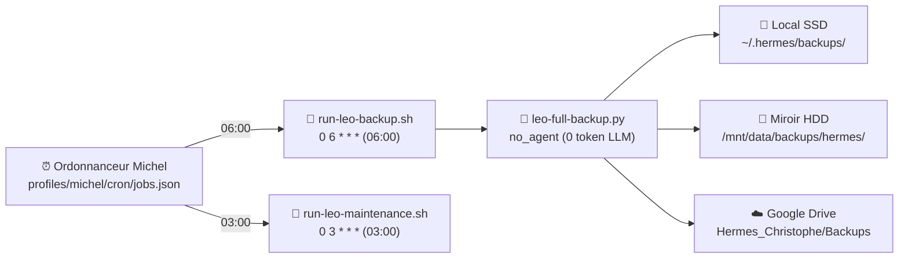

# 💾 Sauvegardes & Plan de Reprise d'Activité (PRA) — LEO

> **Document de référence opérationnelle.** Mesures vérifiées le **21/09/2026**.
> Ce document décrit la stratégie de sauvegarde intégrale, l'ordonnancement des tâches, le contenu archivé, le Recovery Kit et la procédure de restauration après sinistre.

---

## 1. Synthèse opérationnelle

| Indicateur | Donnée observée & mesurée | Source de vérité |
|---|---|---|
| **Dernier backup mesuré** | **2026-09-21 06:10** (`leo-full-backup-2026-09-21.tar.gz`) | Système de fichiers local et miroir |
| **Taille mesurée** | **~3,7 Go** (3.5 GiB) | `/home/tofdan/.hermes/backups/` |
| **Périmètre sauvegardé** | 6 profils, 9 vaults, 5 wikis, projets métier, configurations & secrets | Script `leo-full-backup.py` |
| **Destinations vérifiées** | Local SSD + Miroir HDD (1 To) | `/home/tofdan/.hermes/backups/` et `/mnt/data/backups/hermes/` |
| **Destination cloud** | Google Drive (`Hermes_Christophe/Backups`) | Script d'upload OAuth (ID dossier masqué) |
| **État distant GDrive** | Programmé via script ; non affirmé sans lecture API directe | Principe de traçabilité factuelle |
| **Rétention réelle** | **5 jours** glissants (local, miroir HDD, GDrive) | `RETENTION_DAYS = 5` dans le script |
| **RTO théorique** | Estimation indicative non mesurée (à valider lors d'un test PRA) | Procédure de reconstruction multi-couches |

---

## 2. Ordonnancement et exécution

Les tâches de sauvegarde et de maintenance sont orchestrées de manière autonome via l'ordonnanceur Michel :



### Job de sauvegarde quotidienne
- **Nom exact dans jobs.json** : `💾 LEO Backup quotidien → GDrive (script)`
- **Planification** : `0 6 * * *` (tous les jours à 06:00 CEST)
- **Wrapper cron** : `/home/tofdan/.hermes/scripts/run-leo-backup.sh` (exécute le script sous environnement sécurisé)
- **Script réel** : `/home/tofdan/.hermes/scripts/leo-full-backup.py` (miroir dans `profiles/michel/scripts/leo-full-backup.py`)
- **Mode d'exécution** : `no_agent = True` (exécution déterministe par script direct, 0 token LLM consommé)
- **Statut observé** : `enabled = True`, dernière exécution réussie le 21/09/2026.

### Job de maintenance quotidienne
- **Nom exact dans jobs.json** : `🔧 LEO Maintenance quotidienne`
- **Planification** : `0 3 * * *` (tous les jours à 03:00 CEST)
- **Script réel** : `/home/tofdan/.hermes/scripts/run-leo-maintenance.sh`
- **Mode d'exécution** : `no_agent = True`, `enabled = True`
- **Rôle** : Nettoyage préventif des fichiers temporaires, purge des outputs de crons expirés, vérification de l'espace disque et détection d'anomalies avant le déclenchement du backup à 06:00.

---

## 3. Périmètre archivé et politique d'exclusion

Le script `leo-full-backup.py` construit une archive `tar.gz` complète combinant les chemins internes de Hermes et les projets métiers associés.

### Chemins Hermes inclus (`HERMES_PATHS`)

```text
profiles/default       vault-michel       memories                 metrics
profiles/michel        vault-default      .env                     state.db
profiles/sylvia        vault-emile        config.yaml              kanban.db
profiles/emile         vault-sylvia       delegation-config.json   cron
profiles/robert        vault-robert       credentials_vault.json   mail_router
profiles/gerard        vault-gerard       SOUL.md
                       vault-copilot      gateway_state.json
                       vault-agy          Tokens OAuth (7 fichiers)
                       vault-dsh          skills / scripts
```

1. **Six profils opérationnels** : `default`, `michel`, `sylvia`, `emile`, `robert`, `gerard` (configurations, sessions, contextes et mémoires dédiées).
2. **Neuf vaults documentaires** :
    - Vaults profils : `vault-michel`, `vault-default`, `vault-emile`, `vault-sylvia`, `vault-robert`, `vault-gerard` ;
    - Vaults de sessions automatisées : `vault-copilot`, `vault-agy`, `vault-dsh`.
3. **Configurations, secrets et tokens** :
    - `.env`, `config.yaml`, `delegation-config.json`, `credentials_vault.json`, `SOUL.md`, `gateway_state.json` ;
    - Fichiers de tokens Google OAuth : `leo_google_token.json`, `gdrive-service-account.json`, `leo_token.json`, `google_token.json`, `google_client_secret.json`, `leo_sheets_token.json`, `leo_drive_token.json`.
4. **Bases de données et états opérationnels** :
    - `state.db`, `kanban.db`, dossiers `cron/`, `mail_router/`, `metrics/`, `skills/`, `scripts/` et `memories/`.

### Projets métiers et wikis inclus (hors `.git`)

| Projet / Ressource | Chemin source | Contenu inclus & Traitement |
|---|---|---|
| **hermes-christophe** | `~/Projets_Dev/hermes-christophe` | Documentation et scripts personnels de Christophe |
| **MyCDC** | `~/Projets_Dev/MyCDC` | Portail de société : code métier et base de données SQLite (`.git` et `__pycache__` exclus) |
| **clarity-workshop** | `~/Projets_Dev/clarity-workshop` | Mur de cadrage et mission : code + base `clarity.sqlite3` (`.git`, `__pycache__` exclus) |
| **5 Wikis** | `~/Projets_Dev/{BAVI_LEO, hermes-wiki, emile-wiki, voyages-wiki, wiki-oca}` | Contenu documentaire intégral (`.git`, `__pycache__`, `.venv` exclus) |
| **lea-workbench/data** | `~/Projets_Dev/lea-workbench/data` | Données uniques : base `lea.db`, documents métier et exports `lea_backup_*.tar.gz` (~91 Mo) |
| **LEA_CLIENT_BUNDLES** | `/home/tofdan/LEA_CLIENT_BUNDLES` | Bundles clients distribués (~9 Mo) |
| **leo-docs** | `~/Projets_Dev/leo-docs` et `~/Projets_Dev/leo-docs.py` | Portail documentaire port 8766 (repo hors `.git` et script racine) |

> [!WARNING]
> **Volumes Docker lourds hors périmètre direct :**
> Les volumes Docker de l'environnement Léa (`lea_data`, `lea_hermes_data` représentant environ 29 Go) ne sont pas injectés directement dans l'archive quotidienne globale. Ils font l'objet d'exports compressés applicatifs dédiés (`lea-workbench/scripts/backup.sh`) dirigés vers `data/backups/`, dont les archives résultantes (~91 Mo) sont quant à elles parfaitement intégrées au backup LEO.

### Règles d'exclusion et tolérance aux fichiers volatils

1. **Exclusion d'arborescences de travail** : `.git/`, `.venv/`, `__pycache__/`, `.staging/`, `.pytest_cache/`.
2. **Filtrage des débris de base de données** : Le filtre du script ignore explicitement tout fichier de type `state.db.corrompu*`, `state.db.bak*` ou `state.db.recovered*` pour éviter de gonfler inutilement l'archive (gain constaté de plusieurs gigaoctets).
3. **Protection contre les fichiers volatils (`safe_add`)** : Le script applique une tolérance aux fichiers disparaissant pendant la lecture (ex. builds MkDocs temporaires régénérés à 06:05). Le composant tente 3 lectures successives avec temporisation d'une seconde ; si le fichier volatil a disparu, il est ignoré sans interrompre la sauvegarde.

---

## 4. Destinations et politique de rétention

Pour garantir la résilience, le script archive et réplique les données selon une rotation stricte de **5 jours** :

1. **Stockage primaire local (SSD)** :
    - Répertoire : `/home/tofdan/.hermes/backups/`
    - Format : `leo-full-backup-YYYY-MM-DD.tar.gz`
    - Rotation : purge automatique des archives âgées de plus de 5 jours.
2. **Miroir secondaire local (Disque 1 To)** :
    - Répertoire : `/mnt/data/backups/hermes/`
    - Copie miroir automatique immédiatement après génération de l'archive primaire.
    - Rotation : purge automatique miroir à 5 jours.
3. **Téléversement Cloud distant (Google Drive)** :
    - Dossier de destination : `Hermes_Christophe/Backups` (identifiant de dossier masqué par mesure de sécurité).
    - Authentification : jeton OAuth sécurisé (`leo_google_token.json`).
    - Rotation distante : suppression automatique des archives Drive antérieures à 5 jours.
    - *Traçabilité* : Le téléversement est programmé et automatisé ; la confirmation d'état distant ne doit toutefois pas être affirmée sans lecture API directe contemporaine de l'audit.

---

## 5. Le Recovery Kit

Le **Recovery Kit** constitue le kit de secours autonome de niveau 2 (PRA), indépendant des dépôts Git et du conteneur en cours d'exécution.

- **Emplacement sécurisé** : `/home/tofdan/.hermes/recovery-kit/`
- **Permissions système** :
    - `secrets.b64` et `README.md` : `chmod 600` (lecture/écriture strictement réservées à l'utilisateur) ;
    - `rebuild.sh` : `chmod 711` (exécutable restreint) ;
    - Répertoire parent : restreint.

### Fichiers composant le Recovery Kit

| Fichier | Rôle dans le PRA | Règle de sécurité |
|---|---|---|
| `secrets.b64` | Archive chiffrée/encodée contenant l'ensemble des configurations sensibles et jetons | `chmod 600` — **Interdiction absolue de commit Git** |
| `secrets-manifest.txt` | Inventaire nominatif des fichiers embarqués dans `secrets.b64` | Fichier public sans valeur de secret |
| `checksums.sha256` | Empreintes SHA-256 de vérification d'intégrité du kit | Contrôle de non-altération |
| `rebuild.sh` | Script d'orchestration de la reconstruction après sinistre | Script d'automatisation des étapes |
| `docker-commands.md` | Commandes de référence pour la relance des conteneurs | Documentation technique |
| `README.md` | Instructions d'urgence et consignes d'exploitation | `chmod 600` |

### Contenu du manifest des secrets (`secrets-manifest.txt`)
Le bundle `secrets.b64` regroupe les éléments critiques nécessaires pour redémarrer à froid : `.env`, `credentials_vault.json`, `config.yaml`, `SOUL.md`, `gateway_state.json`, ainsi que les jetons OAuth Google (`leo_google_token.json`, `gdrive-service-account.json`, `google_token.json`, `google_client_secret.json`, `leo_email_token.json`, `leo_sheets_token.json`, `leo_drive_token.json`).

> [!CAUTION]
> **Règle absolue de non-commit :**
> `secrets.b64` et tout fichier contenant des clés ou des jetons ne doivent **jamais être ajoutés à un commit Git** ni stockés dans un dépôt public ou privé.

---

## 6. Procédure de restauration après sinistre (PRA)

En cas de perte totale de la machine hôte, la restauration s'opère selon un modèle en trois couches distinctes :

```
Couche 1 : Code source       ──→ Clonant les dépôts officiels depuis GitHub
Couche 2 : Données & Secrets ──→ Restaurés depuis le backup tar.gz et recovery-kit
Couche 3 : Volumes lourds    ──→ Restaurés depuis les backups d'export applicatifs
```

> [!NOTE]
> Le temps global de reprise d'activité (RTO) dépend de la bande passante de téléchargement et de la vitesse de décompression des archives. Il est estimé à titre indicatif et devra faire l'objet d'un exercice de mesure en conditions réelles.

### Étape 1 — Préparation de l'environnement système

Installation des paquets de base et du runtime Hermes :

```bash
sudo apt update && sudo apt install -y python3 python3-pip python3-venv git curl
mkdir -p /home/tofdan/.hermes /home/tofdan/Projets_Dev
```

### Étape 2 — Restauration des données depuis le backup quotidien

Récupération de la dernière archive quotidienne `leo-full-backup-YYYY-MM-DD.tar.gz` (depuis le miroir HDD ou l'espace Google Drive `Hermes_Christophe/Backups`) :

```bash
# Extraction dans le répertoire utilisateur
tar -xzf leo-full-backup-YYYY-MM-DD.tar.gz -C /home/tofdan/
chown -R tofdan:tofdan /home/tofdan/.hermes /home/tofdan/Projets_Dev
```

### Étape 3 — Restauration et vérification des secrets via le Recovery Kit

Application des configurations sensibles avec vérification d'intégrité :

```bash
cd /home/tofdan/.hermes/recovery-kit

# Vérification de l'intégrité du kit
sha256sum -c checksums.sha256

# Restauration des secrets
base64 -d secrets.b64 | tar -xz -C /home/tofdan/.hermes/
chmod 600 /home/tofdan/.hermes/.env /home/tofdan/.hermes/credentials_vault.json
```

### Étape 4 — Authentification sécurisée GitHub CLI

Pour restaurer l'accès GitHub sans jamais afficher ni imprimer de jeton en clair dans un terminal ou un fichier journal :

```bash
# Authentification sécurisée via variable d'environnement ou gestionnaire de secrets
export GH_TOKEN="[REDACTED_SECRET_TOKEN]"
gh auth status
```

*(Ne jamais faire de `cat` d'un fichier de token ni exposer un jeton dans l'historique shell).*

### Étape 5 — Reconstruction du code et dépendances Git

Clonage ou mise à jour des dépôts maîtres depuis l'espace GitHub :

```bash
cd /home/tofdan/Projets_Dev
for repo in BAVI_LEO hermes-wiki emile-wiki wiki-oca voyages-wiki hermes-christophe MyCDC clarity-workshop lea-workbench leo-docs; do
    if [ ! -d "$repo/.git" ]; then
        git clone "https://github.com/christophedanhier-hash/${repo}.git" "$repo"
    fi
done
```

### Étape 6 — Restauration des volumes applicatifs Docker (Couche 3)

Pour les applications disposant de volumes de stockage isolés (ex. bases et conteneurs Léa) :

```bash
# Restauration des données applicatives exportées
cd /home/tofdan/Projets_Dev/lea-workbench
./scripts/restore.sh data/backups/dernier_export.tar.gz
```

### Étape 7 — Redémarrage des services et validation opérationnelle

1. Lancement des gateways et services locaux :
   ```bash
   systemctl --user restart hermes-dashboard.service
   ```
2. Contrôle de santé des interfaces HTTP :
   - `http://localhost:8765/` (Panel LEO)
   - `http://localhost:8766/` (Leo Docs)
   - `http://localhost:9119/` (Hermes Dashboard)
   - `http://localhost:8793/` (My Émile IA)
3. Contrôle des gateways et crons :
   ```bash
   hermes cron list
   ```

---

## 7. Règles d'hygiène et maintenance du PRA

1. **Régénération du Recovery Kit** : Après tout ajout ou modification de clé d'API, de mot de passe de service ou de token OAuth dans `~/.hermes/.env`, regénérer `secrets.b64` et recalculer `checksums.sha256`.
2. **Surveillance quotidienne** : Contrôler le bon état du cron `💾 LEO Backup quotidien → GDrive (script)` chaque matin dans le rapport d'activité de 07:00.
3. **Exercice périodique** : Tester une extraction à blanc sur une machine ou un répertoire isolé pour valider l'intégrité de l'archive tar.gz sans écraser la production.

---

> 🤖 Documentation mise à jour le **21/09/2026** — LEO 🦁 & Michel 🔧.
> Sources directes : `/home/tofdan/.hermes/scripts/leo-full-backup.py`, `~/.hermes/profiles/michel/cron/jobs.json` et `/home/tofdan/.hermes/recovery-kit/`.
