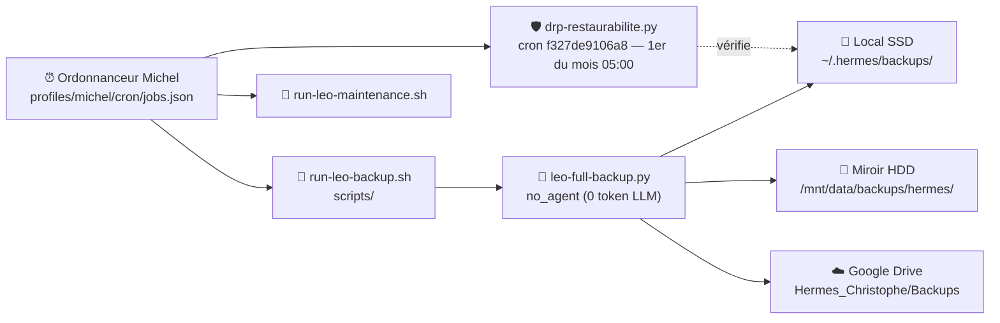

# 💾 Sauvegardes & Plan de Reprise d'Activité (PRA) — LEO

> **Document de référence opérationnelle.** Mesures vérifiées le **05/10/2026**.<br/>
> Ce document décrit la stratégie de sauvegarde intégrale, l'ordonnancement des tâches, le contenu archivé, le Recovery Kit la procédure de restauration après sinistre, et le **dispositif de vérification de la reprise (DRP)**.

> ⚠️ **Le test précédent de ce document (21/09/2026) annonçait des archives complètes. C'était faux.**
> Un défaut majeur — les **liens symboliques étaient archivés vides** — rendait les archives
> **non restaurables** depuis l'origine. Il est **corrigé et prouvé depuis le 05/10/2026**.
> Voir la section 4 bis.

---

## 1. Synthèse opérationnelle

| Indicateur | Donnée observée & mesurée | Source de vérité |
|---|---|---|
| **Dernier backup mesuré** | **2026-10-05 08:50 CEST** (`leo-full-backup-2026-10-05.tar.gz`), **81 970 entrées** | `~/.hermes/backups/`, miroir HDD, GDrive |
| **Taille mesurée** | **3,20 Go** (3 435 090 000 octets env.) — ⚠️ une archive de 3,20 Go *n'est pas* forcément complète : voir section 4 bis | `ls` local + miroir + `gzip -t` OK |
| **Périmètre sauvegardé** | 6 profils, vaults, mémoires, configurations, credentials, fichiers OAuth, bases SQLite, cron, **795 scripts**, **55 fichiers `lib/`** | Script `leo-full-backup.py` |
| **Destinations vérifiées** | Local SSD + Miroir HDD (1 To) + Google Drive | `/home/tofdan/.hermes/backups/`, `/mnt/data/backups/hermes/` (`01 — Full Backups`) |
| **Destination cloud** | Google Drive (`Hermes_Christophe/Backups`) | Script d'upload OAuth et journal stdout |
| **Rétention réelle** | **30 jours** (minimum 48 archives) — règle du script `leo-full-backup.py` | Script lui-même |
| **RTO** | **Non mesuré** (aucune durée garantie) | Constat factuel (absence de test chronométré complet) |
| **Vérification de la reprise** | **Automatique à chaque démarrage** — service `leo-drp-reprise` | `~/.hermes/metrics/drp-reprise-latest.log` |
| **Test de restaurabilité** | **Mensuel**, le 1er à 5h — cron `f327de9106a8` | `~/.hermes/metrics/drp-restaurabilite.json` |

---

## 2. Ordonnancement et exécution

Les tâches de sauvegarde et de maintenance sont orchestrées de manière autonome via l'ordonnanceur Michel :


```mermaid
flowchart LR
    Cron["⏰ Ordonnanceur Michel<br/>profiles/michel/cron/jobs.json"]
    Wrapper["📜 run-leo-backup.sh<br/>scripts/"]
    Script["🐍 leo-full-backup.py<br/>no_agent (0 token LLM)"]
    Maint["🔧 run-leo-maintenance.sh"]
    DRP["🛡️ drp-restaurabilite.py<br/>cron f327de9106a8 — 1er du mois 05:00"]

    Dest1["💾 Local SSD<br/>~/.hermes/backups/"]
    Dest2["💽 Miroir HDD<br/>/mnt/data/backups/hermes/"]
    Dest3["☁️ Google Drive<br/>Hermes_Christophe/Backups"]

    Cron --> Wrapper --> Script
    Cron --> Maint
    Cron --> DRP -.->|"vérifie"| Dest1

    Script --> Dest1
    Script --> Dest2
    Script --> Dest3
```

### Job de sauvegarde quotidienne
- **Nom exact dans jobs.json** : `💾 LEO Backup quotidien → GDrive (script)`
- **Planification** : `0 6 * * *` (tous les jours à 06:00 CEST)
- **Wrapper cron** : `/home/tofdan/.hermes/scripts/run-leo-backup.sh` (appelle `cron-runner.sh` avec `/home/tofdan/.hermes/profiles/michel/scripts/leo-full-backup.py`)
- **Script réel** : `/home/tofdan/.hermes/scripts/leo-full-backup.py` (même fichier que `profiles/michel/scripts/leo-full-backup.py` — **lien symbolique**)
- **Mode d'exécution** : `no_agent = true` (exécution déterministe par script direct, 0 token LLM consommé)
- **Mesure observée au 21/09/2026** : `enabled = true`, déclenché à `2026-09-21T06:00:17+02:00`, `exit_code: 0`, durée `2121 s` (~35 min 21 s, complété à `06:35:38`).

### Job de maintenance quotidienne
- **Nom exact dans jobs.json** : `🔧 LEO Maintenance quotidienne`
- **Planification** : `0 3 * * *` (tous les jours à 03:00 CEST)
- **Wrapper cron** : `/home/tofdan/.hermes/scripts/run-leo-maintenance.sh` (appelle `cron-runner.sh` avec `leo-daily-maintenance.py`)
- **Mode d'exécution** : `no_agent = true`, `enabled = true`
- **Mesure observée au 21/09/2026** : dernière exécution à `03:00:06`, `last_status: ok`.
- **Rôle** : Nettoyage préventif des fichiers temporaires, purge des outputs de crons expirés, vérification de l'espace disque et détection d'anomalies avant le déclenchement du backup à 06:00.

---

## 3. Périmètre archivé et politique d'exclusion

Le script `leo-full-backup.py` construit une archive `tar.gz` complète combinant les chemins internes de Hermes et les projets métiers associés.

### Chemins Hermes inclus (`HERMES_PATHS`)

Le script parcourt strictement la liste `HERMES_PATHS` (36 chemins) sans omission ni ajout externe :

```text
profiles/default       vault-michel       memories                 skills
profiles/michel        vault-default      .env                     scripts
profiles/sylvia        vault-emile        config.yaml              metrics
profiles/emile         vault-sylvia       delegation-config.json   state.db
profiles/robert        vault-robert       credentials_vault.json   kanban.db
profiles/gerard        vault-gerard       SOUL.md                  cron
                       vault-copilot      gateway_state.json       mail_router
                       vault-agy          Tokens OAuth (7 fichiers)
                       vault-dsh
```

1. **Six profils opérationnels** : `profiles/default`, `profiles/michel`, `profiles/sylvia`, `profiles/emile`, `profiles/robert`, `profiles/gerard` (configurations, sessions, contextes et mémoires dédiées).
2. **Neuf vaults documentaires** :
    - Vaults profils : `vault-michel`, `vault-default`, `vault-emile`, `vault-sylvia`, `vault-robert`, `vault-gerard` ;
    - Vaults de sessions automatisées : `vault-copilot`, `vault-agy`, `vault-dsh`.
3. **Mémoires partagées** : `memories`.
4. **Configurations, credentials et états** :
    - `.env`, `config.yaml`, `delegation-config.json`, `credentials_vault.json`, `SOUL.md`, `gateway_state.json`.
5. **Fichiers OAuth Google (7 fichiers déclarés)** :
    - `leo_google_token.json`, `gdrive-service-account.json`, `leo_token.json`, `google_token.json`, `google_client_secret.json`, `leo_sheets_token.json`, `leo_drive_token.json`.
    - *Note opérationnelle* : Si un fichier optionnel est absent (ex. `google_token.json` lors de l'exécution du 21/09), le script signale l'omission et poursuit l'archivage sans bloquer.
6. **Bases de données, outils et ordonnancement** :
    - `skills`, `scripts`, `metrics`, `state.db`, `kanban.db`, `cron`, `mail_router`.

### Projets métiers et wikis inclus

En complément de `HERMES_PATHS`, le script intègre explicitement les dépôts et répertoires projets suivants :

| Projet / Ressource | Chemin source | Contenu inclus & Traitement |
|---|---|---|
| **hermes-christophe** | `~/Projets_Dev/hermes-christophe` | Documentation et scripts personnels de Christophe |
| **MyCDC** | `~/Projets_Dev/MyCDC` | Portail de société : code métier et base de données SQLite (`.git` et `__pycache__` exclus) |
| **clarity-workshop** | `~/Projets_Dev/clarity-workshop` | Mur de cadrage et mission : code + base SQLite `clarity.sqlite3` (`.git`, `__pycache__`, `.pytest_cache` exclus) |
| **5 Wikis** | `~/Projets_Dev/{BAVI_LEO, hermes-wiki, emile-wiki, voyages-wiki, wiki-oca}` | Contenu documentaire intégral (`.git`, `__pycache__`, `.venv` exclus) |
| **lea-workbench/data** | `~/Projets_Dev/lea-workbench/data` | Données métier uniques : base `lea.db`, documents et archives d'export applicatives `lea_backup_*.tar.gz` (`.git`, `__pycache__`, `.staging` exclus) |
| **LEA_CLIENT_BUNDLES** | `/home/tofdan/LEA_CLIENT_BUNDLES` | Bundles clients distribués (~9 Mo) |
| **leo-docs** | `~/Projets_Dev/leo-docs` et `~/Projets_Dev/leo-docs.py` | Portail documentaire port 8766 (dépôt hors `.git`, `__pycache__`, `.venv`, plus le script racine) |

> [!WARNING]
> **Volumes Docker Léa :**
> Les volumes Docker de l'environnement Léa (`lea_data`, `lea_hermes_data` représentant ~29 Go) ne sont pas injectés directement dans l'archive quotidienne globale. Ils font l'objet d'exports compressés applicatifs dédiés (`lea-workbench/scripts/backup.sh`) dirigés vers `data/backups/`, dont les archives résultantes (~91 Mo) sont quant à elles intégrées au backup LEO via `lea-workbench/data`.

### Règles d'exclusion et tolérance aux fichiers volatils

1. **Exclusions selon le projet** : `.git/`, `.venv/`, `__pycache__/`, `.pytest_cache/`, `.staging/`.
2. **Filtrage des débris de base de données** : Le filtre du script ignore explicitement tout fichier dont le nom contient `state.db.corrompu*`, `state.db.bak*` ou `state.db.recovered*` afin d'éviter d'alourdir l'archive avec des reliquats de maintenance.
3. **Tolérance aux fichiers volatils (`safe_add`)** : Le script gère les fichiers temporaires pouvant disparaître pendant la lecture (ex. builds MkDocs régénérés pendant l'archivage). Il applique jusqu'à 3 tentatives successives espacées d'1 seconde ; si le fichier n'est plus présent, il est ignoré avec un avertissement dans les logs sans interrompre la sauvegarde.

---

## 4. Destinations et politique de rétention

Le script archive et réplique les données sur **trois cibles**.
⚠️ La rétention réelle est de **30 jours** (minimum 48 archives conservées) —
la valeur `RETENTION_DAYS` a été portée bien au-delà des 5 jours annoncés par
la version précédente de ce document.

1. **Stockage primaire local (SSD)** :
    - Répertoire : `/home/tofdan/.hermes/backups/`
    - Format : `leo-full-backup-YYYY-MM-DD.tar.gz`
    - Taille mesurée au **05/10/2026** : **3,28 Go** — **81 970 entrées** dans l'archive.
    - Mécanisme de rétention : Le script calcule l'âge calendaire de chaque fichier `age = (today - mtime_date).days`. Tout fichier pour lequel `age > RETENTION_DAYS` est supprimé.
2. **Miroir secondaire local (Disque 1 To)** :
    - Répertoire : `/mnt/data/backups/hermes/`
    - Copie miroir automatique (`shutil.copy2`) immédiatement après création de l'archive primaire.
    - **Vérifié le 05/10/2026** : contenu **identique bit-à-bit** à l'archive primaire.
    - Mécanisme de rétention : Même logique de purge à `age > RETENTION_DAYS`.
3. **Téléversement Cloud distant (Google Drive)** :
    - Dossier de destination : `Hermes_Christophe/Backups` (identifiant interne non divulgué).
    - Authentification : jeton OAuth sécurisé (`leo_google_token.json`).
    - Validation mesurée le **05/10/2026** : téléversement confirmé (`☁️ GDrive upload OK`), suivi de la purge automatique des archives expirées.
    - Rétention distante : requête Drive supprimant les fichiers dont `createdTime` dépasse la fenêtre de rétention.

---

## 4 bis. 🔴 Défaut majeur corrigé le 05/10/2026 — les archives n'étaient pas restaurables

**C'est le défaut le plus grave jamais trouvé sur ce dispositif. Il était invisible.**

### Ce qui se passait

`~/.hermes/scripts` est un **lien symbolique** (il pointe vers
`profiles/michel/scripts`), et `SOUL.md` en est un aussi. Or l'archiveur
ajoutait ces chemins **sans suivre le lien** : il n'archivait que **le lien
lui-même**, jamais son contenu.

Mesure sur les **7 archives réelles** présentes sur disque :

| Archive | `scripts/` | `lib/` |
|---|---|---|
| 29/09 → 04/10 (6 archives) | **0** | **0** |
| **05/10** (après correctif) | **795** | **55** |

**Conséquence concrète** : une restauration aurait rendu une plateforme
**privée de ses 795 scripts** (dont les 84 crons) et du **cœur de la base Hive**
(`lib/` : `hive.py`, `engagements.py`, `breaker.py`). Le système se serait
rallumé **vide de sa logique**, sans qu'aucune alerte ne se déclenche.

### Pourquoi personne ne l'a vu

**Un dossier absent d'une archive ne produit aucun symptôme.** L'archive
s'ouvre, pèse 3 Go, se décompresse, et paraît normale. Seul un **comptage
d'entrées** révèle le trou — pas la présence d'un nom.

### Correctif appliqué

Deux modifications dans `leo-full-backup.py` :
1. **`lib` ajouté** à la liste des chemins sauvegardés ;
2. **les liens symboliques sont désormais suivis** (`realpath`), avec la
   justification en commentaire daté.

**Preuve** : `scripts/` 0 → **795**, `lib/` 0 → **55**, `hive.py` /
`engagements.py` / `breaker.py` **présents dans l'archive**.

### Règle

> **Un dossier de sauvegarde vide n'a pas de symptôme.**
> Compter les fichiers — jamais se fier à la présence du dossier.

---

## 4 ter. 🛡️ Vérification de la reprise (DRP) — mis en place le 05/10/2026

Un PRA qui n'est jamais testé est une **intention**, pas un dispositif.
Deux mécanismes automatiques le rendent vérifiable.

### 1. Vérification à chaque démarrage

- **Service** : `leo-drp-reprise.service` (systemd utilisateur, activé)
- **Script** : `~/.hermes/scripts/drp-verifie-reprise.sh`
- **Contrôle** : carte graphique, les 7 ports, les services, les boucles,
  le dashboard, Ollama
- **Silencieux si tout va bien** — ne nomme que ce qui ne va pas
- **Journal** : `~/.hermes/metrics/drp-reprise-latest.log`

**Il a déjà servi** : à son premier passage, il a trouvé `leo-docs`
**arrêté depuis 15 h**. Son port répondait, mais grâce à un processus lancé
à la main qui **n'aurait pas survécu au redémarrage**. Service relancé
proprement.

### 2. Test de restaurabilité, le 1er de chaque mois

- **Cron** : `f327de9106a8` (`0 5 1 * *`, mode script, 0 token LLM)
- **Script** : `~/.hermes/scripts/drp-restaurabilite.py`
- **Contrôle** : les éléments critiques de l'archive du jour — état de
  reprise, base Hive, crons (dont `cron/jobs.json`), skills, profils,
  gateway, vault, `scripts/`, `lib/`, fichiers `.env`
- **Silencieux si 7/7**, nomme les manquants sinon
- **État** : `~/.hermes/metrics/drp-restaurabilite.json` — actuellement **OK (7/7)**

### Piège corrigé dans le test lui-même

Ce test criait pour **deux faux problèmes permanents** : un fichier
inexistant (`lea_hermes_data`) et un mauvais motif de recherche (`jobs.json`
sans son dossier). Les deux contrôles ont été retirés.

> **Un garde-fou qui crie toujours finit ignoré — et fait manquer les vraies
> pannes.** Il ne doit signaler que ce qui peut réellement manquer.

---

## 5. Le Recovery Kit

Le **Recovery Kit** constitue le kit de secours autonome de niveau 2 (PRA),
indépendant des dépôts Git et de l'état des conteneurs en cours d'exécution.
Il est décrit à l'**étape 3** de la procédure de restauration ci-dessous.

---

## 6. Procédure indicative de restauration après sinistre (PRA)

En cas de perte de la machine hôte, la restauration s'opère selon un modèle en trois couches distinctes :

```
Couche 1 : Code source       ──→ Clonant les dépôts officiels depuis GitHub
Couche 2 : Données & Secrets ──→ Restaurés depuis le backup tar.gz et recovery-kit
Couche 3 : Volumes lourds    ──→ Restaurés depuis les backups d'export applicatifs
```

> [!NOTE]
> **Caractère indicatif de la procédure :**<br/>
> Le temps global de reprise d'activité (RTO) n'est **pas mesuré** et aucune durée de remise en service n'est garantie. Cette procédure fournit le chemin technique indicatif et dépend de la connectivité réseau, de la disponibilité des dépôts et des temps de décompression.

### Étape 1 — Préparation de l'environnement système

Installation des paquets de base et création de l'arborescence :

```bash
sudo apt update && sudo apt install -y python3 python3-pip python3-venv git curl
mkdir -p /home/tofdan/.hermes /home/tofdan/Projets_Dev
```

### Étape 2 — Restauration des données depuis le backup quotidien

Récupération de la dernière archive quotidienne `leo-full-backup-YYYY-MM-DD.tar.gz` (depuis le miroir HDD `/mnt/data/backups/hermes/` ou l'espace Google Drive `Hermes_Christophe/Backups`) :

```bash
# Extraction dans le répertoire utilisateur
tar -xzf leo-full-backup-YYYY-MM-DD.tar.gz -C /home/tofdan/
chown -R tofdan:tofdan /home/tofdan/.hermes /home/tofdan/Projets_Dev
```

### Étape 3 — Restauration et vérification des secrets via le Recovery Kit

Application des configurations sensibles avec contrôle d'intégrité :

```bash
cd /home/tofdan/.hermes/recovery-kit

# Vérification de l'intégrité du kit
sha256sum -c checksums.sha256

# Restauration des secrets
base64 -d secrets.b64 | tar -xz -C /home/tofdan/.hermes/
chmod 600 /home/tofdan/.hermes/.env /home/tofdan/.hermes/credentials_vault.json
```

### Étape 4 — Reconnexion GitHub CLI

Pour restaurer l'accès GitHub de manière sécurisée sans afficher de jeton en clair dans les logs ou l'historique shell :

```bash
# Authentification GitHub CLI interactive ou via flux d'authentification sécurisé
gh auth login
gh auth status
```

*(Ne jamais afficher ni imprimer de clé privée ou jeton d'authentification dans l'historique shell).*

### Étape 5 — Reconstruction du code et dépendances Git

Clonage ou mise à jour des dépôts maîtres depuis l'espace GitHub :

```bash
cd /home/tofdan/Projets_Dev
for repo in BAVI_LEO hermes-wiki emile-wiki wiki-oca voyages-wiki hermes-christophe MyCDC clarity-workshop lea-workbench leo-docs; do
    if [ ! -d "$repo/.git" ]; then
        git clone "https://github.com/christophedanhier-hash/${repo}.git" "$repo"
    fi
done
```

### Étape 6 — Restauration des volumes applicatifs Docker (Couche 3)

Pour les applications disposant de volumes applicatifs isolés (ex. bases et conteneurs Léa) :

```bash
# Restauration des données applicatives exportées
cd /home/tofdan/Projets_Dev/lea-workbench
./scripts/restore.sh data/backups/dernier_export.tar.gz
```

### Étape 7 — Redémarrage des services et validation opérationnelle

1. Lancement des services et daemons :
   ```bash
   systemctl --user restart hermes-dashboard.service
   ```
2. Contrôle de santé des interfaces HTTP :
   - `http://localhost:8765/` (Panel LEO)
   - `http://localhost:8766/` (Leo Docs)
   - `http://localhost:9119/` (Hermes Dashboard)
   - `http://localhost:8793/` (My Émile IA)
3. Contrôle des cron jobs :
   ```bash
   hermes cron list
   ```

---

## 7. Règles d'hygiène et maintenance du PRA

1. **Maintien du Recovery Kit** : Après tout renouvellement ou modification de clés, jetons OAuth ou configurations dans `~/.hermes/.env`, régénérer `secrets.b64` et mettre à jour `checksums.sha256`.
2. **Surveillance quotidienne** : Contrôler la bonne exécution du job `💾 LEO Backup quotidien → GDrive (script)` dans les journaux de cron (`status.json` et sortie `stdout`).
3. **Exercice périodique** : Tester une extraction à blanc sur une machine ou un répertoire isolé pour vérifier la cohérence des archives sans impacter l'environnement en production. **Compter les entrées** de l'archive — jamais se contenter de vérifier qu'un dossier est présent (voir section 4 bis).
4. **Vérifier la reprise** : consulter `~/.hermes/metrics/drp-reprise-latest.log` après chaque redémarrage, et `~/.hermes/metrics/drp-restaurabilite.json` après le test mensuel.

---

> 🦁 Documentation auditée et réalignée le **05/10/2026**.<br/>
> ⚠️ L'audit du **21/09/2026** avait conclu à tort que les archives étaient complètes : il vérifiait la **présence** des éléments, pas leur **contenu**. Le défaut des liens symboliques n'a été découvert que le 05/10/2026, en **comptant les entrées**.<br/>
> Sources directes auditées : `/home/tofdan/.hermes/scripts/leo-full-backup.py`, `/home/tofdan/.hermes/profiles/michel/cron/jobs.json`, `/home/tofdan/.hermes/cron/output/leo-full-backup.stdout`, `/home/tofdan/.hermes/backups/` et `/mnt/data/backups/hermes/`.
