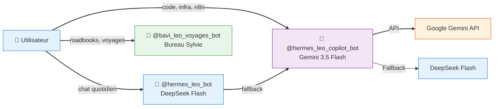

# 🤖 Bots Telegram — Écosystème LEO

> **3 bots, 3 missions** — chaque bot a un modèle, un profil Hermes et un rôle dédié.

---

## 🗺️ Architecture



---

## 1️⃣ 🤖 `@hermes_leo_bot` — Leo DeepSeek

| | |
|--|--|
| **Rôle** | Chat quotidien, conversation générale |
| **Modèle** | DeepSeek Flash (deepseek-chat) |
| **Provider** | OpenRouter / DeepSeek direct |
| **Profil Hermes** | `default` |
| **Latence** | ⚡ < 2s |
| **Coût** | $0.15/M tokens — suivi dashboard budget |
| **Usage** | Questions courantes, analyse rapide, tâches simples |
| **Fallback** | Bascule vers Leo Copilot si DeepSeek indisponible |

### Configuration

```yaml
# ~/./config.yaml (profil default)
provider: deepseek
model: deepseek-chat
```

### Routage

- Messages Telegram → DeepSeek Flash
- Tâches simples, conversations, analyses rapides
- Si API DeepSeek down → fallback sur Copilot

---

## 2️⃣ 🤖 `@hermes_leo_copilot_bot` — Leo Copilot (Gemini Pro)

| | |
|:--|:--|
| **Rôle** | Code, infrastructure, n8n, analyses complexes |
| **Modèle** | Gemini 2.5 Pro (par défaut) |
| **Provider** | Google Gemini API (direct) |
| **Profil Hermes** | `leo-copilot` (isolé, dédié) |
| **Latence** | ⚡ < 3s |
| **Coût** | $0.10/M tokens — gratuit jusqu'à 60 req/min (API tier gratuit) |
| **Fallback** | DeepSeek Flash si Gemini indisponible |
| **Sync mémoire** | Cron `sync-memory` toutes les 30min — partage mémoire entre profil `default` et `leo-copilot` |

### Architecture technique

```
Telegram → Gateway (profil leo-copilot, provider: gemini) → Google Gemini API → Gemini 2.5 Pro
```

### Intégration Gemini

- Connexion directe à l'API Google Gemini (plus de proxy local)
- Endpoint : `https://generativelanguage.googleapis.com/v1beta/models/gemini-2.5-pro:generateContent`
- Streaming supporté ✅
- Mémoire partagée via `sync-memory.py` (toutes les 30min)

### Dashboard

- Le [Global Dashboard](https://christophedanhier-hash.github.io/leo-global-dashboard/) suit le budget DeepSeek et les métriques des machines
- Les métriques Gemini ne sont plus trackées individuellement (API gratuite, pas de limite de crédits)

---

## 3️⃣ 🧭 `@bavi_leo_voyages_bot` — Voyages

| | |
|--|--|
| **Rôle** | Organisation de voyages camping-car |
| **Modèle** | DeepSeek Flash (via profil partagé) |
| **Profil Hermes** | Partagé (profil voyages) |
| **Accès** | Christophe + invités (accès limité aux skills voyage) |
| **Skills** | `bureau-sylvie`, `voyages-wiki`, `maps` |
| **Wiki** | [🧭 Voyages](https://christophedanhier-hash.github.io/voyages-wiki/) |

### Usage

- Planification d'itinéraires
- Roadbooks avec cartes Folium
- Calcul distances Haversine
- Astuces camping-car (ZTL, hauteur, aires)
- Journal de bord

---

## 📊 Comparatif

|| Critère | Leo DeepSeek | Leo Copilot | Voyages |
||:--------|:------------:|:-----------:|:-------:|
|| **Modèle** | DeepSeek Flash | Gemini 2.5 Pro | DeepSeek Flash |
|| **Latence** | ⚡ < 2s | ⚡ < 3s | ⚡ < 2s |
|| **Coût** | $ pay-as-you-go | $0.10/M tokens (tier gratuit) | $ pay-as-you-go |
|| **Usage principal** | Chat quotidien | Code, infra, n8n | Voyages |
|| **Profil dédié** | ❌ (default) | ✅ leo-copilot | Partagé |
|| **Provider** | DeepSeek | Google Gemini | DeepSeek |
|| **Accès invités** | ❌ | ❌ | ✅ |

---

## 🔧 Maintenance

|| Action | Commande / Cron |
||:-------|:----------------|
|| **Redémarrer Leo Copilot** | `hermes gateway restart` (profil leo-copilot) |
|| **Dashboards** | Tous auto-déployés via GH Pages |

---

*Document généré le 23/06/2026 — Écosystème LEO 🦁*
