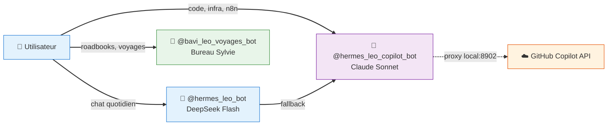

# 🤖 Bots Telegram — Écosystème LEO

> **3 bots, 3 missions** — chaque bot a un modèle, un profil Hermes et un rôle dédié.

---

## 🗺️ Architecture



---

## 1️⃣ 🤖 `@hermes_leo_bot` — Leo DeepSeek

| | |
|--|--|
| **Rôle** | Chat quotidien, conversation générale |
| **Modèle** | DeepSeek Flash (deepseek-chat) |
| **Provider** | OpenRouter / DeepSeek direct |
| **Profil Hermes** | `default` |
| **Latence** | ⚡ < 2s |
| **Coût** | $0.15/M tokens — suivi dashboard budget |
| **Usage** | Questions courantes, analyse rapide, tâches simples |
| **Fallback** | Bascule vers Leo Copilot si DeepSeek indisponible |

### Configuration

```yaml
# ~/./config.yaml (profil default)
provider: deepseek
model: deepseek-chat
```

### Routage

- Messages Telegram → DeepSeek Flash
- Tâches simples, conversations, analyses rapides
- Si API DeepSeek down → fallback sur Copilot

---

## 2️⃣ 🤖 `@hermes_leo_copilot_bot` — Leo Copilot

| | |
|--|--|
| **Rôle** | Code, infrastructure, n8n, analyses complexes |
| **Modèle** | Claude Sonnet 4.6 (par défaut) |
| **Provider** | `custom` → proxy local `http://localhost:8902/v1` |
| **Profil Hermes** | `leo-copilot` (isolé, dédié) |
| **Latence** | ~5-15s (via proxy ACP → GitHub Copilot CLI) |
| **Coût** | $0 — inclus dans abonnement GitHub Copilot (~3000 credits/mois) |
| **Modèles disponibles** | Sonnet 4.6 (défaut), Opus 4.6, Sonnet 4.5, GPT-5.5, GPT-5.4, GPT-Codex |

### Architecture technique

```
Telegram → Gateway (profil leo-copilot) → Proxy local (:8902) → CLI Copilot (ACP) → GitHub Copilot API → Claude Sonnet
```

### Proxy local (`copilot-proxy.py`)

- Port **8902**, endpoint OpenAI-compatible `/v1/chat/completions`
- Mode **ACP** (stdio) — gère les conversations longues sans limite de prompt
- SSE streaming supporté ✅
- Watchdog cron toutes les 5 min (`proxy-watchdog`)
- Supporte 6 modèles, modèle par défaut configurable

### Dashboard intégré

- Carte **Copilot Usage** sur le [Global Dashboard](https://christophedanhier-hash.github.io/leo-global-dashboard/)
- Métriques : crédits consommés, appels, statut proxy
- Logs : `copilot-calls.log`, agrégation toutes les 10 min

---

## 3️⃣ 🧭 `@bavi_leo_voyages_bot` — Voyages

| | |
|--|--|
| **Rôle** | Organisation de voyages camping-car |
| **Modèle** | DeepSeek Flash (via profil partagé) |
| **Profil Hermes** | Partagé (profil voyages) |
| **Accès** | Christophe + invités (accès limité aux skills voyage) |
| **Skills** | `bureau-sylvie`, `voyages-wiki`, `maps` |
| **Wiki** | [🧭 Voyages](https://christophedanhier-hash.github.io/voyages-wiki/) |

### Usage

- Planification d'itinéraires
- Roadbooks avec cartes Folium
- Calcul distances Haversine
- Astuces camping-car (ZTL, hauteur, aires)
- Journal de bord

---

## 📊 Comparatif

| Critère | Leo DeepSeek | Leo Copilot | Voyages |
|:--------|:------------:|:-----------:|:-------:|
| **Modèle** | DeepSeek Flash | Claude Sonnet 4.6 | DeepSeek Flash |
| **Latence** | ⚡ < 2s | ~5-15s | ⚡ < 2s |
| **Coût** | $ pay-as-you-go | $0 (abonnement) | $ pay-as-you-go |
| **Usage principal** | Chat quotidien | Code, infra, n8n | Voyages |
| **Profil dédié** | ❌ (default) | ✅ leo-copilot | Partagé |
| **Proxy** | ❌ | ✅ local:8902 | ❌ |
| **Accès invités** | ❌ | ❌ | ✅ |

---

## 🔧 Maintenance

| Action | Commande / Cron |
|:-------|:----------------|
| **Redémarrer Leo Copilot** | `hermes gateway restart` (profil leo-copilot) |
| **Redémarrer proxy** | `pkill -f copilot-proxy; python3 /opt/data/scripts/copilot-proxy.py &` |
| **Watchdog proxy** | Cron `proxy-watchdog` toutes les 5 min |
| **Logs Copilot** | `/opt/data/scripts/copilot-calls.log` |
| **Agrégation usage** | Cron `copilot-tracker` toutes les 10 min |
| **Dashboards** | Tous auto-déployés via GH Pages |

---

*Document généré le 23/06/2026 — Écosystème LEO 🦁*
