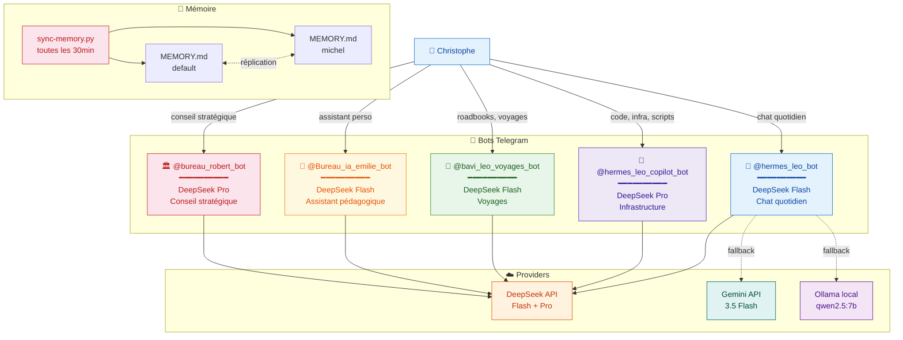
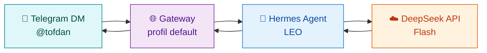

# 🤖 Bots Telegram — Écosystème LEO

> **5 bots, 5 missions, mémoire unifiée default↔michel** — chaque bot a un profil Hermes et un rôle dédié.

---

## 🗺️ Architecture globale

---

## 1️⃣ 🦁 `@hermes_leo_bot` — Leo Hermes (Dialogue)

| | |
|---|---|
| **Rôle** | Chat quotidien, conversation générale, veille |
| **Modèle** | **DeepSeek Flash** (deepseek-v4-flash) |
| **Provider** | DeepSeek API directe |
| **Profil Hermes** | `default` |
| **Latence** | ⚡ < 2s |
| **Coût** | DeepSeek V4 Flash: $0.14/1M input, $0.28/1M output |
| **Fallback** | Gemini 3.5 Flash → Ollama local qwen2.5:7b |

### Flux de communication

---

## 2️⃣ 🔧 `@hermes_leo_copilot_bot` — Michel (Infrastructure)

> Ce bot correspond au profil **`michel`** (ex-leo-copilot, renommé juillet 2026).

| | |
|:---|:---|
| **Rôle** | Code, infrastructure, dashboards, déploiements, audits |
| **Modèle** | **DeepSeek Pro** (deepseek-v4-pro) |
| **Provider** | DeepSeek API directe |
| **Profil Hermes** | `michel` (isolé, mémoire unifiée avec `default`) |
| **Latence** | ⚡ < 3s |
| **Coût** | $ pay-as-you-go |
| **Fallback** | deepseek-v4-flash → gemini-3.5-flash → qwen2.5:7b |
| **Crons** | 41 jobs (tous actifs) |

---

## 3️⃣ 🧭 `@bavi_leo_voyages_bot` — Sylvia (Voyages)

> Ce bot correspond au profil **`sylvia`** (ex-bavi-leo).

| | |
|---|---|
| **Rôle** | Roadbooks, itinéraires, organisation voyages camping-car |
| **Modèle** | DeepSeek Flash (deepseek-v4-flash) |
| **Profil Hermes** | `sylvia` (isolé) |
| **Accès** | Christophe uniquement |
| **Wiki** | [🧭 Voyages](https://christophedanhier-hash.github.io/voyages-wiki/) |

---

## 4️⃣ 👤 `@Bureau_ia_emilie_bot` — Émile (Pédagogie)

| | |
|---|---|
| **Rôle** | Assistant pédagogique pour mémoire de fin d'études |
| **Modèle** | DeepSeek Flash (deepseek-v4-flash) |
| **Profil Hermes** | `emile` (isolé) |
| **Accès** | Christophe uniquement |

---

## 5️⃣ 🏛️ `@bureau_robert_bot` — Robert (Conseil Stratégique)

> Ce bot correspond au profil **`robert`** (ex-bureau-robert).

| | |
|---|---|
| **Rôle** | Conseil stratégique IT, audits, analyses |
| **Modèle** | DeepSeek Pro (deepseek-v4-pro) |
| **Profil Hermes** | `robert` (isolé) |
| **Accès** | Christophe uniquement |

---

## 📊 Comparatif

| Critère | 🦁 Leo Hermes | 🔧 Michel | 🧭 Sylvia | 👤 Émile | 🏛️ Robert |
|:--------|:------------:|:-----------:|:-------:|:------:|:-------:|
| **Modèle** | DeepSeek Flash | **DeepSeek Pro** | DeepSeek Flash | DeepSeek Flash | DeepSeek Pro |
| **Latence** | ⚡ < 2s | ⚡ < 3s | ⚡ < 2s | ⚡ < 2s | ⚡ < 3s |
| **Profil** | `default` | `michel` | `sylvia` | `emile` | `robert` |
| **Provider** | DeepSeek (+ Gemini/Ollama fallback) | DeepSeek | DeepSeek | DeepSeek | DeepSeek |
| **Mémoire** | Unifiée (default+michel) | Unifiée (default+michel) | Séparée | Séparée | Séparée |
| **Crons** | 0 | **41 (tous actifs)** | 0 | 0 | 0 |

> **Note** : Les profils `leo-copilot`, `bavi-leo`, `bureau-robert` ont été renommés respectivement en `michel`, `sylvia`, `robert` lors de la consolidation de juillet 2026. Les noms de bots Telegram sont restés inchangés.

---

> 🤖 Dernier audit : 23/07/2026 à 05:00 (UTC+2)
