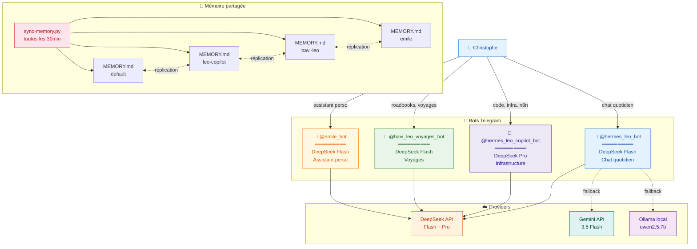
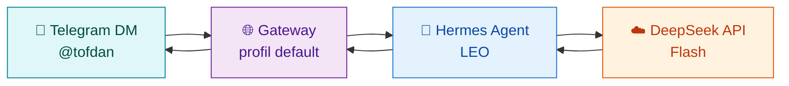
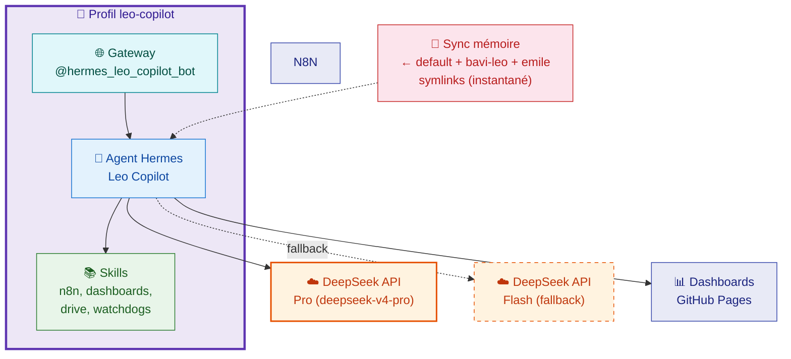

# 🤖 Bots Telegram — Écosystème LEO

> **4 bots, 4 missions, 1 mémoire partagée** — chaque bot a un modèle, un profil Hermes et un rôle dédié.

---

## 🗺️ Architecture globale

---

## 1️⃣ 🦁 `@hermes_leo_bot` — Leo Hermes (Dialogue)

||||
|--|--|
| **Rôle** | Chat quotidien, conversation générale, veille |
| **Modèle** | **DeepSeek Flash** (deepseek-v4-flash) |
| **Provider** | DeepSeek API directe |
| **Profil Hermes** | `default` |
| **Latence** | ⚡ < 2s |
| **Coût** | DeepSeek V4 Flash: $0.14/1M input, $0.28/1M output — suivi dashboard budget |
| **Fallback** | Gemini 3.5 Flash + Ollama local qwen2.5:7b comme fallback |

### Flux de communication

---

## 2️⃣ 🔧 `@hermes_leo_copilot_bot` — Leo Copilot (Infrastructure)

||:--|:--|
| **Rôle** | Code, infrastructure, n8n, dashboards, déploiements |
| **Modèle** | **DeepSeek Pro** (deepseek-v4-pro) |
| **Provider** | DeepSeek API directe |
| **Profil Hermes** | `leo-copilot` (isolé, dédié) |
| **Latence** | ⚡ < 3s |
| **Coût** | $ pay-as-you-go — suivi dashboard budget |
| **Fallback** | DeepSeek Flash si Pro indisponible |
| **Sync mémoire** | Cron `sync-memory` toutes les 30min — partage mémoire entre profils |

### Architecture technique

### Pourquoi DeepSeek Pro et Gemini 3.5 Flash en fallback ?

- **Qualité de réflexion supérieure** pour les tâches d'infrastructure complexes (DeepSeek V4 Pro)
- **Mémoire partagée** avec les autres profils via `sync-memory.py`
- **Gemini 3.5 Flash** utilisé comme fallback si DeepSeek Pro est indisponible
- **Ollama local qwen2.5:7b** comme dernière ligne de repli

---

## 3️⃣ 🧭 `@bavi_leo_voyages_bot` — Voyages

||||
|--|--|
| **Rôle** | Organisation de voyages camping-car |
| **Modèle** | DeepSeek Flash (deepseek-v4-flash) |
| **Profil Hermes** | `bavi-leo` (isolé) |
| **Accès** | Christophe + invités (accès limité aux skills voyage) |
| **Skills** | `bureau-sylvie`, `voyages-wiki`, `maps` |
| **Wiki** | [🧭 Voyages](https://christophedanhier-hash.github.io/voyages-wiki/) |

---

## 4️⃣ 👤 `@emile_bot` — Assistant personnel

||||
|--|--|
| **Rôle** | Assistant personnel, tâches quotidiennes |
| **Modèle** | DeepSeek Flash (deepseek-v4-flash) |
| **Profil Hermes** | `emile` (isolé) |

---

## 📊 Comparatif

| Critère | 🦁 Leo Hermes | 🔧 Leo Copilot | 🧭 Voyages | 👤 Émile |
|:--------|:------------:|:-----------:|:-------:|:------:|
| **Modèle** | DeepSeek Flash | **DeepSeek Pro** | DeepSeek Flash | DeepSeek Flash |
| **Latence** | ⚡ < 2s | ⚡ < 3s | ⚡ < 2s | ⚡ < 2s |
| **Coût** | $0.14/$0.28 /1M tokens | $ pay-as-you-go | $0.14/$0.28 /1M tokens | $0.14/$0.28 /1M tokens |
| **Usage principal** | Chat quotidien | **Infra, code, n8n** | Voyages | Assistant perso |
| **Profil** | `default` | `leo-copilot` | `bavi-leo` | `emile` |
| **Provider** | DeepSeek (+ Gemini/Ollama fallback) | DeepSeek | DeepSeek | DeepSeek |
| **Accès invités** | ❌ | ❌ | ✅ | ❌ |
| **Sync mémoire** | ✅ 30min | ✅ 30min | ✅ 30min | ✅ 30min |

### Post-restauration 10/07/2026

Suite à la perte du conteneur Docker LEO, le profil `leo-copilot` a été restauré depuis `leo-full-backup-2026-07-10.tar.gz`.

| Problème | Fix |
|:---------|:----|
| `SOUL.md` cassé (symlink → `/opt/data/` inexistant) | Recréé vers `~/.hermes/profiles/default/SOUL.md` |
| Vaults inaccessibles (`OBSIDIAN_VAULT_PATH`) | Mis à jour vers `~/.hermes/vault-*` |
| 28 crons restaurés | Tous actifs et tournent |
| Gateway redémarrée | ✅ Connecté Telegram |

**Leçons :**
- Le `SOUL.md` partagé par symlink est le point critique — sa perte bloque identité + crons
- Les chemins absolus doivent être vérifiés après restauration
- Backuper immédiatement après restauration

---

## 🔧 Maintenance

| Action | Commande / Cron |
|:-------|:----------------|
| **Redémarrer Leo Copilot** | `hermes -p leo-copilot gateway restart` |
| **Vérifier sync mémoire** | `cat ~/.hermes/profiles/default/memories/MEMORY.md` |
| **Dashboards** | Tous auto-déployés via GH Pages |

---

*Document mis à jour le 10/07/2026 — 16:00 — Léo 🦁*
