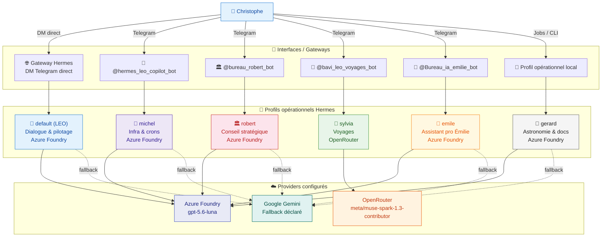

# 🤖 Interfaces Telegram & Profils — Écosystème LEO

> **Page canonique de référence :** [`hermes/architecture.md`](../architecture.md). Mesures vérifiées le **20/09/2026**.

L'écosystème LEO s'appuie sur une architecture multi-profils isolée où chaque profil Hermes dispose de sa propre configuration, de ses sessions et de sa mémoire. Les interactions s'effectuent via les gateways et bots autorisés.

> [!IMPORTANT]
> **Principes directeurs d'identification :**
> - **LEO est un agent Hermes** (profil `default`) et non un bot Telegram autonome. Son accès se fait par le Gateway Hermes (en DM direct avec Christophe), sans handle public inventé.
> - **`leo`** est l'alias Hive du profil `default`, et non un septième profil d'exécution.
> - **Gérard** est un profil opérationnel dédié à l'astronomie, à l'astrophotographie, au site tofdan et à la documentation générale (le T600/OCA étant un projet parmi d'autres ; aucun bot Telegram n'est inventé sans preuve de déploiement).
> - **Six profils opérationnels** sont actifs au 20/09/2026 : `default`, `michel`, `robert`, `sylvia`, `emile` et `gerard`.

---

## 🗺️ Architecture globale

```mermaid
flowchart TB
    User["👤 Christophe"]

    subgraph PROFILES["🏢 Profils opérationnels Hermes"]
        direction TB
        P_Default["🦁 default (LEO)<br/>Dialogue & pilotage<br/>Azure Foundry"]
        P_Michel["🔧 michel<br/>Infra & crons<br/>Azure Foundry"]
        P_Robert["🏛️ robert<br/>Conseil stratégique<br/>Azure Foundry"]
        P_Sylvia["🧭 sylvia<br/>Voyages<br/>OpenRouter"]
        P_Emile["👤 emile<br/>Assistant pro Émilie<br/>Azure Foundry"]
        P_Gerard["🔭 gerard<br/>Astronomie & docs<br/>Azure Foundry"]
    end

    subgraph INTERFACES["📱 Interfaces / Gateways"]
        direction TB
        GW_Leo["🌐 Gateway Hermes<br/>DM Telegram direct"]
        Bot_Michel["🔧 @hermes_leo_copilot_bot"]
        Bot_Robert["🏛️ @bureau_robert_bot"]
        Bot_Sylvia["🧭 @bavi_leo_voyages_bot"]
        Bot_Emile["👤 @Bureau_ia_emilie_bot"]
        Local_Gerard["📂 Profil opérationnel local"]
    end

    subgraph PROVIDERS["☁️ Providers configurés"]
        AF["Azure Foundry<br/>gpt-5.6-luna"]
        OR["OpenRouter<br/>meta/muse-spark-1.3-contributor"]
        FB["Google Gemini<br/>Fallback déclaré"]
    end

    User -->|"DM direct"| GW_Leo
    User -->|"Telegram"| Bot_Michel
    User -->|"Telegram"| Bot_Robert
    User -->|"Telegram"| Bot_Sylvia
    User -->|"Telegram"| Bot_Emile
    User -->|"Jobs / CLI"| Local_Gerard

    GW_Leo --> P_Default
    Bot_Michel --> P_Michel
    Bot_Robert --> P_Robert
    Bot_Sylvia --> P_Sylvia
    Bot_Emile --> P_Emile
    Local_Gerard --> P_Gerard

    P_Default --> AF
    P_Michel --> AF
    P_Robert --> AF
    P_Emile --> AF
    P_Gerard --> AF
    P_Sylvia --> OR

    P_Default -.->|fallback| FB
    P_Michel -.->|fallback| FB
    P_Robert -.->|fallback| FB
    P_Emile -.->|fallback| FB
    P_Gerard -.->|fallback| FB

    style User fill:#e3f2fd,stroke:#1976d2,color:#0d47a1
    style P_Default fill:#e3f2fd,stroke:#1976d2,color:#0d47a1
    style P_Michel fill:#ede7f6,stroke:#5e35b1,color:#311b92
    style P_Robert fill:#fce4ec,stroke:#c62828,color:#b71c1c
    style P_Sylvia fill:#e8f5e9,stroke:#388e3c,color:#1b5e20
    style P_Emile fill:#fff8e1,stroke:#f57f17,color:#e65100
    style P_Gerard fill:#f5f5f5,stroke:#616161,color:#212121
    style AF fill:#e8eaf6,stroke:#3f51b5,color:#1a237e
    style OR fill:#fff3e0,stroke:#e65100,color:#bf360c
    style FB fill:#e0f2f1,stroke:#00695c,color:#004d40
```

---

## 1️⃣ 🦁 Profil `default` — LEO (Agent principal)

| Propriété | Valeur |
|---|---|
| **Rôle** | Chat quotidien, dialogue général, pilotage et coordination |
| **Interface** | Gateway Hermes en DM Telegram avec Christophe (pas de handle inventé) |
| **Modèle configuré** | `gpt-5.6-luna` |
| **Provider principal** | Azure Foundry |
| **Fallback déclaré** | Google Gemini |
| **Mémoire** | Indépendante (`~/.hermes/profiles/default/memories/`) |

---

## 2️⃣ 🔧 Profil `michel` — Infrastructure (`@hermes_leo_copilot_bot`)

| Propriété | Valeur |
|---|---|
| **Rôle** | Infrastructure, dashboards, crons, sauvegardes, déploiements |
| **Interface** | Bot Telegram `@hermes_leo_copilot_bot` |
| **Modèle configuré** | `gpt-5.6-luna` |
| **Provider principal** | Azure Foundry |
| **Fallback déclaré** | `custom:google/gemini-3.7-flash` |
| **Jobs planifiés** | 72 jobs dans `profiles/michel/cron/jobs.json` (71 activés, 70 `no_agent`, 2 LLM) |
| **Statut opérationnel** | Opérationnel. Unité systemd en boucle d'auto-restart (PID déjà actif), suivie hors lot doc. |

---

## 3️⃣ 🧭 Profil `sylvia` — Voyages (`@bavi_leo_voyages_bot`)

| Propriété | Valeur |
|---|---|
| **Rôle** | Roadbooks, itinéraires, logistique voyages et camping-car |
| **Interface** | Bot Telegram `@bavi_leo_voyages_bot` |
| **Modèle configuré** | `meta/muse-spark-1.3-contributor` |
| **Provider principal** | OpenRouter |
| **Fallback déclaré** | Selon configuration du profil |
| **Espace documentaire** | Section voyages desservie via l'écosystème documentaire local |

---

## 4️⃣ 👤 Profil `emile` — Assistant professionnel Émilie (`@Bureau_ia_emilie_bot`)

| Propriété | Valeur |
|---|---|
| **Rôle** | Assistant professionnel d'Émilie au sein de My Émile IA Workbench (développé via Avenyra) : aide à la rédaction, à la structuration et à la gestion des notes, rapports, activités et documents professionnels (avec validation humaine). La phase initiale de formation et d'accompagnement de mémoire est achevée. |
| **Interface** | Bot Telegram `@Bureau_ia_emilie_bot` |
| **Modèle configuré** | `gpt-5.6-luna` |
| **Provider principal** | Azure Foundry |
| **Fallback déclaré** | Google Gemini |
| **Services liés** | Workbench My Émile IA (port local 8793, développé via Avenyra) |

---

## 5️⃣ 🏛️ Profil `robert` — Conseil Stratégique (`@bureau_robert_bot`)

| Propriété | Valeur |
|---|---|
| **Rôle** | Conseil stratégique IT, gouvernance, audits d'architecture |
| **Interface** | Bot Telegram `@bureau_robert_bot` |
| **Modèle configuré** | `gpt-5.6-luna` |
| **Provider principal** | Azure Foundry |
| **Fallback déclaré** | Google Gemini |

---

## 6️⃣ 🔭 Profil `gerard` — Astronomie, Astrophotographie & Documentation (Profil opérationnel)

| Propriété | Valeur |
|---|---|
| **Rôle** | Assistant de Christophe pour ses activités d'astronomie et d'astrophotographie, le wiki et le site tofdan liés à l'astronomie, la documentation générale et son étude comme guide astronomie (le projet T600/OCA étant un volet parmi d'autres). |
| **Interface** | Profil opérationnel (aucun bot Telegram fictif inventé) |
| **Modèle configuré** | `gpt-5.6-luna` |
| **Provider principal** | Azure Foundry |
| **Fallback déclaré** | Google Gemini |

---

## 📊 Matrice comparative des profils

| Profil | Rôle | Interface / Bot | Provider principal | Modèle | Fallback |
|:---|:---|:---|:---|:---|:---|
| `default` (LEO) | Dialogue et pilotage | Gateway (DM direct) | Azure Foundry | `gpt-5.6-luna` | Google Gemini |
| `michel` | Infrastructure & crons | `@hermes_leo_copilot_bot` | Azure Foundry | `gpt-5.6-luna` | `gemini-3.7-flash` |
| `robert` | Conseil stratégique | `@bureau_robert_bot` | Azure Foundry | `gpt-5.6-luna` | Google Gemini |
| `sylvia` | Voyages camping-car | `@bavi_leo_voyages_bot` | OpenRouter | `meta/muse-spark-1.3-contributor` | Selon config |
| `emile` | Assistant professionnel Émilie | `@Bureau_ia_emilie_bot` | Azure Foundry | `gpt-5.6-luna` | Google Gemini |
| `gerard` | Astronomie, astrophoto & documentation | Profil opérationnel | Azure Foundry | `gpt-5.6-luna` | Google Gemini |

---

## Contexte historique (daté)

> 📜 **Historique de nommage et d'architecture (juillet - août 2026) :**
>
> - Le profil `bureau-robert` a été renommé en `robert` en juillet 2026, tout en conservant le bot Telegram `@bureau_robert_bot`.
> - **Rôles initiaux :** Le profil `emile` accompagnait initialement la formation et la rédaction du mémoire d'études d'Émilie avant d'évoluer vers son rôle d'assistant professionnel pour ses activités. Le profil `gerard` a d'abord été restreint à la seule documentation T600/OCA avant d'être documenté pour l'ensemble des activités d'astronomie et du site tofdan.
> - Les chiffres antérieurs de crons (45, 49, 58) correspondent à d'anciennes étapes intermédiaires de reconstruction et de consolidation aujourd'hui archivées.
> - La configuration d'origine basée sur DeepSeek direct a été remplacée en production par la configuration actuelle Azure Foundry et OpenRouter.

---

## Pour aller plus loin

- Consulter [`architecture.md`](../architecture.md) pour la description canonique de référence
- Consulter [`profiles.md`](../configuration/profiles.md) pour la gestion et les commandes des profils
- Consulter [`providers.md`](../configuration/providers.md) pour les détails de paramétrage LLM
- Consulter [`dashboards.md`](dashboards.md) pour les interfaces web et la surveillance

---

> 🤖 Dernière mesure vérifiée : **20/09/2026** — LEO et Michel. Source de vérité : `~/.hermes/profiles/*/config.yaml`, `~/.hermes/profiles/michel/cron/jobs.json` et `architecture.md`.
